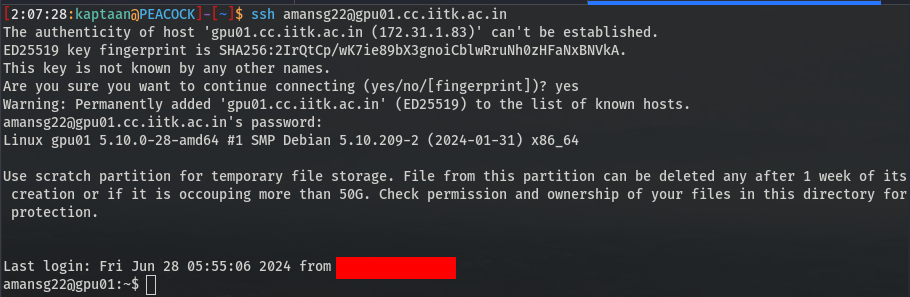
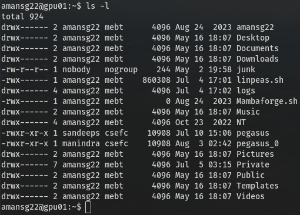
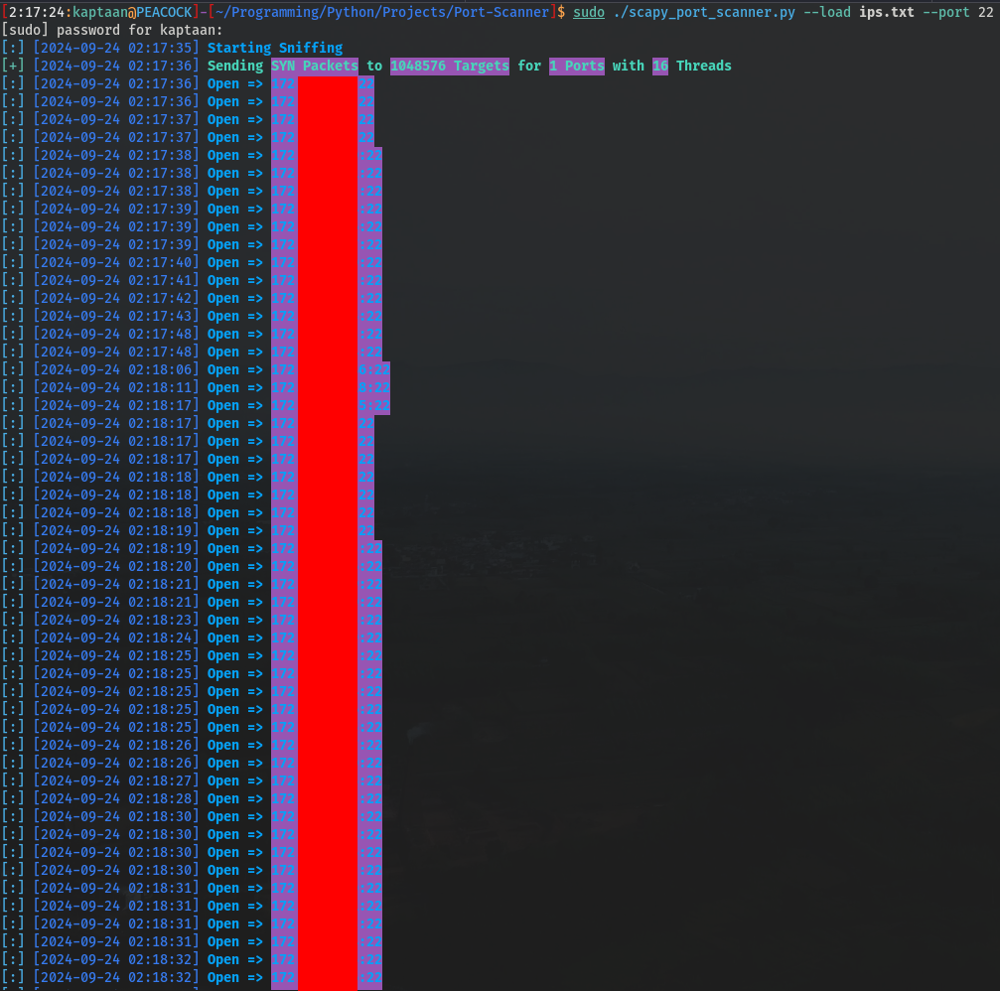
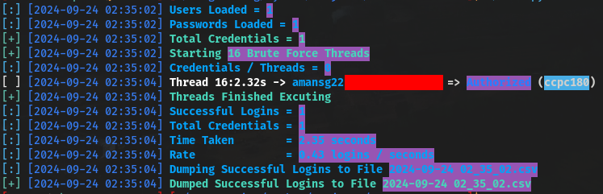
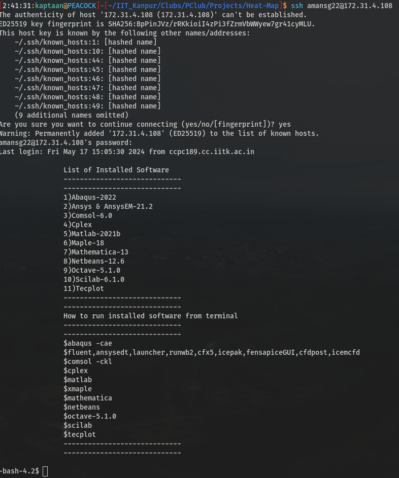
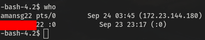
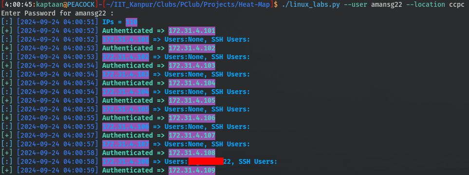
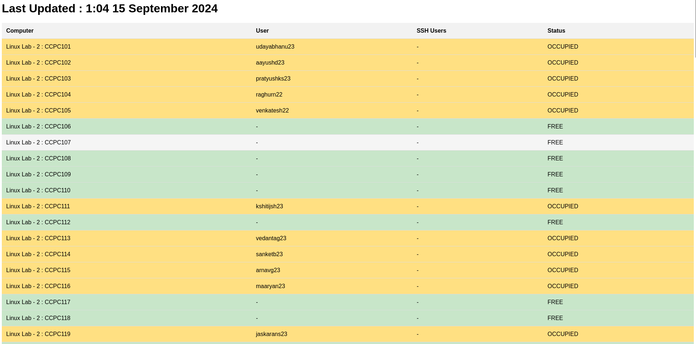

## SSH Services at IIT Kanpur
IIT Kanpur's network uses Class B private IP addresses. Within this private network, students, faculty and staff can SSH into various servers using their Computer Center credentials to access different services. Examples of such servers include the GPU server, APP server, and MATH server. 
 
Each user has a 2GB directory on the Computer Center's NFS (Network File System), which is mounted on all servers. This allows users to access their files across multiple servers without needing to copy them to each one, reducing the need for additional storage on individual servers.  

## Port Scan of whole Private Network
I couldn’t find a complete list of servers supporting SSH authentication with our Computer Center credentials and was eager to discover all the servers users could SSH into. 
So, I conducted a port scan of IIT Kanpur's entire private network for port 22 (SSH) using [Gill-Singh-A/Port-Scanner](https://github.com/Gill-Singh-A/Port-Scanner.git) and identified around 4,000 devices with the port open.  

## Brute Forcing SSH Servers
The next task was to identify the servers where we could authenticate using our Computer Center credentials. 
To accomplish this, I used the tool [Gill-Singh-A/SSH-Brute-Force](https://github.com/Gill-Singh-A/SSH-Brute-Force.git) 
 
After getting the Results, I got some interesting results.
## Linux Lab IPs
I discovered 110 consecutive IP addresses, and upon gathering more information, I learned that these belonged to the Computer Center's Linux Lab 2 and 3. 
 
## Users currently logged in the Computer
After that, I accessed the computer using my user ID via SSH.  
To check the currently logged-in users, I entered the command **who** 
 
This command allowed me to see both users logged in through SSH (indicated by their IP addresses) and those who were logged in offline (identified by the DISPLAY index, which starts with *:*) with their login time.
## Building the Heat Map
After identifying the users on specific computers in Computer Center Linux Lab 2 and 3, it was time to create the heat map. 
I compiled a CSV file containing the IP addresses and locations of the computers, then developed a Python program to automate the process of checking user activity on each machine and display the results. 
 
The program presents the results on the user's [IITK Homepage](https://home.iitk.ac.in) that was used in the program. 

## Results
The Final Python Program used  to create the Heat Map for Linux Computer Labs at IIT Kanpur is [Gill-Singh-A/IITK-Heat-Map](https://github.com/Gill-Singh-A/IITK-Heat-Map) 
It displays the results on [My Student Homepage](https://home.iitk.ac.in/~amansg22/) for the following Labs:
* Computer Center Linux Labs
* NCL Linux Lab
<!-- -->
In my opinion, this tool is particularly useful for students during exams, as it helps save time by allowing them to see in advance if a computer lab is full before heading there. 