# Compromising CCTVs 101
## RTSP Protocol
RTSP Protocol stands for *Real Time Streaming Protocol* and by default runs on *Port 554*. As the name tells, its an application level protocol designed to transport streams over a network and is commonly used by Devices like CCTVs. The RTSP Protocol doesn't offer encryption, therefore everything is transparent to an Attacker eavesdropping on the Network Traffic of a Device using RTSP. We won't cover MITM (Man-in-the-Middle) Attacks and other eavesdropping methods in this blogs, rather will focus on gaining direct access to CCTVs.
## Information Gathering
### Collecting IP Addresses of CCTVs
There are several ways of collecting IP Addresses of CCTVs, We'll cover the most common ones:
* Shodan
* Google Dorking
* Port Scanning
#### Shodan
On [Shodan Search Engine](https://www.shodan.io), search with query *port:554 RTSP*. This would list out all the Devices that have Port 554 Open found by Shodan with *RTSP* in their banner. Most of them will be CCTVs.
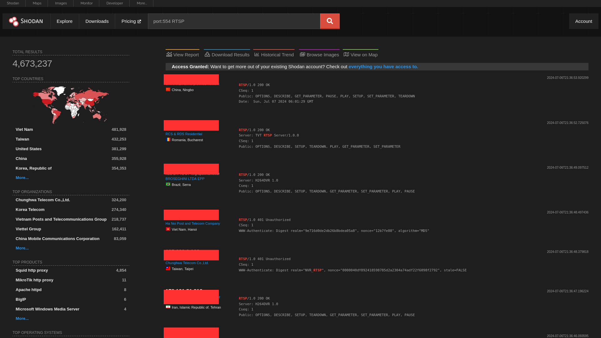<br />
We can even filter out more on various basis, for example location (country, city, etc)<br />
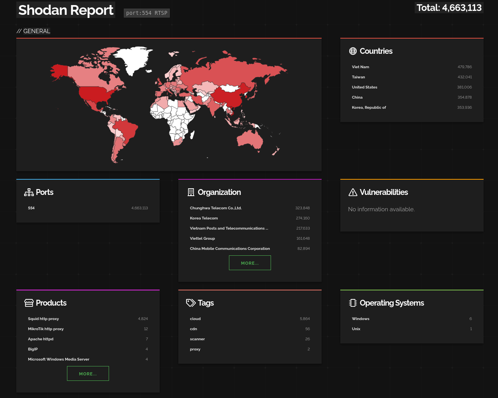<br />
Or if we want to find CCTVs that have no authentication, we can provide the filter *has_screenshot:true*.<br />
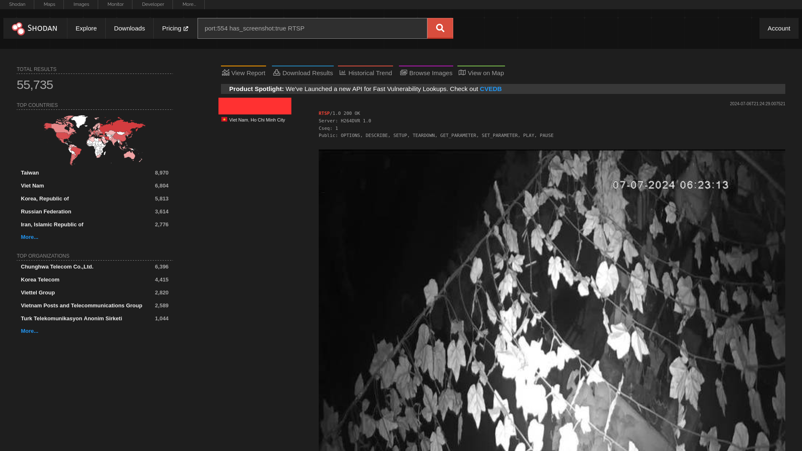<br/>
After setting the requeired filters, we can download the results.<br />
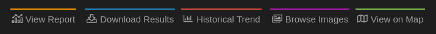<br />
The Number of Results that can be downloaded depends upon your query credits available(1 Query Credit = 100 Results)<br />
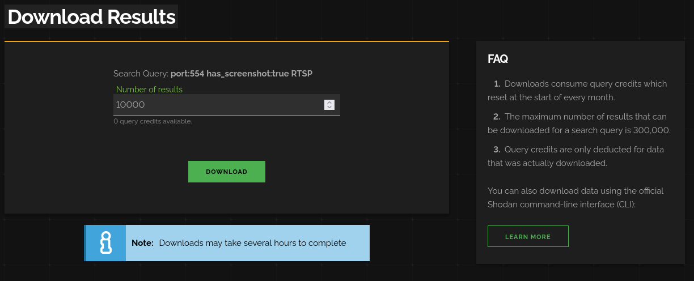<br />
After Shodan has done compiling the data, it sends us a Mail that *Data is ready for Download* or we can alernatively wait on [Shodan Download Page](https://www.shodan.io/download) while the data is being compiled<br />
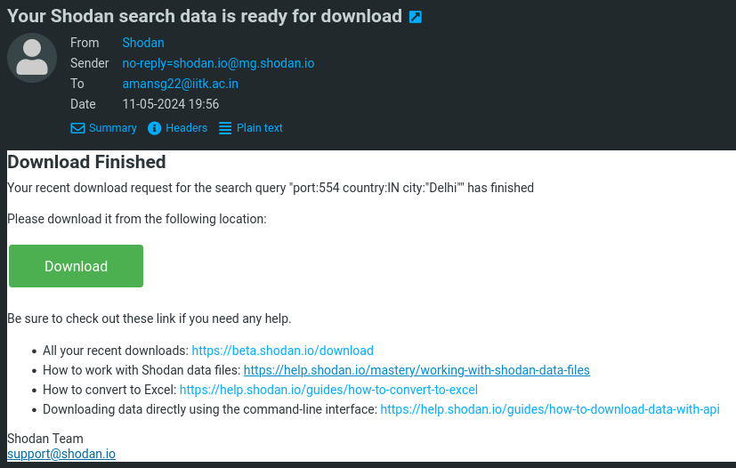<br />
The Download will be in the format *.json.gz*. Shodan provides a Command-Line Utility to Parse the data in these download files.<br />
The utility can be installed with the command
```bash
pip install shodan
```
The IP Addresses from the downloaded file can be extracted with the following command
```bash
shodan parse --fields ip_str {file_name}.json.gz
```
To save the IP Addresses to a file, simply redirect the output of the command
```bash
shodan parse --fields ip_str {file_name}.json.gz > {file_name_to_save_ip_addresses_to}
```
I sometimes manually filterout some IPs by running a port scan, because sometimes the information provided by Shodan for some Devices is outdated.
#### Google Dorking
Here is the Google Dorks that I use for finding CCTVs
```
inurl:"view/index.shtml"
inurl:"MultiCameraFrame?Mode=Motion"
VB Viewer inurl:/viewer/live/ja/live.html
intitle:"IP CAMERA Viewer" intext:"setting | Client setting"
intitle:"Device(" AND intext:"Network Camera" AND "language:" AND "Password"
intitle:"webcam 7" inurl:'/gallery.html'
intitle:"Yawcam" inurl:8081
inurl:control/camerainfo
intitle:"webcamXP 5" -download
inurl:"/view/view.shtml?id="
inurl:/view/viewer_index.shtml
intext:"powered by webcamXP 5"
intitle:webcam 7 inurl:8080 -intext:8080
intitle:"Live View / - AXIS" | inurl:view/view.shtml OR inurl:view/indexFrame.shtml | intitle:"MJPG Live Demo" | "intext:Select preset position"
allintitle: Axis 2.10 OR 2.12 OR 2.30 OR 2.31 OR 2.32 OR 2.33 OR 2.34 OR 2.40 OR 2.42 OR 2.43 "Network Camera"
allintitle:Edr1680 remote viewer
allintitle: EverFocus | EDSR | EDSE400 Applet
allintitle: EDR1600 login | Welcome
intitle:"BlueNet Video Viewer"
intitle:"SNC-RZ30" -demo
inurl:cgi-bin/guestimage.html
(intitle:(EyeSpyFX|OptiCamFX)) "go to camera")|(inurl:servlet/DetectBrowser)
intitle:"Veo Observer XT" - inurl:shtml|pl|php|htm|asp|aspx|pdf|cfm - intext:observer
intitle:"iGuard Fingerprint Security System"
(intitle:MOBOTIX intitle:PDAS) | (intitle:MOBOTX intitle:Seiten) | (inurl:/pda/index.html +camera)
intitle:"Edr1680 remote viewer"
intitle:"NetCam Live Image" -.edu -.gov -johnny.ihackstuff.com
intitle:"INTELLINET" intitle:"IP Camera Homepage"
intitle:"WEBDVR" -inurl:product -inurl:demo
intitle:"Middle frame of Videoconference Management System" ext:htm
tilt intitle:"Live View / - AXIS" | inurl:view/view.shtml
intitle:"AXIS 240 Camera Server" intext:"server push" -help
intitle:"--- VIDEO WEB SERVER ---" intext:"Video Web Server" "Any time & Any where" username password
intitle:HomeSeer.Web.Control | Home.Status.Events.Log
inurl:camctrl.cgi
intitle:"supervisioncam protocol"
intitle"active webcame page"
```
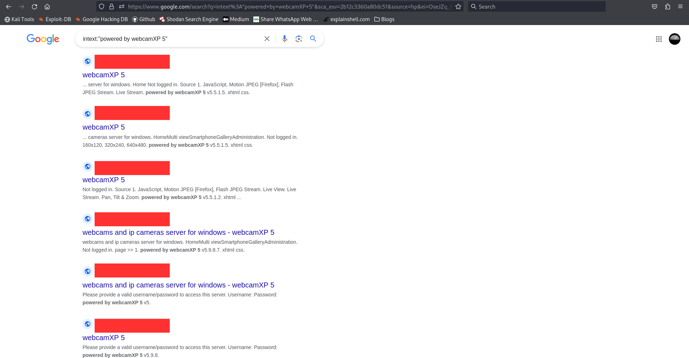
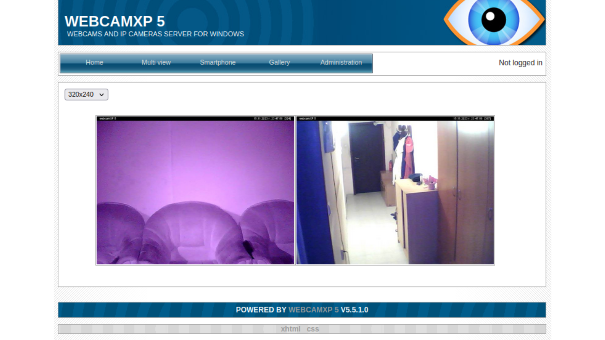
We won't cover much of the dorking part, because it is painful to extract the links from a google search queries and the other 2 mentioned methods work well for our purporse.
#### Port Scanning
Instead of using Shodan for getting Devices with a open port, we can manually scan for open ports. This is the method that should be opted for collecting IP Addresses of CCTVs on a Local/Corporate Network. We can use Port Scanning tools like [nmap](https://nmap.org/), [unicornscan](https://www.kali.org/tools/unicornscan/), etc. For scanning a Large Subdomain/Large Number of Devices I'd prefer using *unicornscan* tool, because it sends all the *SYN Packets* without waiting for responses and starts a sniffer which looks for *SYN-ACK Packets* to determine which Device has an open port, making it faster than *nmap*.<br />
In the following example of port scan, I've used [Gill-Singh-A/Port-Scanner](https://github.com/Gill-Singh-A/Port-Scanner). In this repository *port_scanner.py* sends the *SYN Packet*, waits for the *SYN-ACK Packets* and then completes the TCP Handshake by sending the *ACK* Packet and finally closes the connection by sending *FIN Packet* making it a slow scanner. The *scapy_port_scanner.py* (used in the following example) is somewhat based on the *unicornscan tool* and is faster than *port_scanner.py*.<br />
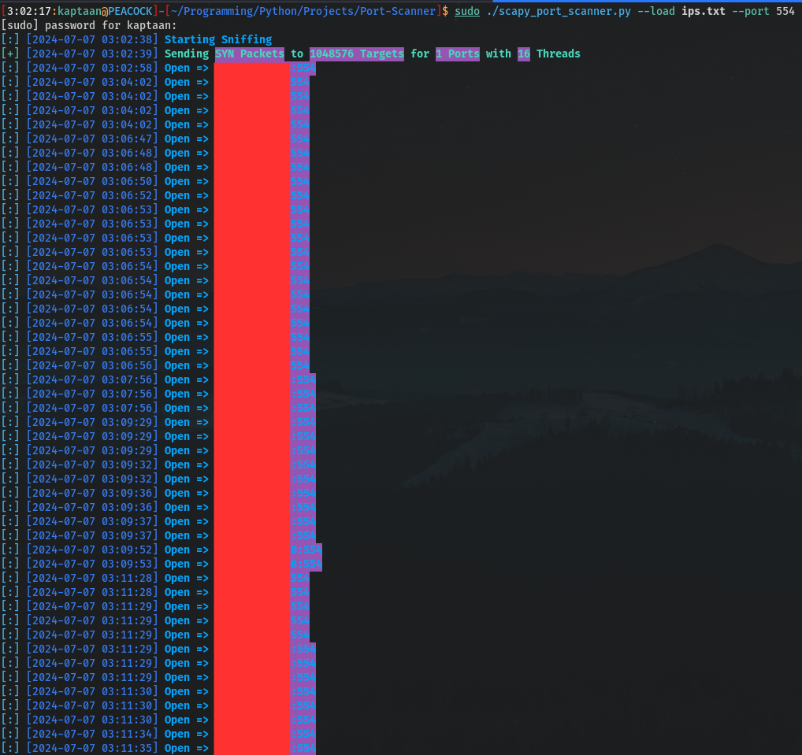<br />
### Compiling a suitable Wordlist for Brute-Force
We can make a wordlist by looking for Default Credentials for various CCTV Vendors, Weak Credentials and credentials present in [SecLists](https://github.com/danielmiessler/SecLists).<br />
Here, I won’t disclose more information about the wordlists that I use.
## Brute Force
After Collecting the IP Address, Port and Credentials, we're ready to do a Brute-Force attack on the Devices.<br />
I use [Gill-Singh-A/RTSP-Brute-Force](https://github.com/Gill-Singh-A/RTSP-Brute-Force), it is a Program written in python that uses OpenCV to brute force the CCTVs and uses multithreading module to parallelize the brute force tasks. We can also redirect the Error output by OpenCv by using the error redirected to Null *2>/dev/null* at the end of the command.<br />
Here in the following exampe, I've run the program and also opened the Stream in [VLC Media Player](https://www.videolan.org/vlc/) of the CCTV that it gained access to.<br />
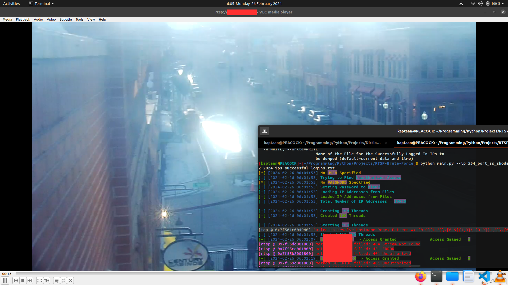<br />
We can further more Geolocate the IP Addresses using [Gill-Singh-A/IP-Location](https://github.com/Gill-Singh-A/IP-Location) to get an approximate location of the Devices (although it may not always be correct)<br />
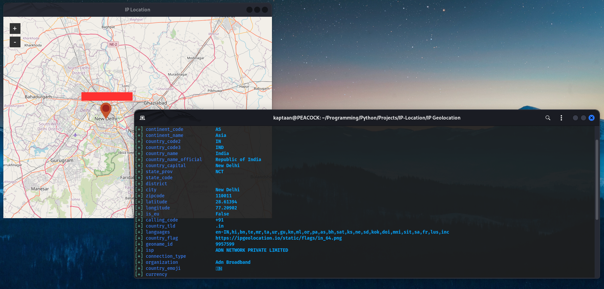
We can now even open the Admin Panel of the CCTV using the Browser and can manipulate crucial settings, backup storage and more.
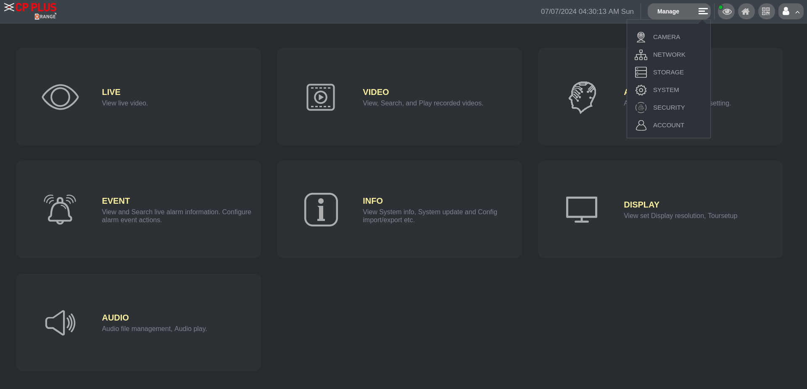
## DOS
We can also do a DOS (Denial-of-Service) attack on the CCTV Device to interrupt the live stream. We can use various tools to do a DOS Attack like [Gill-Singh-A/SYN-Flood-Attack](https://github.com/Gill-Singh-A/SYN-Flood-Attack), [GoldenEye](https://www.kali.org/tools/goldeneye/), etc<br />
But I prefer using the *hping* tool to do SYN Flood Attack because its more effective.

## Mitigations
In this blog we saw that how easy it was to gain access to a CCTV that was misconfigured (exposed to internet, using weak credentials) in several ways.<br />
To avoid getting your CCTV Device compromised, you should take the following steps:
* Make sure that a CCTV Device on your Local Network is not exposed to the Internet
* Not using Default/Weak Credentials
* Setting up Proper Firewall Rules
* Keeping the Software/Firmware up to date, to avoid any CVEs present in the device that could be exploited
### Note
The Above mentioned points doesn't Guarantee 100% protection, they only enhance the security
## Checking Leaked Passwords
There are several websites you can use to check whether the password that you're using has been leaked somewhere online or not. Here are some popular ones:
* [Have I Been Pwned](https://haveibeenpwned.com/): Check if your email or phone is in a data breach
* [Dehashed](https://www.dehashed.com/): Free deep-web scans and protection against credential leaks
* [LeakCheck.io](https://leakcheck.io/): Make sure your credentials haven't been compromised
* [crackstation.net](https://crackstation.net/): Massive pre-computed lookup tables to crack password hashes
* [HashKiller](https://hashkiller.io/listmanager): Pre-cracked Hashes, easily searchable
* [LeakedPassword](https://leakedpassword.com/): Search across multiple data breaches to see if your pass has been compromised
* [BugMeNot](https://bugmenot.com/): Find and share logins
<!-- -->
Source: [edoardottt/awesome-hacker-search-engines](https://github.com/edoardottt/awesome-hacker-search-engines)