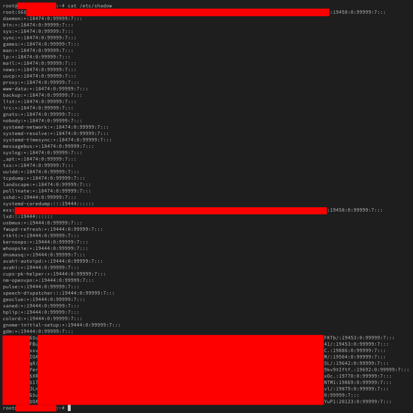
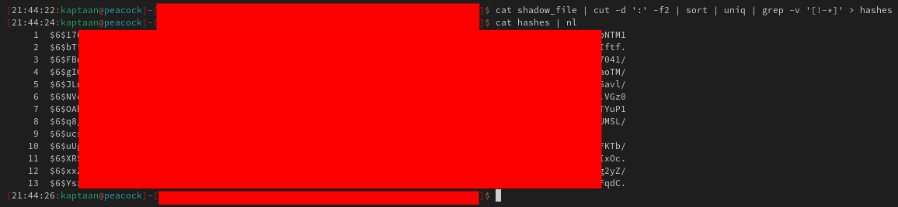
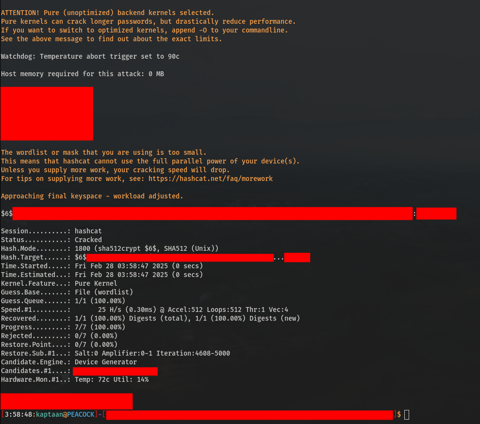
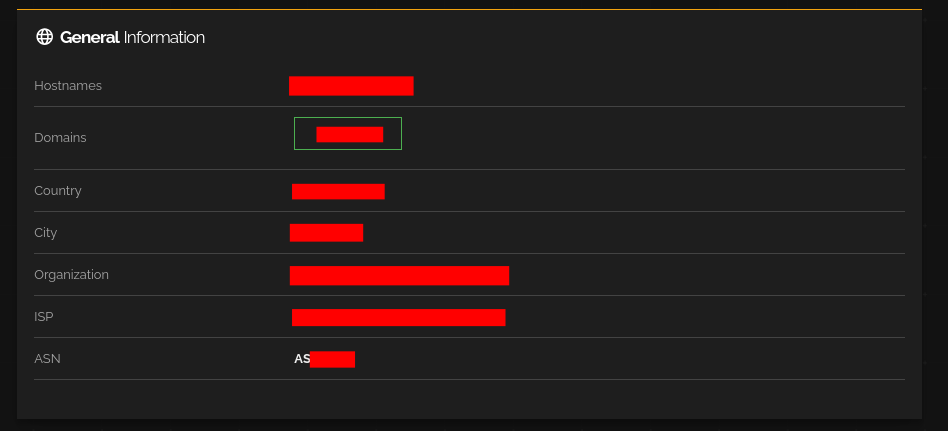
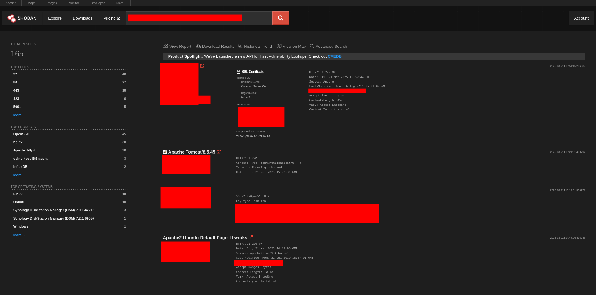
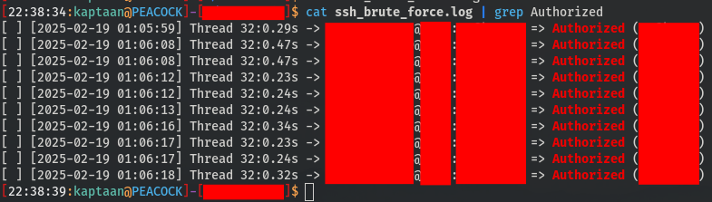
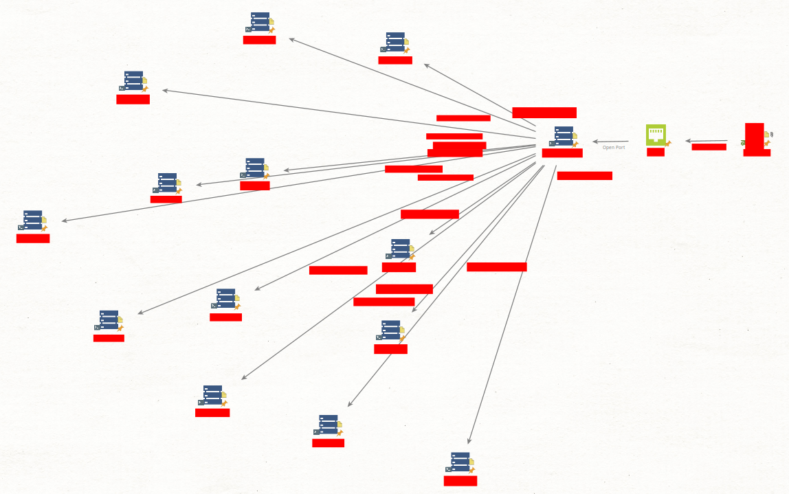

## Initial Entry Point
During a routine exploration of vulnerable servers on the internet, I successfully gained root access to several machines. While the specific method used to achieve root access is beyond the scope of this blog, I’ll focus on how I expanded my access to other servers within the same organization.
## Extracting Linux User Hashes
Once inside the compromised machine, I noticed multiple user accounts. With root privileges, I accessed the */etc/shadow* file, which stores password hashes for all users on the system.<br />
<br />
I copied the contents of the shadow file to my local machine and extracted the hashes using the following command:
```bash
cat shadow_file | cut -d ':' -f2 | sort | uniq | grep -v '[!-*]' > hashes
```
<br />
This command isolates the hashes, removes unnecessary characters, and saves them to a file named `hashes`.
## Identifying the Hash Type
The next step was to determine the type of hash used. I referenced [Hashcat’s Example Hashes](https://hashcat.net/wiki/doku.php?id=example_hashes) to identify the hash format. In this case, the hashes were of type **sha512crypt**, which includes salting for added security.
## Selecting a Wordlist
> "Hacking is about patience. If you rush, you lose. If you’re too slow, you lose. Timing is everything." - Mr. Robot
<!-- -->
With the hash type identified, I needed a suitable wordlist for a dictionary attack. Given the presence of salting, using an excessively large wordlist would be inefficient. I opted for the [rockyou](https://github.com/danielmiessler/SecLists/blob/master/Passwords/Leaked-Databases/rockyou.txt.tar.gz) wordlist, a popular choice for password cracking due to its manageable size and effectiveness. You can explore other useful wordlists on platforms like [SecLists](https://github.com/danielmiessler/SecLists) and [WeakPass](https://weakpass.com/).<br />
For more advanced scenarios, tools like [CUPP (Common User Passwords Profiler)](https://github.com/Mebus/cupp) can generate custom wordlists tailored to specific users or organizations. Additionally, leveraging GPU resources can significantly speed up the cracking process. For a deeper dive into password cracking techniques, check out this [Password Cracking Blog](https://gill-singh-a.github.io/p/password-cracking/).
## Cracking the Hashes
I used **Hashcat**, a powerful password-cracking tool, to crack the extracted hashes. The command I used was:
```bash
hashcat -a 0 -m 1800 path_to_hashes_file path_to_wordlist
```
### Explanation of Arguments:
- `-a 0`: Specifies a dictionary attack.
- `-m 1800`: Indicates the hash type (sha512crypt).
<!-- -->
After running the command, Hashcat successfully cracked two of the hashes. Below is an example of one of the cracked hashes:<br />

## Discovering Additional Machines
With the cracked credentials in hand, my next goal was to identify other machines within the same organization. I began by gathering information about the compromised server’s owner or organization. Using tools like **Shodan**, I extracted details such as the organization name, ISP (Internet Service Provider), ASN (Autonomous System Number), and subnet associated with the server’s IP address.<br />
<br />
Using this information, I filtered Shodan search results to compile a list of IP addresses belonging to the same organization, ISP, or subnet.<br />

## Gaining Access to Other Machines
>  "Credentials are the keys to the kingdom. Once you have them, you can go anywhere." - Mr. Robot
<!-- -->
Armed with a list of IP addresses and valid credentials, I launched a SSH brute-force attack using the [Gill-Singh-A/SSH-Brute-Force](https://github.com/Gill-Singh-A/SSH-Brute-Force) tool. This allowed me to authenticate successfully on several other machines within the organization.<br />

## Attack Path Visualization
Below is a visual representation of the attack path, created using [Maltego](https://www.maltego.com/):<br />

## Conclusion
This exercise highlights how a single compromised machine can serve as a gateway to an entire network. By extracting and cracking Linux user hashes, identifying related machines using Shodan, and leveraging brute-force techniques, I was able to expand my access across multiple servers within the organization.
## Mitigations
To prevent such attacks, organizations should implement the following security measures:
1. **Strong Password Policies**: Enforce the use of complex, unique passwords and mandate regular password changes.
2. **Multi-Factor Authentication (MFA)**: Implement MFA for SSH and other critical services to add an extra layer of security.
3. **Regular Audits**: Conduct regular security audits to identify and address vulnerabilities, including weak passwords and misconfigurations.
4. **Limit SSH Access**: Restrict SSH access to specific IP addresses or networks and disable root login.
5. **Monitor Logs**: Continuously monitor system logs for suspicious activity, such as repeated failed login attempts.
6. **Patch Management**: Keep all systems and software up to date with the latest security patches.
7. **Network Segmentation**: Segment networks to limit lateral movement in case of a breach.
8. **Educate Users**: Train employees and system administrators on security best practices, including password hygiene and phishing awareness.
<!-- -->
By adopting these measures, organizations can significantly reduce the risk of unauthorized access and lateral movement within their networks.