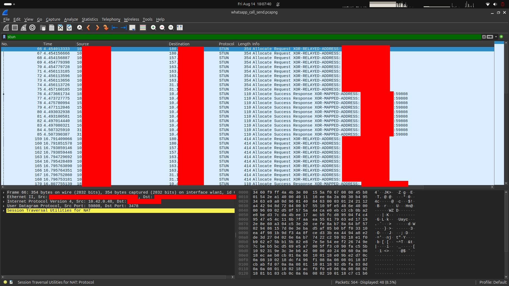
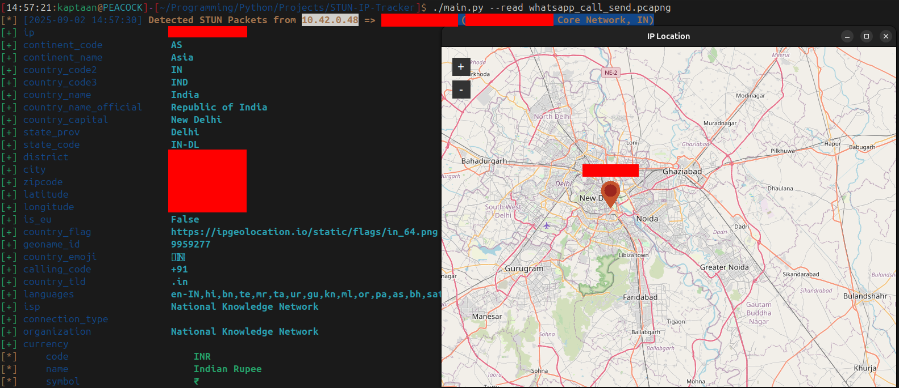
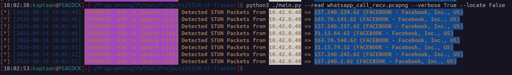
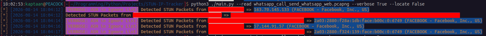
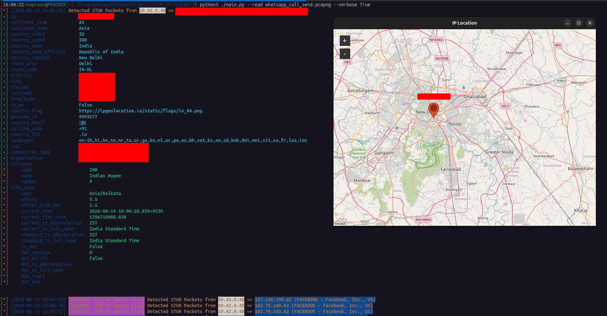
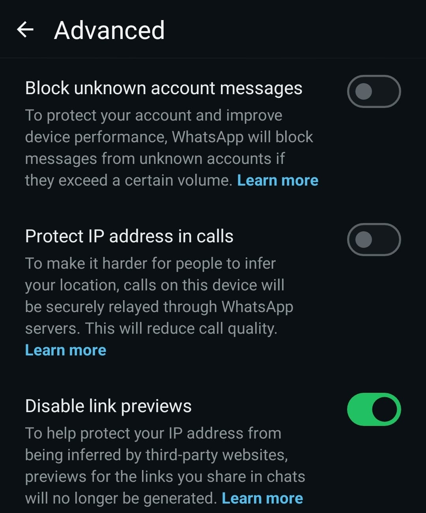

# Every Call Leaves a Trail - Extracting IP Addresses and Locations from WhatsApp Calls
In this blog, I'll walk through how the **STUN protocol** and **WebRTC** can expose a caller's real IP address during a WhatsApp call, and how I built a tool that captures STUN packets to extract and geolocate the other participant's IP in real time.

The idea for this came from reading [**Analyzing WhatsApp Calls**](https://medium.com/@schirrmacher/analyzing-whatsapp-calls-176a9e776213) by [Schirrmacher](https://medium.com/@schirrmacher), which breaks down the network-level behavior and low level workings of WhatsApp calls. That analysis made me want to build something that automates the entire process: from packet capture to IP extraction to geolocation, all in one tool.

## Prologue
> **"People tell you who they are all the time. You just have to listen."**
> *- Mr. Robot*

<!-- -->

Every time you place a WhatsApp call, your device quietly reaches out to the other person's device and introduces itself: here's my IP address, here's my port, let's talk directly. This handshake happens before a single word is spoken, before the first frame of video is rendered, and before most users even realize the call has connected. It's not a bug, it's how the protocol was designed. The same mechanism that makes your calls fast and clear is the one that tells the other side exactly where you are.

## What is WebRTC?

**WebRTC (Web Real-Time Communication)** is an open-source framework that enables **real-time audio, video, and data exchange directly between browsers and devices** without requiring plugins, intermediary servers, or additional software. It was originally developed by Google and standardized by the W3C and IETF.

WebRTC is the backbone of virtually every modern communication application. When you make a voice or video call on WhatsApp, Google Meet, Discord, Facebook Messenger, Signal, Telegram, or Microsoft Teams, WebRTC is what's moving the audio and video between devices.

### Why P2P?

The core design goal of WebRTC is to establish **Peer-to-Peer (P2P) connections** wherever possible. Instead of routing audio and video through a central server (which adds latency, bandwidth costs, and a single point of failure), WebRTC attempts to build the **most direct path** between two devices. The result is lower latency, better call quality, and reduced infrastructure costs for the service provider.

But there's a fundamental problem: most devices on the internet don't have public IP addresses. They sit behind **NAT (Network Address Translation)** routers, firewalls, and gateways that hide their private IP addresses from the outside world. A device behind NAT knows its own private IP (like `192.168.1.5`), but the rest of the internet sees the NAT router's public IP (like `203.x.x.x`). For P2P to work, both devices need to discover their **public-facing IP address and port mapping**, and that's where STUN comes in.

## What is NAT?

**NAT (Network Address Translation)** is a technique used by routers to map multiple private IP addresses to a single public IP address. Almost every home and mobile network uses NAT. When your phone sends a packet to the internet, the NAT router rewrites the source address from your private IP to its own public IP, keeps a mapping table to route replies back to you, and from the outside, only the router's public IP is visible.

This is efficient and provides a basic layer of obscurity, but it creates a problem for P2P communication: if both Alice and Bob are behind NAT, neither knows the other's public IP and port. They can't send packets to each other directly because their routers haven't established a mapping for incoming traffic from the other side. They need a way to discover their own public-facing address and punch through the NAT.

## What is STUN?

**STUN (Session Traversal Utilities for NAT)**, defined in [**RFC 5389**](https://datatracker.ietf.org/doc/html/rfc5389), is a protocol that allows a device behind NAT to discover its **public IP address and port number** as seen from the outside internet.

### How STUN Works

The process is straightforward:

1. **Alice's device** sends a **STUN Binding Request** to a **STUN server** on the public internet.
2. The STUN server receives the request and inspects the source IP and port of the incoming packet, which is the NAT router's public IP and the port the router assigned for this connection.
3. The STUN server responds with a **STUN Binding Response** containing Alice's **public IP address and port** (the "reflexive transport address").
4. Alice's device now knows its own public-facing address and can share it with Bob (through a signaling server) so Bob can send packets directly to it.

This is called **NAT traversal**. Once both peers know each other's public IP and port, they can attempt to send packets directly to each other, punching through both NAT routers.

### ICE: Putting It All Together

WebRTC doesn't just blindly use STUN. It uses a framework called **ICE (Interactive Connectivity Establishment)** that gathers multiple **candidates** (possible network paths) and tests them to find the best connection:

- **Host candidates:** The device's local/private IP addresses.
- **Server-reflexive candidates:** The public IP and port discovered via STUN.
- **Relay candidates:** A fallback path through a **TURN (Traversal Using Relays around NAT)** server when direct P2P fails.

ICE tests all candidates and selects the one with the lowest latency and best connectivity. In most cases, the **server-reflexive candidate** (discovered via STUN) wins, and the call proceeds over a **direct P2P connection** using the public IPs of both participants.

## How WebRTC and STUN Operate Over WAN

The following diagram shows the complete flow of a WebRTC call setup between two devices behind NAT, from STUN discovery through to the direct P2P media stream:

```
                              PUBLIC INTERNET
                                    |
                            +-----------------+
                            |   STUN Server   |
                            |  (stun.xyz.com) |
                            +-----------------+
                             /                \
              1. Binding   /                    \   1. Binding
                Request  /                        \   Request
                       /                            \
                     v                                v
          +------------------+              +------------------+
          |  Alice's NAT     |              |  Bob's NAT       |
          |  Router          |              |  Router          |
          |  Public IP:      |              |  Public IP:      |
          |  203.0.113.10    |              |  82.45.67.89     |
          +------------------+              +------------------+
                  |                                  |
    2. Response:  |                                  |  2. Response:
    "Your IP is   |                                  |  "Your IP is
    203.0.113.10  |                                  |  82.45.67.89
    port 54321"   |                                  |  port 12345"
                  |                                  |
          +------------------+              +------------------+
          |  Alice's Phone   |              |  Bob's Phone     |
          |  Private IP:     |              |  Private IP:     |
          |  192.168.1.5     |              |  10.0.0.8        |
          +------------------+              +------------------+
                  |                                   |
                  |   3. Exchange candidates via      |
                  |      signaling server             |
                  |   (Alice learns Bob's public IP,  |
                  |    Bob learns Alice's public IP)  |
                  |                                   |
                  |   4. ICE connectivity checks      |
                  |      (STUN Binding Requests       |
                  |       sent directly between       |
                  |       public IPs)                 |
                  |                                   |
                  +<=================================>+
                     5. Direct P2P Media Stream
                        (Audio/Video via SRTP)
                     Alice: 203.0.113.10:54321
                        <---->
                     Bob:   82.45.67.89:12345
```

**Step 1-2:** Both devices query the STUN server to discover their public IP and port.<br />
**Step 3:** The discovered addresses (ICE candidates) are exchanged through a signaling server (WhatsApp's servers, in this case).<br />
**Step 4:** Both devices send STUN Binding Requests directly to each other's public IPs to verify connectivity and punch through NAT.<br />
**Step 5:** Once connectivity is confirmed, the actual media stream (encrypted audio/video) flows directly between the two public IPs. No server in the middle.

**This is the privacy problem.** In Step 4 and Step 5, both devices are sending packets directly to each other's public IP addresses. Anyone who can capture packets on either end of the connection can see both IPs in the packet headers.

Opening one of the captured `.pcapng` files in **Wireshark** and filtering for `stun` makes this immediately visible. The STUN Binding Requests and Responses carry the source and destination IP addresses in plain sight:<br />
<br />

## What Happens When P2P Fails? TURN Relays

Sometimes NAT is too restrictive (symmetric NAT, strict firewalls) and the direct P2P connection fails. In that case, ICE falls back to a **TURN (Traversal Using Relays around NAT)** server. The TURN server acts as a relay: both devices send their media to the TURN server, and the server forwards it to the other side.

When a TURN relay is used, the participants' IP addresses are **not exposed to each other**, only to the TURN server operator (in WhatsApp's case, Meta). WhatsApp's **"Protect IP address in calls"** setting forces all calls through TURN relays, trading call quality for privacy.

## Applications That Use STUN/WebRTC

This isn't a WhatsApp-specific issue. **Any application that uses WebRTC or STUN for P2P connections can expose IP addresses the same way:**

- **WhatsApp** (1:1 calls use P2P by default)
- **Google Meet / Google Duo**
- **Discord** (voice channels and video calls)
- **Facebook Messenger** (voice and video)
- **Signal** (1:1 calls)
- **Telegram** (1:1 voice calls)
- **Microsoft Teams** (P2P in certain configurations)
- **Slack** (huddles and calls)
- **WebRTC-based browser applications** (Jitsi Meet, BigBlueButton, etc.)

The underlying protocol is the same. If the application uses STUN for NAT traversal, the same technique applies.

## Building the STUN IP Tracker

With the theory understood, I built [**Gill-Singh-A/STUN-IP-Tracker**](https://github.com/Gill-Singh-A/STUN-IP-Tracker), a Python tool that captures network traffic, filters for STUN packets, extracts the IP addresses involved, performs ASN lookups to filter out relay servers (like Facebook/Meta's infrastructure), and geolocates the remaining IPs to reveal the other participant's approximate location.

### How the Tool Works on LAN

The following diagram shows how the tool operates when running on the same local network as the calling device:

```
                   INTERNET
                      |
            +-------------------+
            |    NAT Router     |
            | Public: 203.x.x.x |
            +-------------------+
                      |
        +-------------+--------------+
        |        LAN (192.168.x.x)   |
        |                            |
  +----------+              +-----------------+
  | Phone    |              | Attacker's PC   |
  | making   |  Wi-Fi /     | running         |
  | WhatsApp |  Ethernet    | STUN IP Tracker |
  | call     |              |                 |
  +----------+              +-----------------+
        |                            |
        |    STUN packets flow       |
        |    through the LAN         |
        |    to/from the router      |
        |                            |
        |   +------------------------+
        |   | Tool captures packets  |
        |   | on network interface   |
        |   +------------------------+
        |              |
        |   +------------------------+
        |   | Filters for STUN       |
        |   | protocol packets       |
        |   +------------------------+
        |              |
        |   +------------------------+
        |   | Extracts src/dst IPs   |
        |   | from STUN packets      |
        |   +------------------------+
        |              |
        |   +------------------------+
        |   | ASN lookup (ipwhois)   |
        |   | Filters out relay IPs  |
        |   | (e.g., FACEBOOK ASN)   |
        |   +------------------------+
        |              |
        |   +------------------------+
        |   | Geolocates remaining   |
        |   | IPs and plots on map   |
        |   +------------------------+
        |              |
        |              v
        |   +------------------------+
        |   | OUTPUT:                |
        |   | Bob's IP: 82.45.67.89  |
        |   | ISP: BT Broadband      |
        |   | Location: London, UK   |
        |   +------------------------+
```

The tool can run in two modes:
- **Live capture** (requires root): Sniffs packets on a network interface in real time using `pyshark` (a Python wrapper around `tshark`/Wireshark).
- **File read**: Reads a previously captured `.pcap`/`.pcapng` file for offline analysis.

For live capture, the attacker needs to be on the **same LAN segment** as the calling device, or have the ability to capture traffic on the network (e.g., via a mirror/span port, ARP spoofing, or running the tool directly on the gateway).

## Testing on WhatsApp Calls

I tested the tool on three scenarios using WhatsApp, capturing the traffic into `.pcapng` files for analysis.

One important thing to note: **you don't need to pick up the call** for the IP and location to be exposed. The STUN exchange happens during the call setup phase, before the call is even answered. Whether you're the one calling or receiving, and whether the call is answered, declined, or left ringing, the STUN packets have already been sent. The IP addresses are exposed the moment the call is initiated.

### Scenario 1: Outgoing WhatsApp Call (Mobile)

I placed a WhatsApp call from my phone while running the tool on my machine on the same Wi-Fi network.
```bash
python3 main.py -r whatsapp_call_send.pcapng -v True
```
<br />
The tool detected multiple STUN packets. After filtering out the FACEBOOK ASN IPs (WhatsApp's relay infrastructure), one IP address remained: **180.149.52.99**, belonging to **NKN-CORE-NW (NKN Core Network, IN)**. This was the other participant's public IP address, exposed through the direct P2P connection.

### Scenario 2: Incoming WhatsApp Call (Mobile)

I received a WhatsApp call from a contact who had **"Protect IP address in calls"** enabled, routing all traffic through WhatsApp's TURN relay servers.
```bash
python3 main.py -r whatsapp_call_recv.pcapng -v True
```
<br />
The tool found 8 unique IPs involved in STUN packets, but **every single one** belonged to the **FACEBOOK** ASN. No non-relay IPs were detected. This is exactly what happens when the relay protection is enabled: the caller's real IP never appears in the STUN traffic, only Meta's relay servers do.

### Scenario 3: Outgoing WhatsApp Call via WhatsApp Web

I placed a WhatsApp call from **WhatsApp Web** on my laptop, which is directly on the network being captured.
```bash
python3 main.py -r whatsapp_call_send_whatsapp_web.pcapng -v True
```
<br />
This time, the tool detected STUN packets over **IPv6**. After filtering out the FACEBOOK ASN, the remaining IP was an **IPv6 address** belonging to **RELIANCEJIO-IN (Reliance Jio Infocomm Limited, IN)**, the other participant's mobile carrier. The tool correctly handles both IPv4 and IPv6 STUN traffic.

### IP Geolocation

When the `--locate` flag is enabled (the default), the tool queries a geolocation API for each discovered IP and plots the results on an interactive map using `tkintermapview`:<br />
<br />

## Attack Path
The full chain, from a phone call to IP geolocation:
1. Place or receive a WhatsApp call (or any WebRTC-based call) on the target network.
2. Capture network traffic on the LAN using the [**STUN IP Tracker**](https://github.com/Gill-Singh-A/STUN-IP-Tracker) in live mode, or save a packet capture file for offline analysis.
3. The tool filters for **STUN protocol** packets in the captured traffic.
4. For each STUN packet, extract the **source and destination IP addresses**.
5. Perform an **ASN (Autonomous System Number) lookup** on each IP using `ipwhois`.
6. Filter out IPs belonging to known relay infrastructure (e.g., **FACEBOOK/Meta** ASN) using the `ignore_asn_names.txt` list.
7. The remaining IPs are the **real public IP addresses** of the call participants.
8. Geolocate the discovered IPs using an IP geolocation API to determine the **approximate city, region, ISP, and coordinates**.
9. Plot the locations on an interactive map.

## Mitigations
A VoIP call that leaks your IP address is a metadata exposure that can reveal your approximate location, ISP, and network. To protect against this:
- **Enable "Protect IP address in calls" on WhatsApp.** Go to **Settings -> Privacy -> Advanced -> Protect IP address in calls**. This forces all call traffic through WhatsApp's TURN relay servers, hiding your real IP from the other participant. The trade-off is slightly reduced call quality due to the extra hop.<br />
<br />
- **Use a VPN.** A VPN replaces your real public IP with the VPN server's IP in all outgoing traffic, including STUN requests. Even if the call uses P2P, the other side sees the VPN's IP, not yours.
- **Be aware that any WebRTC-based application can expose your IP.** This is not specific to WhatsApp. Check the privacy settings of every VoIP/video calling app you use.
- **For organizations:** Monitor STUN traffic on the network. Unusual volumes of STUN packets to non-standard servers can indicate unauthorized VoIP usage or reconnaissance.
- **For developers building WebRTC applications:** Default to TURN relay mode for privacy-sensitive use cases, and give users a clear opt-in for P2P (which exposes IPs but improves quality).

### Note
The above measures reduce risk significantly but do not guarantee 100% protection - defence in depth is the goal.

## Conclusion
WebRTC was built to make real-time communication fast and direct. STUN was built to make that direct connection possible despite NAT. Together, they work exactly as designed, and that design has a side effect: every direct call leaks the public IP addresses of both participants to anyone who can see the packets.

A single WhatsApp call, a few captured STUN packets, and you have someone's IP address, their ISP, and their approximate city. The encryption is irrelevant here, the content of the call is protected, but the metadata never was. Your call, your IP.

## References
* [RFC 5389 - STUN Protocol](https://datatracker.ietf.org/doc/html/rfc5389)
* [RFC 8656 - TURN Protocol](https://datatracker.ietf.org/doc/html/rfc8656)
* [WebRTC Official Site](https://webrtc.org/)
* [ICE - Interactive Connectivity Establishment (RFC 8445)](https://datatracker.ietf.org/doc/html/rfc8445)
* [NAT Traversal in P2P](https://en.wikipedia.org/wiki/NAT_traversal)
* [WhatsApp Security Whitepaper](https://www.whatsapp.com/security/)
* [Analyzing WhatsApp Calls with Wireshark, radare2 and Frida](https://medium.com/@schirrmacher/analyzing-whatsapp-calls-176a9e776213)
* [STUN IP Tracker - Gill-Singh-A (GitHub)](https://github.com/Gill-Singh-A/STUN-IP-Tracker)
