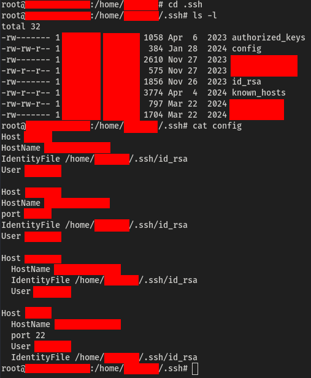
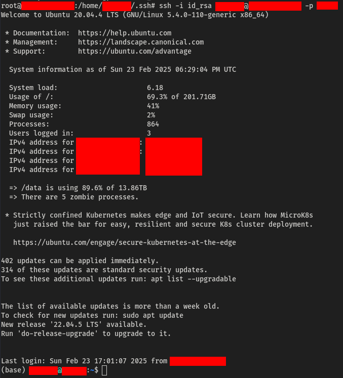
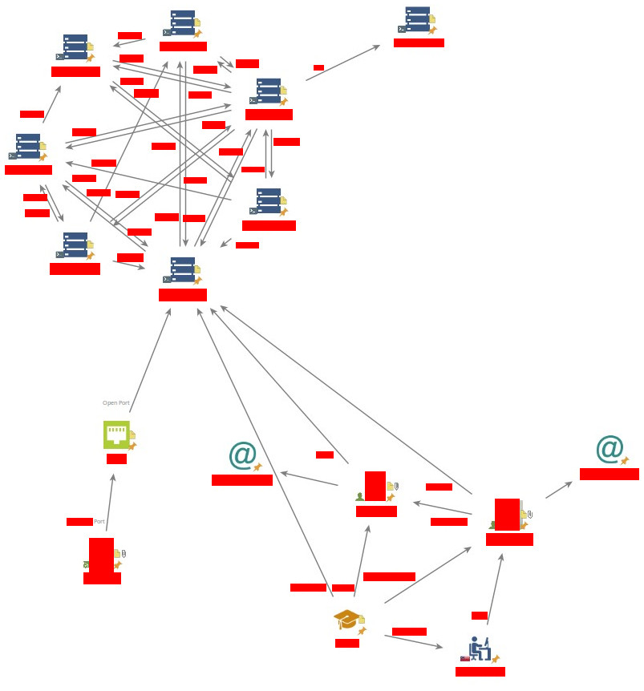

## Discovery of Vulnerable Machines
While investigating vulnerable, internet-facing systems, I successfully compromised several devices. Although the specific techniques I used to gain initial access fall outside the scope of this post, the real discovery came during my post-exploitation phase on one of the compromised machines.
## Discovering Vulnerable SSH Configurations
While reviewing the files on the compromised system, I stumbled upon something interesting in the `~/.ssh` directory of a particular user account. 
 
Within this directory, I found a private key file being used for SSH logins to other systems. My next step was to check whether the private key was encrypted.
## Unencrypted Private Key
>  “The thing about secrets is, once you know them, they change the way you see everything.”  - Irving, Mr. Robot
<!-- -->
To verify if the private key was encrypted, I attempted to use it to connect to a device listed in the SSH configuration file. 
 
The connection was successfully established without any prompts for a passphrase, confirming that the private key was unencrypted.
## Spreading to Other Machines
With the unencrypted private key, I was able to repeat this process across multiple machines listed in the configuration file. By leveraging the same method, I gained access to an increasing number of devices. 
 
This chain of connections allowed me to traverse and breach several systems.
## Key Takeaways and Attack Path
The attack path was simple but effective—once I had access to one system, the unencrypted private key enabled me to easily escalate and spread across other devices. The lack of passphrase protection for the private key and poor SSH configurations provided the necessary leverage. 
Additionally, **if the private key file is encrypted with a weak password, it can be cracked using brute force techniques, making it crucial to use strong, complex passphrases.** You can check out this [Gill-Singh-A/RSA-Private-Key-Passphrase-Brute-Force](https://github.com/Gill-Singh-A/RSA-Private-Key-Passphrase-Brute-Force) for more details on how this can be done. 
Furthermore, **attackers can use [Shodan](https://shodan.io) to discover devices belonging to the same organization by scanning for exposed SSH services and other identifying information.** This highlights the importance of securing not only individual systems but also considering how vulnerable configurations can be exposed publicly. It's vital to ensure SSH ports are either closed or properly secured to prevent remote exploitation.
## Mitigations
To prevent this type of attack, consider the following security best practices:
- **Encrypt Private Keys**: Always use a passphrase to protect private keys. If keys are exposed or leaked, encryption ensures they cannot be easily used.
- **Harden SSH Configurations**: Review and harden your SSH configuration files. Disable weak or unnecessary authentication methods and ensure proper permissions for key files.
- **Use SSH Key Management Tools**: Implement centralized SSH key management solutions to monitor and control which keys are authorized on which systems.
- **Implement Two-Factor Authentication**: For an extra layer of security, enable two-factor authentication (2FA) for SSH access, especially for sensitive machines.
- **Regular Audits**: Conduct regular audits of your systems to identify misconfigurations and potential vulnerabilities like unprotected private keys or improper access controls.