In this blog, I'll walk through how a single **unpatched out-of-band management interface** let me take **full control of a physical server** — from one unauthenticated HTTP request, to a remote console, to a pre-OS root shell, to a permanent SSH backdoor — **without ever knowing a single operating-system credential**.

## Prologue
> **"Power belongs to the people that take it."**  
> — *Mr. Robot*

Every serious server has a second, smaller computer bolted onto its motherboard whose entire job is to let an administrator control the machine as if they were standing in front of it — power it on, watch it boot, type at its console — over the network, whether or not the real operating system is even running. It is the most powerful interface on the box, and it is the one people forget to patch.

## What is HP iLO?
**HP Integrated Lights-Out (iLO)** is HP's **out-of-band management (OOBM)** controller, embedded directly into ProLiant servers. Like any BMC, it has its **own processor, its own network port, its own firmware, and its own power** — it runs completely independently of the host operating system.

Through iLO an administrator gets **lights-out management**:
* **Remote power control** — on, off, reset, at any time.
* **A virtual KVM console** — a real-time, interactive keyboard/video/mouse session, visible from the very first BIOS/POST message through GRUB and into the OS.
* **Virtual media** — mount an ISO or USB image remotely and boot from it.
* **Hardware health and firmware management.**

Every one of these works whether the host OS is running, crashed, or powered off. That last point is the whole story: **access to iLO is operationally equivalent to unrestricted physical access to the server.** If you control the management processor, you control the machine at a level *below* the operating system — and no OS password, MFA prompt, or login screen sits between you and the hardware.

## The iLO Security Model — and Why It Collapses
iLO 4 doesn't ship with a universal default password. Each device gets a **unique, randomly generated password printed on a physical pull-out label** attached to the server chassis. In the intended model, that label is the *only* credential protecting remote access — no physical access to the chassis, no password.

**CVE-2017-12542** throws that entire model away.

## CVE-2017-12542 — Authentication Bypass
CVE-2017-12542 is a **critical (CVSS 9.8) authentication bypass** in the web server of **HP iLO 4 firmware before version 2.53** (patched by HP in August 2017, with a public exploit available ever since).

The bug lives in how the iLO web server parses the HTTP **`Connection`** header. Send a request whose `Connection` header contains **29 or more `A` characters**, and the authentication check is skipped entirely. From there an unauthenticated attacker can issue any *authenticated* management API call — including **creating a brand-new administrator account** — with no credential of any kind.

That's the key: it doesn't leak the label password, it makes the label password *irrelevant*. The only barrier iLO 4 relies on is simply not consulted.

## Enumeration
The starting point was an **iLO 4 web interface reachable on the internal network over HTTPS (port 443)**. Inspecting the firmware version string on the login page confirmed it was running **firmware older than 2.53** — squarely in the vulnerable range for CVE-2017-12542.

## Exploiting the Bypass — Creating an Admin Account
I used my own CVE-2017-12542 exploit — [**`CVE-2017-12542-Exploit`**](https://github.com/Gill-Singh-A/CVE-2017-12542-Exploit). A `--check` run confirmed the target was **`VULNERABLE`** and, thanks to the same bypass, even enumerated the existing iLO accounts (`admin`, `mgmt`). A second run created a **new administrator account** (`hp_ilo`) on the device — no existing credential required:
```bash
# Confirm the target is vulnerable and enumerate existing users
./main.py --server https://172.31.55.220/ --check

# Abuse the bypass to create a brand-new iLO administrator account
./main.py --server https://172.31.55.220/ --username hp_ilo --password '<redacted>'
```
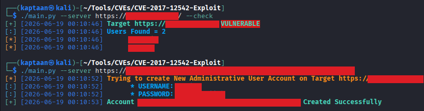<br />
`Account hp_ilo:... Created Successfully`. In seconds, using nothing but network access and a short script, I had **full administrative control of the server's management plane.**

## Logging Into iLO
With the account I'd just minted, I logged straight into the iLO 4 web interface.<br />
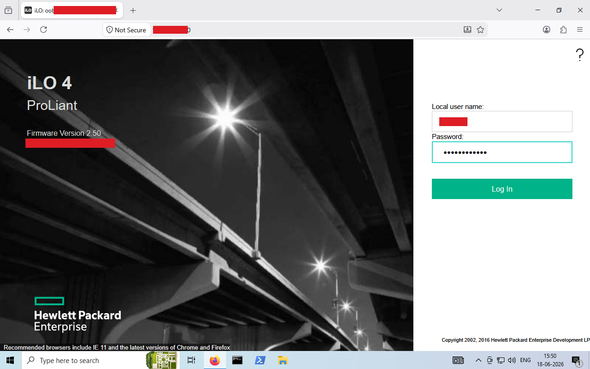<br />
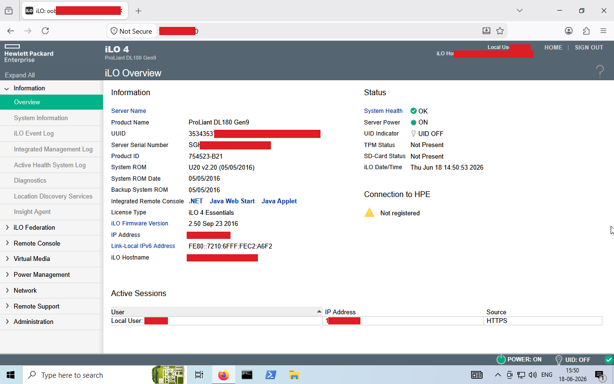<br />
At this point I owned the *management plane* — but not yet the operating system running on the server. The bridge between the two is the remote console.

## Remote Console — a Virtual Keyboard, Screen, and Power Button
These devices were running under a **licensed iLO Advanced** entitlement, which unlocks the **Integrated Remote Console (IRC)** — a full graphical virtual-KVM session to the server. From the Remote Console section of the web UI, I downloaded the **JNLP launcher** (Java Web Start) and opened it with a compatible JRE, which spun up the HP remote console.<br />
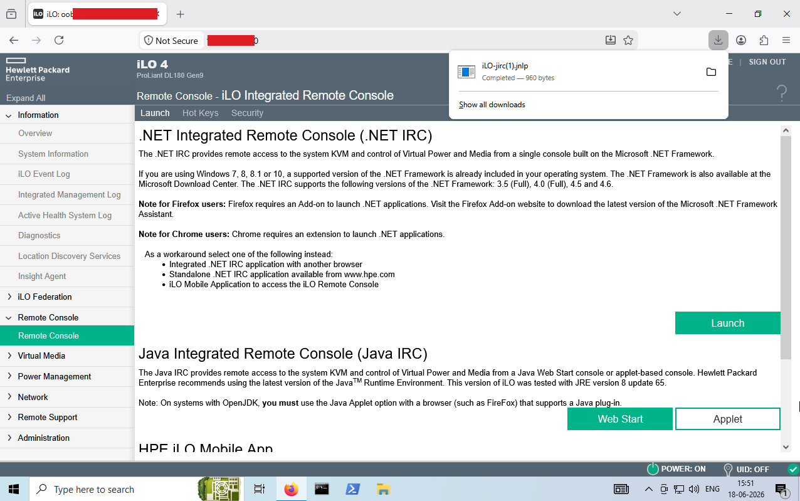<br />
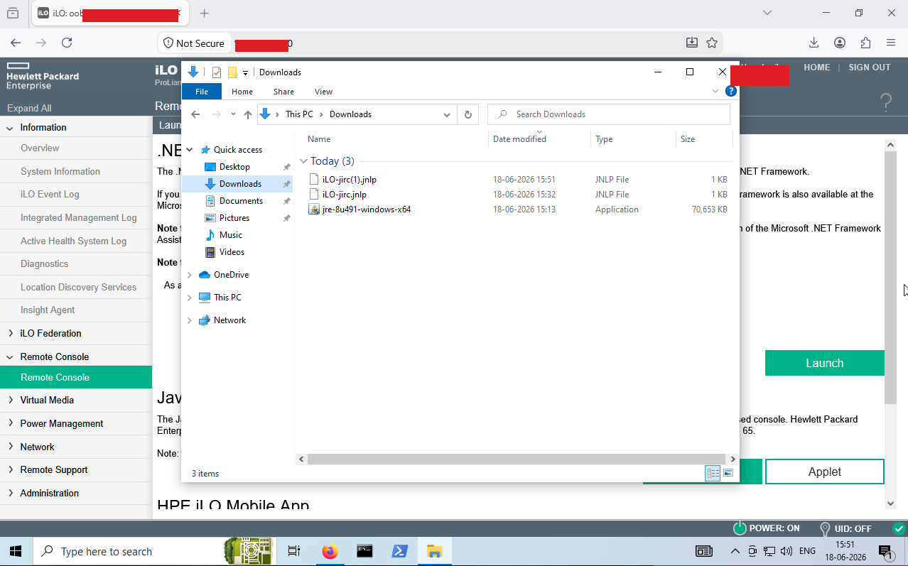<br />
The console dropped me straight onto the server's **live physical screen**, sitting at its login prompt.<br />
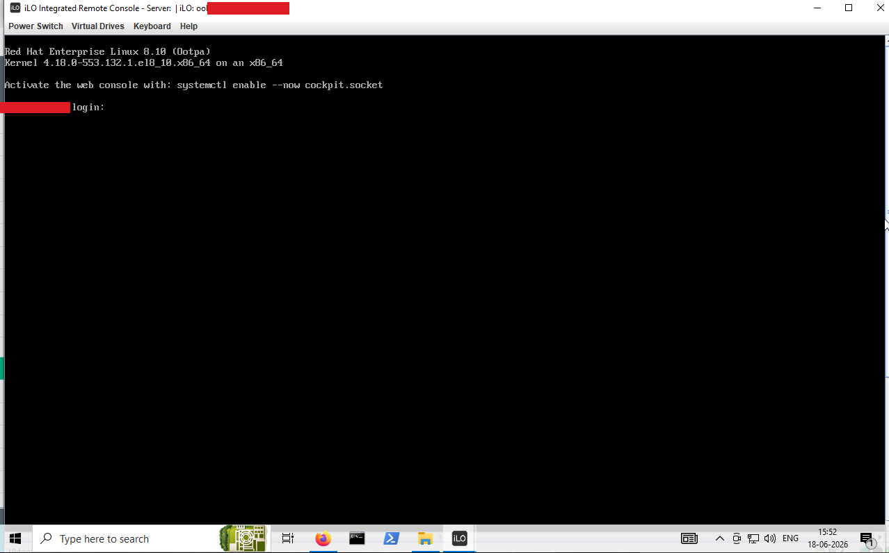<br />
I now had a keyboard on the physical console **and** a power button. That combination is all you need to seize the OS itself — no login required.

## From Console to Root: GRUB + `rd.break`
With interactive console access and remote power control, a classic **physical-access attack** becomes available entirely over the network. I issued **Power Switch → Reset** from the console toolbar and watched the machine reboot through POST toward GRUB.<br />
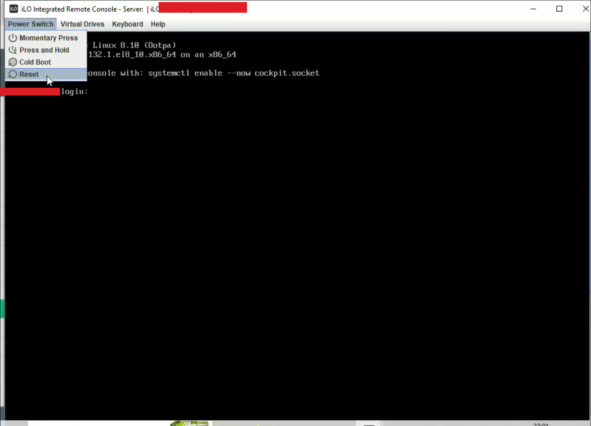<br />
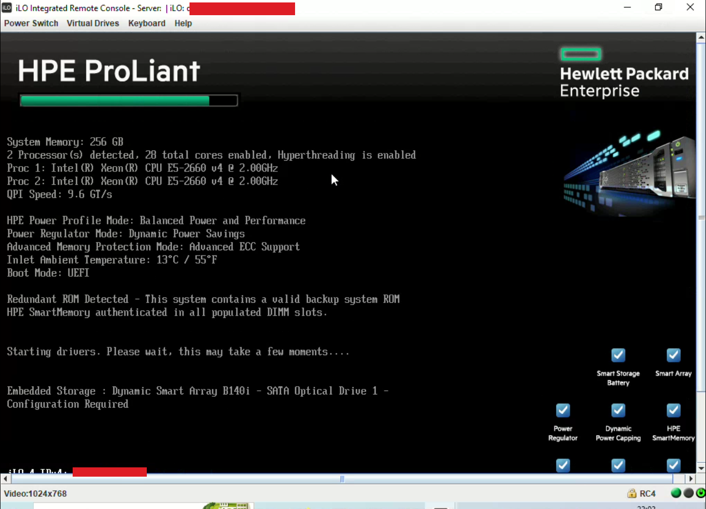<br />
When the **GRUB boot menu** appeared, I pressed **`e`** to edit the boot entry before the countdown elapsed.<br />
<br />
On the `linux` kernel line, I appended a single parameter — **`rd.break`** — and booted the edited entry with **Ctrl+X**.<br />
<br />
`rd.break` is a legitimate Linux recovery switch. When present, **dracut pauses the boot sequence inside the initramfs, *before* the real root filesystem is mounted**, and drops you into an emergency root shell. Intended for password recovery — here it's an attack, because the console it's typed at is mine.

## Pre-OS Root Shell
The kernel booted into the initramfs and halted at an emergency shell. From there I remounted the real root filesystem read-write and `chroot`ed into it:
```bash
mount -o remount,rw /sysroot
chroot /sysroot
```
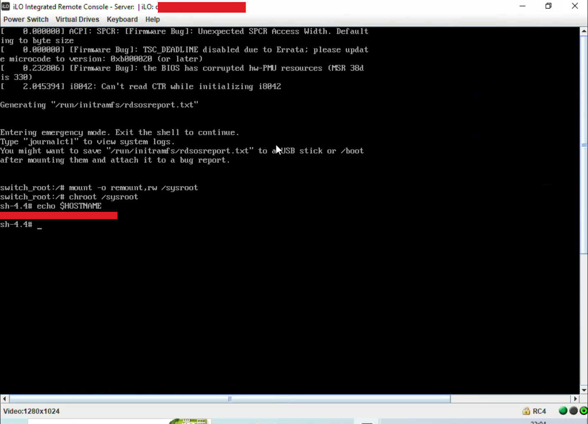<br />
That's an effective **root shell inside the live operating system**, with full read-write access to every file — obtained without a single OS credential, purely because I could reach the management interface.

## Establishing Persistence — Stage 1: A Backdoor User
A shell from the initramfs vanishes on the next normal boot, so the first job was durable access. Inside the `chroot`, I created a new account and gave it full `sudo` rights by adding it to the **`wheel`** group (which grants sudo on RHEL-family systems):
```bash
useradd -m -s /bin/bash kaptaan
usermod -aG wheel kaptaan
passwd kaptaan          # password set here, redacted
```
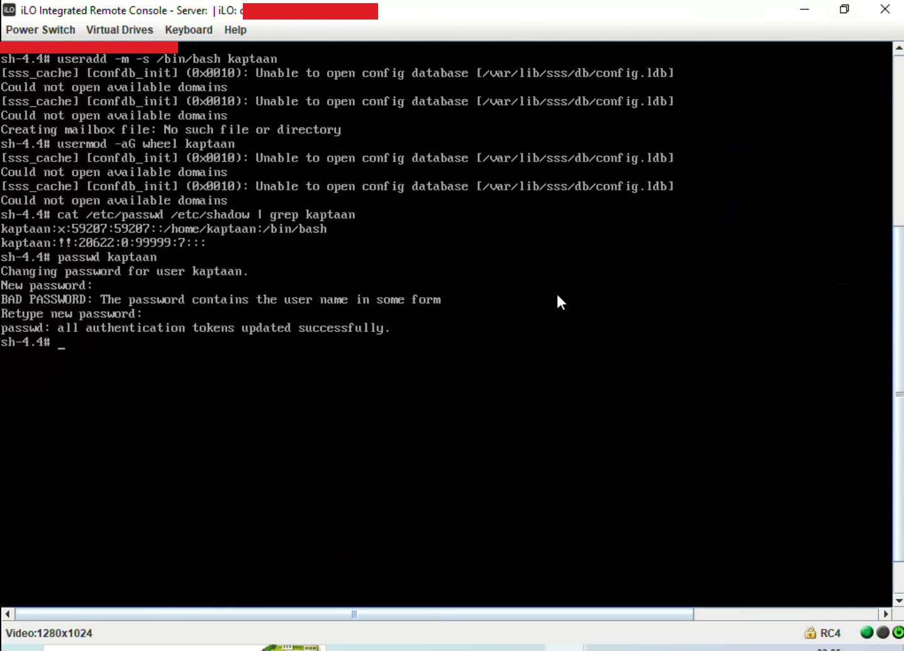<br />
This account now lives in `/etc/passwd`, `/etc/shadow`, and `/etc/group` and survives every reboot. I then exited the initramfs shell and let the server boot normally.<br />
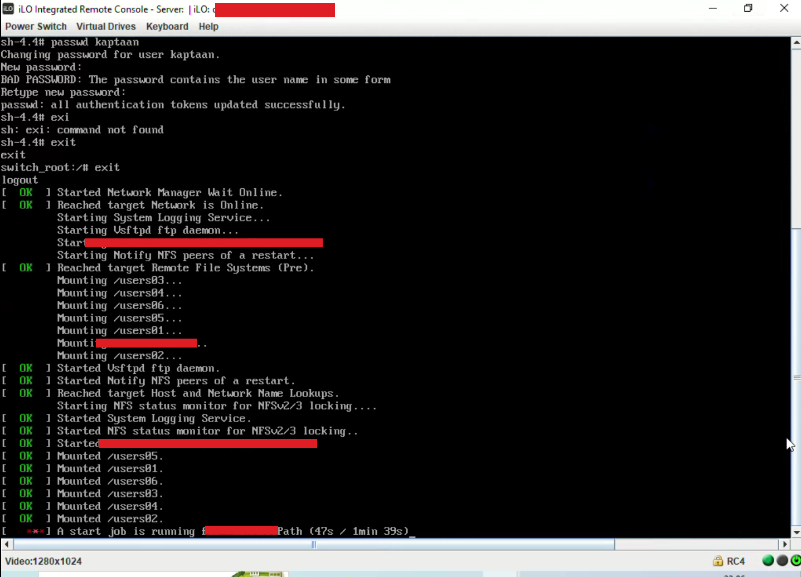<br />

## Persistence — Stage 2: A Root SSH Key
Once the server was up, I logged in as the backdoor user.<br />
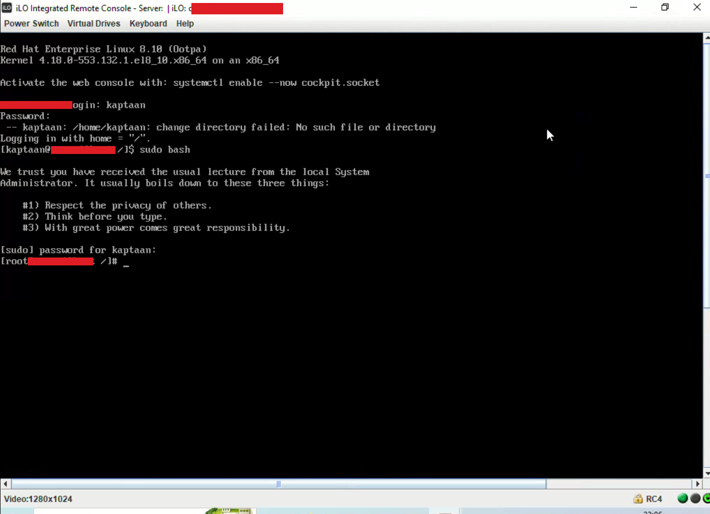<br />
From there I dropped my own **SSH public key into `/root/.ssh/authorized_keys`**, giving me **passwordless root SSH** directly from my machine. This stage needs no vulnerability at all — it's just standard public-key authentication, bootstrapped by the account from Stage 1.<br />
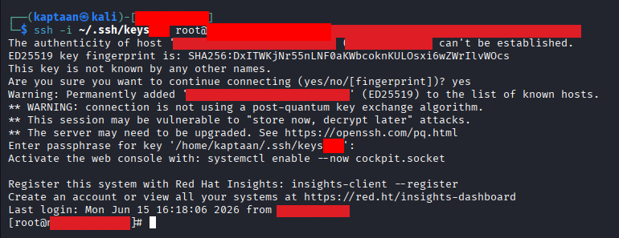<br />
The result is **two independent, mutually reinforcing persistence mechanisms**: losing the backdoor password doesn't kill access while the root key remains, and vice versa. Both survive reboots, and both survive *patching the iLO vulnerability* — closing the front door does nothing about the keys already inside.

## Attack Path
The full chain, from an exposed management port to durable root:
1. Discover an unpatched iLO 4 interface on the internal network.
2. Exploit **CVE-2017-12542** to create an unauthenticated iLO administrator account.
3. Log into the iLO web interface with that account.
4. Download the **JNLP** remote-console launcher and open the Integrated Remote Console.
5. Get a live view of the server's physical console — no OS login needed.
6. **Power → Reset** to reboot the server.
7. Intercept GRUB, edit the kernel line, append **`rd.break`**.
8. Land in the **initramfs emergency shell** — a pre-OS root environment.
9. `mount -o remount,rw /sysroot` and `chroot /sysroot` into the live filesystem.
10. Create a backdoor user in the **`wheel`** (sudo) group.
11. Exit and let the server boot normally.
12. Log in as the backdoor user.
13. Implant an SSH key in **`root`'s `authorized_keys`** — persistent, passwordless root.

## Mitigations
An unpatched, reachable iLO is one of the highest-impact, lowest-effort footholds in an environment. To break this chain:
- **Patch iLO 4 firmware to 2.53 or later.** This is the single most important fix — it closes CVE-2017-12542. Track iLO firmware advisories separately from OS patching; they have their own CVE channel.
- **Segment the out-of-band management network.** iLO interfaces should live on a dedicated, firewalled management VLAN reachable only from documented jump hosts — never from the general LAN, and never the internet.
- **Lock down iLO itself.** Use iLO's **IP address allow-listing**, disable unused features (SNMP, IPMI, unused console types), and **restrict or disable Virtual Media** so an attacker can't boot from attacker-controlled media even with iLO access.
- **Protect GRUB with a superuser password** (`password_pbkdf2`) so boot entries can't be edited to add `rd.break` (or `init=/bin/bash`).
- **Use full-disk encryption with pre-boot authentication** (e.g., LUKS) so that even console/boot access can't read or modify the filesystem.
- **Audit for persistence.** Regularly review `/etc/passwd`, `/etc/group`, `sudoers`, and every `authorized_keys` file. Deploy host-based intrusion detection (AIDE, Wazuh) to alert on changes to these.
- **Monitor iLO audit logs** for the fingerprints of this attack: new administrator accounts, power-reset operations, and remote-console activations from unexpected sources.

### Note
The above measures reduce risk significantly but do not guarantee 100% protection — defence in depth is the goal.

## Conclusion
An iLO — like any BMC — is effectively **a computer with god-mode over the host, sitting on the network**. Left unpatched and reachable from the wrong network, a single unauthenticated request turned it into full administrative access, a remote console turned that into physical-equivalent control, and a legitimate recovery feature (`rd.break`) turned *that* into a pre-OS root shell. From there, persistence was trivial — and it outlives the vulnerability that granted it.

Treat your management plane as the most sensitive part of your infrastructure. To an attacker, an exposed iLO isn't a management convenience — it's the shortest path to root.

## References
* [Gill-Singh-A/CVE-2017-12542-Exploit — the exploit used in this writeup](https://github.com/Gill-Singh-A/CVE-2017-12542-Exploit)
* [CVE-2017-12542 — HPE iLO 4 Authentication Bypass / RCE](https://nvd.nist.gov/vuln/detail/CVE-2017-12542)
* [HPE Security Bulletin — iLO 4 firmware 2.53](https://support.hpe.com/)
* [Red Hat — Resetting access using `rd.break`](https://access.redhat.com/solutions/918283)
* [GTFOBins](https://gtfobins.github.io/)
