In this blog, I'll walk through how a single exposed **IPMI/BMC** interface let me take **full control of a physical server** — and how that server turned out to be a **Proxmox** hypervisor, handing me every **virtual machine and container** running on top of it, along with the backups behind them.

## Prologue
> **"A bug is never just a mistake. It represents something bigger. An error of thought that makes you who you are."**  
> — *Elliot Alderson, Mr. Robot*

Every server has a second, smaller computer living inside it — one that never sleeps, answers the network even when the machine is "off," and was built entirely on the assumption that only administrators would ever talk to it. That assumption is the vulnerability.

## What is IPMI?
**IPMI (Intelligent Platform Management Interface)** is a protocol introduced by Intel in 1998 for **remote management and monitoring of servers** — even when the operating system isn't running, the machine is powered off, or the system has completely hung.

It works because it runs on a dedicated **Baseboard Management Controller (BMC)** — a small microcontroller soldered onto the motherboard that operates **independently of the CPU, firmware, and OS**. It has its own processor, its own memory, its own network stack, and its own power. To an administrator it means *lights-out management*: power the box on or off, watch temperatures and fans, read event logs, and — crucially — get a **remote console (KVM over IP)** as if you were standing at the keyboard.<br />
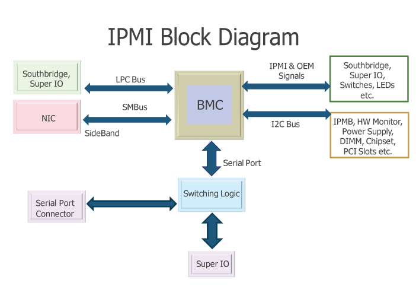<br />
That last capability — a remote screen, keyboard, and power button — is exactly what makes a compromised BMC so dangerous. If you control the BMC, you control the machine at a level *below* the operating system.

## IPMI Over the Network
For all of this to work, the BMC needs just two things: **power** and a **LAN connection**. It listens on **UDP port 623**. Find that port open on a host, and you've found a BMC waiting to talk.

## Supermicro BMC — and Everyone Else
This particular server used a **Supermicro** BMC supporting **IPMI 2.0**, exposing the usual web-based management interface. But nothing here is Supermicro-specific.

The exact same weaknesses and workflow apply to virtually every server-class BMC, because they all implement the same IPMI 2.0 specification — including **Tyrone**, **Hexadata**, **ASUS (ASMB)**, **ASRockRack**, Dell iDRAC, HPE iLO, Lenovo XCC, and others. Different logos, same protocol, same design flaws. If you learn it on one, you can do it on all of them.

And they all widen the attack surface the same way: every one of these vendors ships its BMCs with well-known **factory-default credentials** (Supermicro's `ADMIN`/`ADMIN`, Dell iDRAC's `root`/`calvin`, and so on). Left unchanged — which, in practice, they very often are — those defaults hand an attacker valid credentials outright, no cracking required, and expose the machine to the exact chain that follows.

## The Vulnerabilities
Two long-standing weaknesses in IPMI 2.0 make BMCs a favourite target.

### Cipher 0 — Authentication Bypass
IPMI 2.0 negotiates a *cipher suite* for each session. **Cipher Suite 0** is a special case that provides **no encryption and no authentication**. Where it's left enabled, an attacker can simply *request* a session using cipher 0 and issue privileged commands **without any valid credentials** — power control, monitoring, and management, straight to the BMC.

### RAKP Authentication Hash Disclosure
The bigger flaw is baked into the **RAKP (Remote Authenticated Key-Exchange Protocol)** handshake that IPMI 2.0 uses at login. By design, when a client begins authentication with a **valid username**, the BMC responds with a **salted hash of that user's password** — *before* the client has proven anything.

An attacker can request this handshake, capture the returned hash, and **crack it offline** with Hashcat or John the Ripper. This is often called **IPMI Hash Disclosure / Hash Dumping**, and it's the path I took here.

## Enumeration
The first step was confirming a BMC was present. A UDP scan of the target flagged **port 623 open**.
* **IP Address:** `x.x.x.x`
* **UDP Port:** `623`

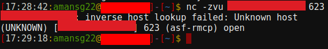<br />
That's the fingerprint of an IPMI service. To confirm the version and implementation, I used the Metasploit Framework module `scanner/ipmi/ipmi_version`.<br />
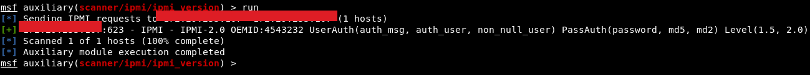<br />
The scan confirmed **IPMI 2.0**, which meant the RAKP hash-disclosure weakness was in play.

## Dumping the Authentication Hash
Metasploit ships a module built exactly for the RAKP flaw: `scanner/ipmi/ipmi_dumphashes`. It requests the handshake for common usernames and returns the password hashes the BMC leaks back.<br />
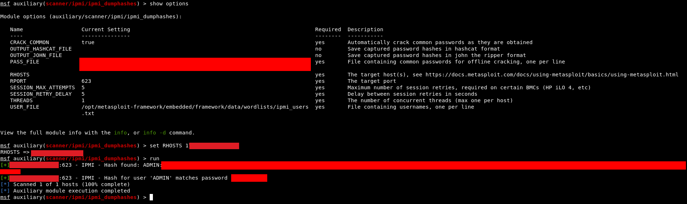<br />
The module recovered a hash for the user **`ADMIN`**, and because `CRACK_COMMON` was enabled it cracked the password on the spot: **`ADMIN`**. With valid credentials in hand, the offline-cracking step collapsed into an instant win.

## Logging Into the BMC
With valid credentials, I logged straight into the Supermicro web interface.<br />
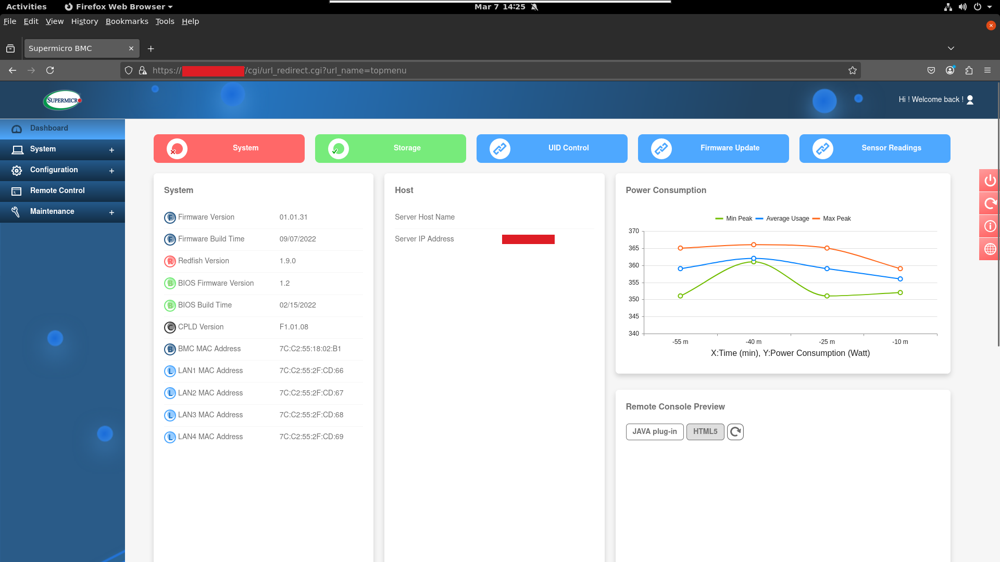<br />
At this point I had full administrative control of the *management plane* of the server — but not yet of the operating system running on it. The bridge between the two is the remote console.

## KVM Over IP — A Remote Screen and Keyboard
The BMC provides a **remote console using KVM over IP**, giving live **screen, keyboard, and mouse** access to the physical machine, exactly as if I were sitting in front of it.<br />
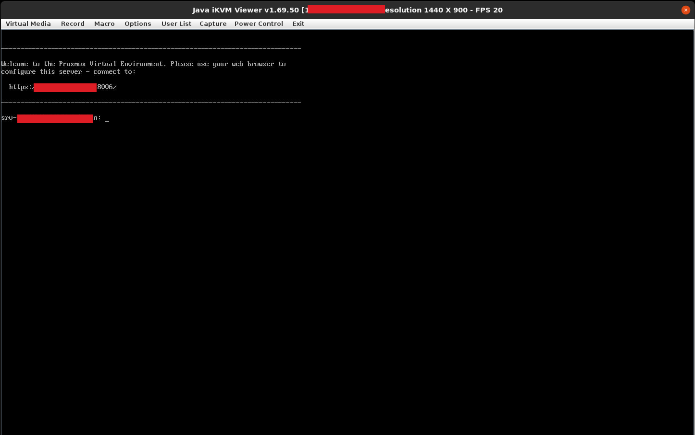<br />
The console also exposes **remote power control** — Power On, Power Off, Power Cycle, and Reset.<br />
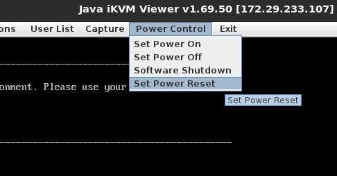<br />
This combination — a keyboard on the physical console *plus* a power button — is all that's needed to seize the OS itself.

## From KVM to Root: Editing the GRUB Entry
Being able to watch the boot process and reset the machine at will opens a classic **physical-access attack**, now available entirely over the network: editing the **GRUB boot entry** to boot straight into a root shell.

I issued a **Reset** from the power menu and caught the machine at the **GRUB menu**.<br />
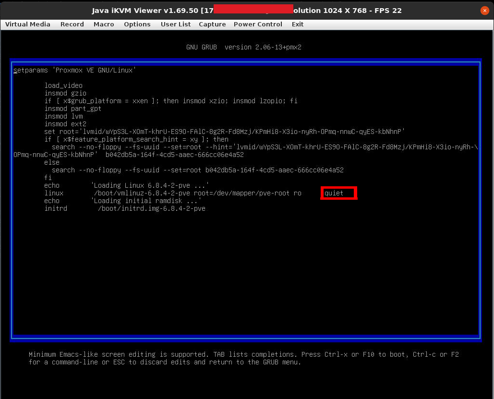<br />
GRUB lets you edit a boot entry temporarily (`e`). By appending `init=/bin/bash` to the kernel line, the system boots directly into a **root shell** instead of loading the full operating system and its login prompt — no password required.<br />
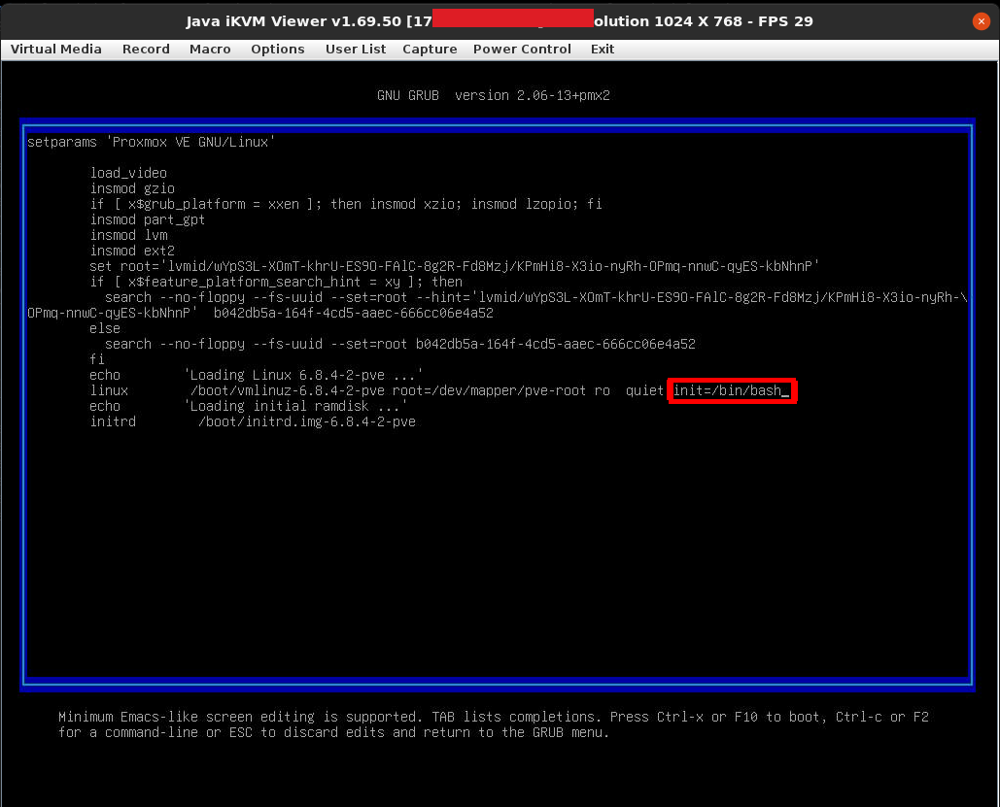<br />
Booting the edited entry dropped me straight to a root prompt.<br />
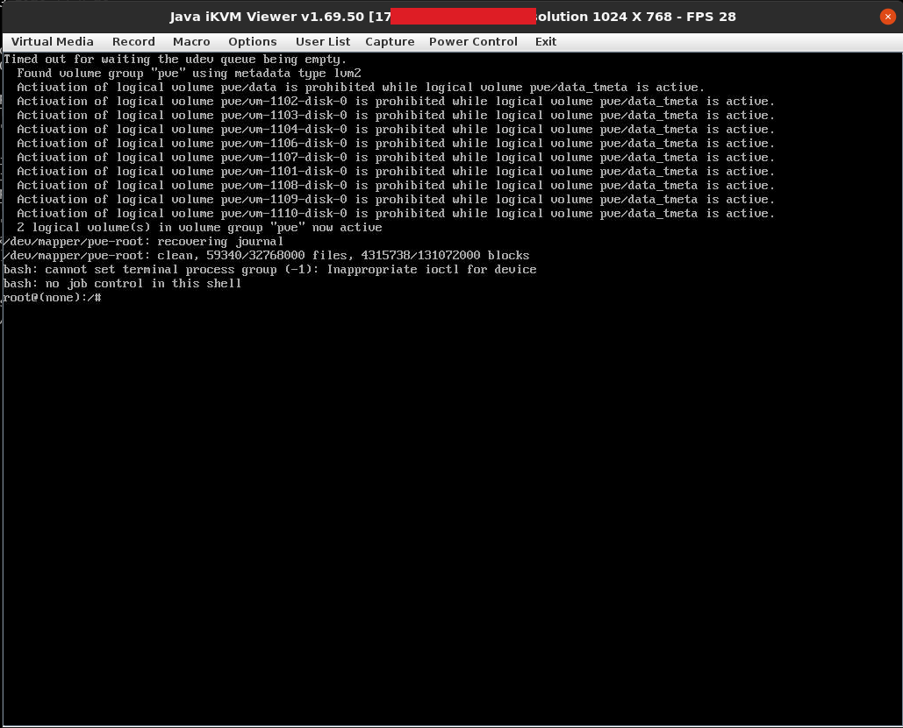<br />
`uid=0(root)` — total control of the operating system, obtained without a single OS credential, purely because I could reach the management interface.

## Establishing Persistence
A shell from `init=/bin/bash` is temporary — it disappears on the next normal boot. To keep durable access, I remounted the root filesystem read-write and added a persistent account with shell and sudo access:
```bash
mount -o remount,rw /
useradd -m -s /bin/bash -G sudo svcadmin
passwd svcadmin          # password set here, redacted
```
Then I rebooted the machine normally. After it came back up, I logged in through the KVM viewer as my new user.<br />
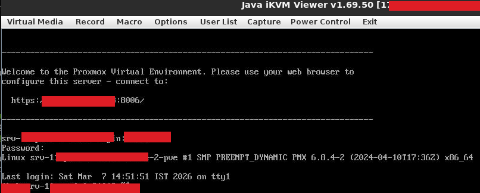<br />

## This Isn't Just a Server — It's a Hypervisor
Now inside a normal shell, I checked the network configuration with `ip a`.
* **IP Address:** `x.x.x.x`
* **Interface:** `vmbr0`

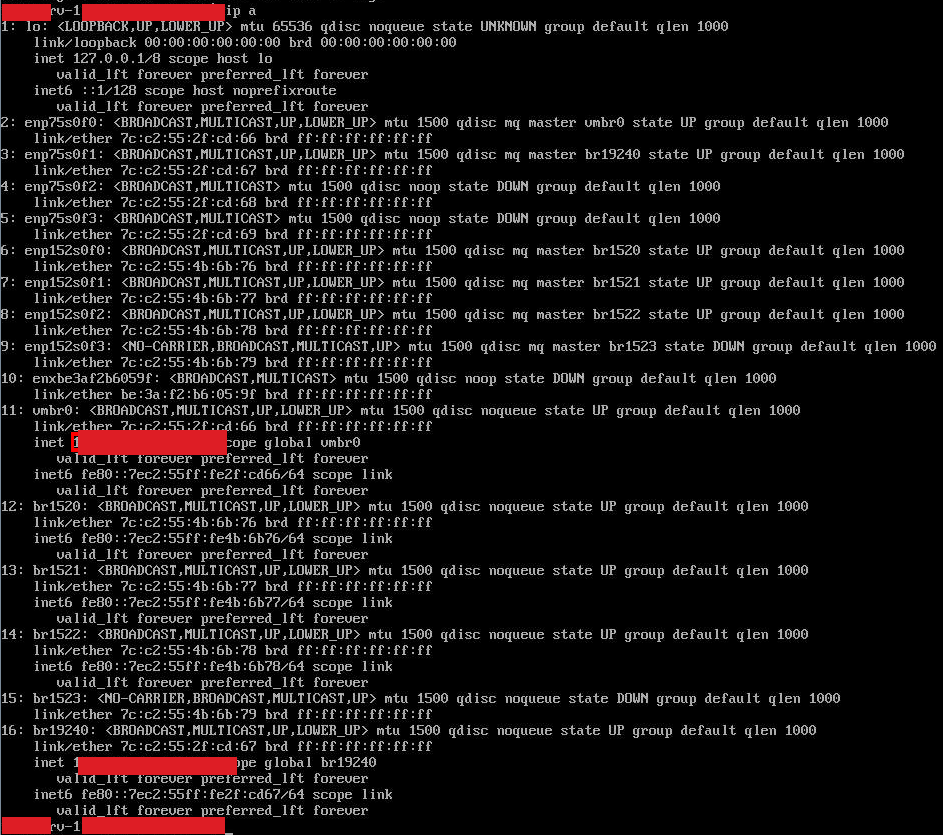<br />
That interface name — **`vmbr0`** — is a giveaway. `vmbrX` is the naming convention for a **Proxmox virtual bridge**. I hadn't just rooted a server; I'd rooted a **Proxmox VE hypervisor**, the machine that hosts and controls an entire fleet of virtual machines and containers.

## Proxmox Virtual Environment
**Proxmox VE** is an open-source virtualization platform (built on Debian) that manages **KVM virtual machines** and **LXC containers** through a web interface, with storage, backup, and clustering built in. Root on the Proxmox host means authority over *every* guest it runs — their disks, their consoles, and their power.

## Accessing the Proxmox Web Interface
Proxmox exposes its management UI on **`https://<host>:8006`**. Because I already had root on the host, I could reach and administer it directly.<br />
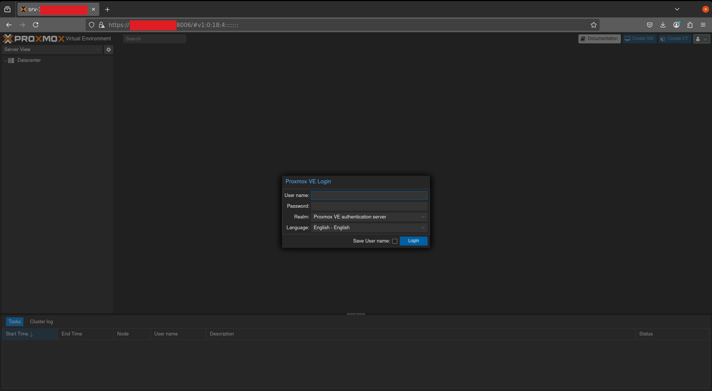<br />

## Adding a Backdoor Proxmox User
For persistent control of the virtualization layer itself (independent of the OS account), I created a dedicated Proxmox administrator in the built-in authentication realm:
* **User:** `proxmox@pve`
* **Realm:** Proxmox VE Authentication Server
* **Endpoint:** `https://x.x.x.x:8006`

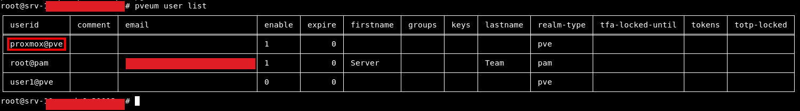<br />

## Owning the Entire Cluster
This is where a single misconfigured BMC turns into a full-infrastructure compromise. The host wasn't standalone — it was part of a **Proxmox cluster** spanning more than a dozen physical nodes, and the web interface laid the whole estate bare.<br />
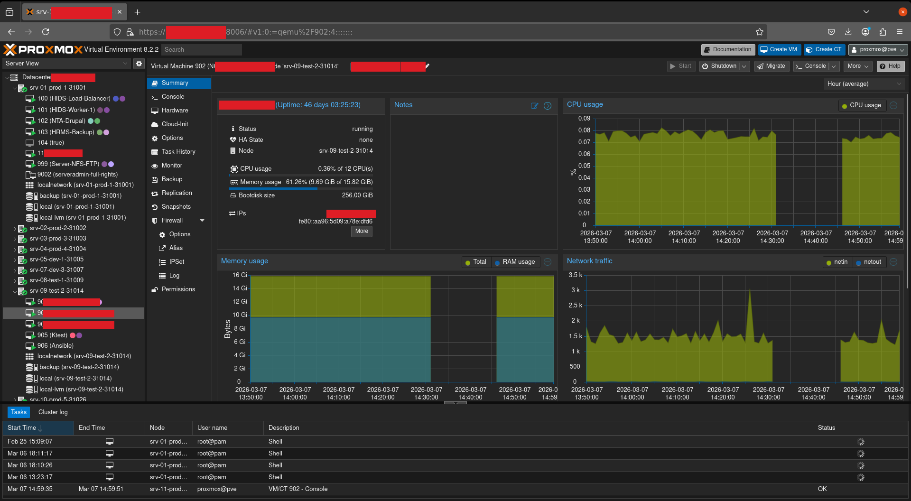<br />
The Datacenter search view enumerated **every node and every guest** at once — production, dev, and test servers, each running dozens of VMs, complete with their IP addresses and owner tags.<br />
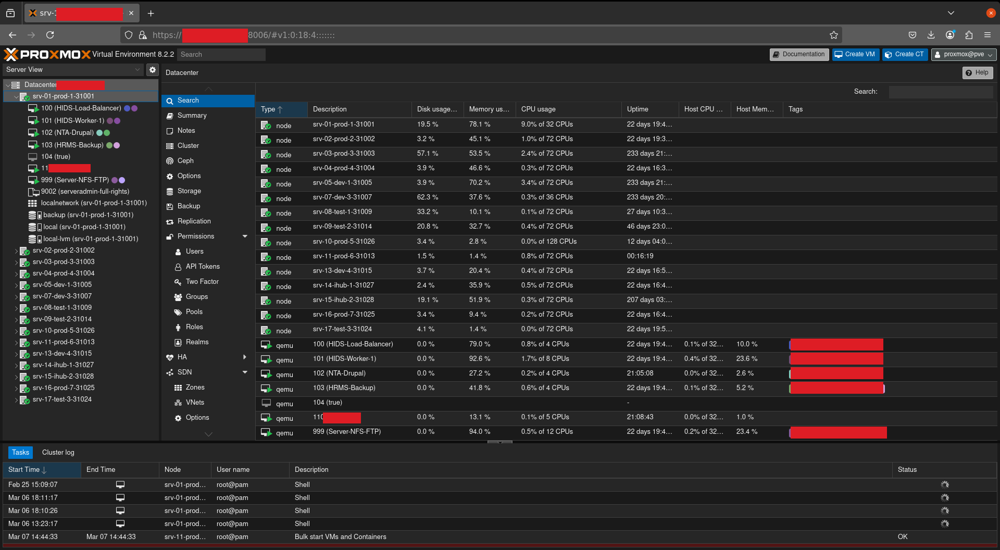<br />
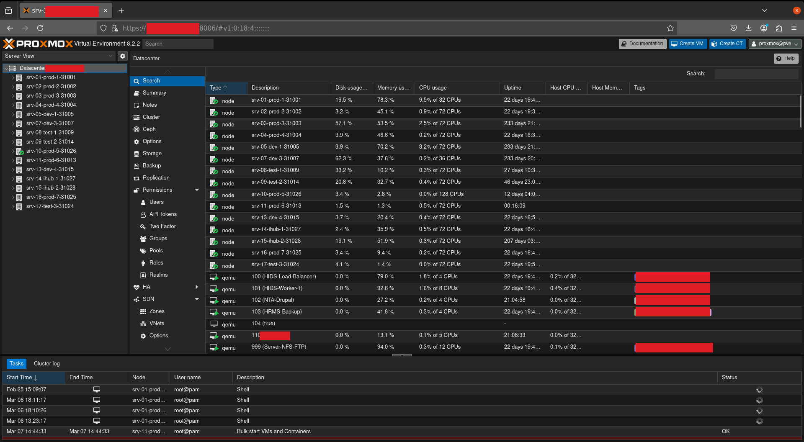<br />
From the CLI on the host, the same picture came from a single command:
```bash
pvesh get /cluster/resources --type vm
```
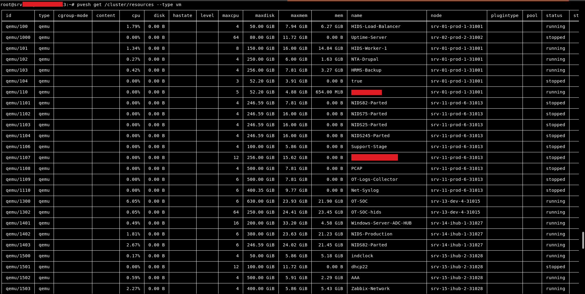<br />
The inventory read like the organisation's entire backbone — load balancers, IDS/IPS workers, SOC and OT-SOC monitoring VMs, Windows domain servers, databases, syslog and PCAP collectors, and more.

## A Full Remote Shell on the Host
The web UI and the KVM console weren't the only way in. I could also reach the host over the network — routed through **ProxyChains** — and open a proper interactive **SSH shell** on it, greeted by its own login banner:<br />
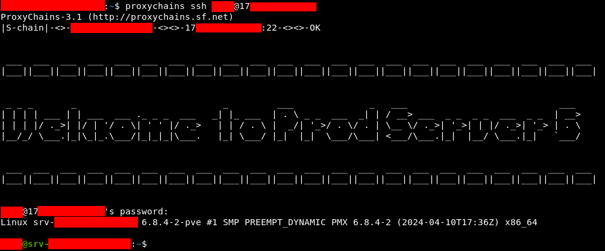<br />
A real shell on the hypervisor is the comfortable place to operate from — enumerating the cluster, reading root's command history, and lining up the next move.

## Reaching Into Every VM and Container
Control of the hypervisor means control of the guests. Through the same interface I could open a **console into any VM** — dropping straight onto their login screens (or, for appliances, their boot output) — inspect their hardware, and manage their firewalls, power, and disks.<br />
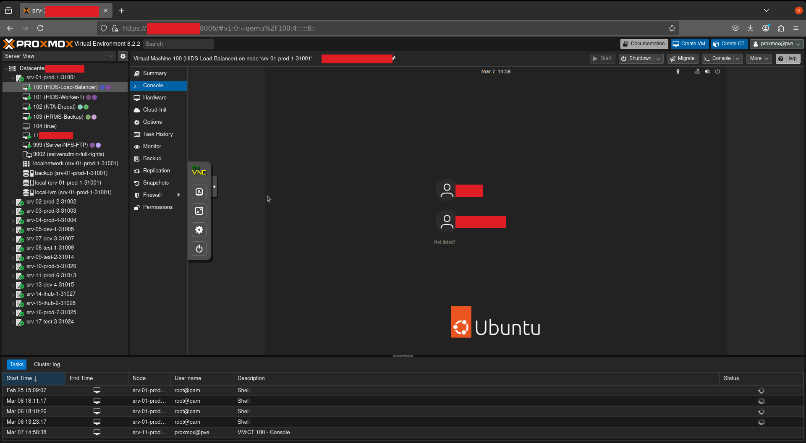<br />
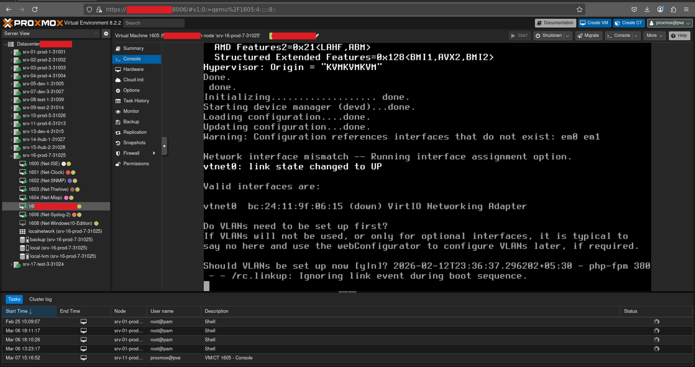<br />
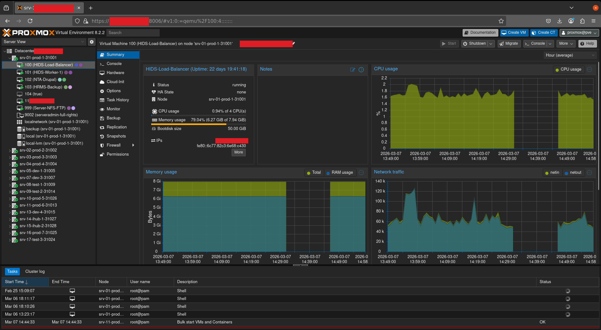<br />
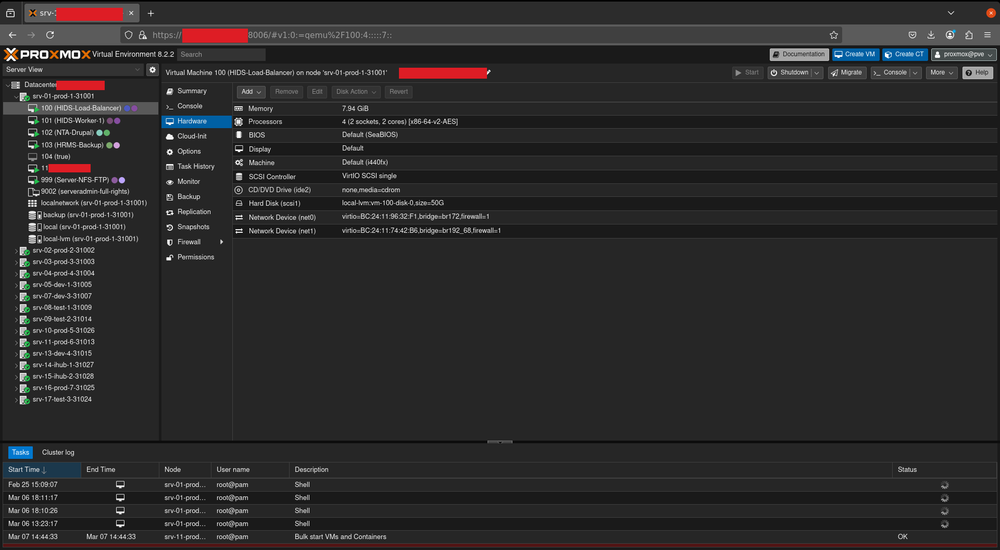<br />
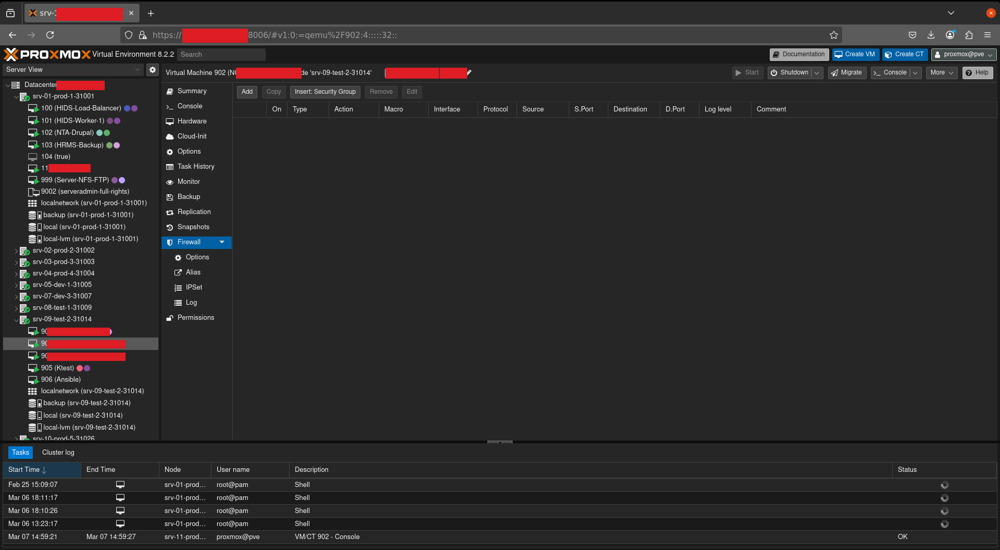<br />
Every one of these guests could now be powered off, cloned, snapshotted, consoled into, or have its virtual disk read directly from the host — regardless of whatever passwords or hardening existed *inside* the VMs. When you own the hypervisor, the guest's own security no longer matters.

## Pivoting to the Backups
One more step made the compromise complete. Reviewing the **bash history of the root user** on the host revealed an **NFS server** used for backups:
* **NFS Server:** `y.y.y.y`

Mounting that export exposed the crown jewels — **backups of every server, along with operational scripts and reports**:
* All server backups
* Administrative scripts
* Reports

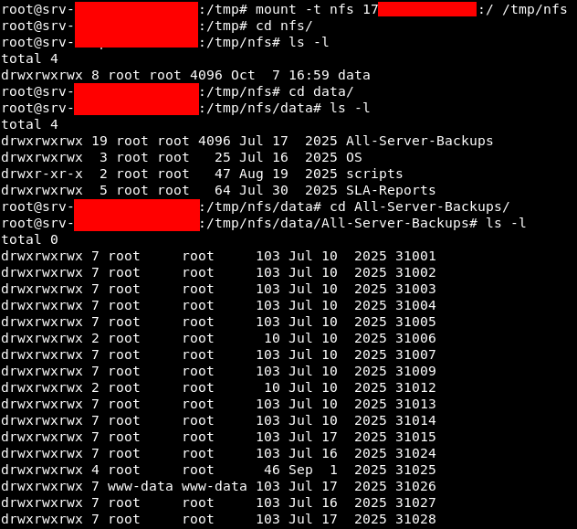

At that point, not only was the live infrastructure under control, but so was its **offline copy** — the very thing you'd rely on to recover from an incident.

## Attack Path
Below is the full chain, from an open UDP port to complete infrastructure and backup compromise.<br />
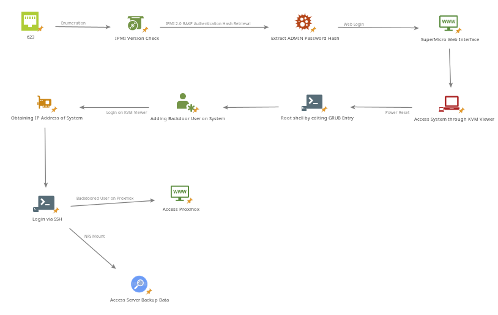<br />

## Mitigations
IPMI/BMC exposure is one of the highest-impact, lowest-effort footholds in an environment. To defend against this chain:
- **Change default BMC credentials immediately.** Default `ADMIN`/`ADMIN`-style logins are the single most common cause of BMC compromise.
- **Disable Cipher Suite 0** on all BMCs.
- **Never expose IPMI to untrusted networks.** Put BMCs on a dedicated, firewalled **management VLAN** reachable only via VPN or a jump host — never the internet, and never the general LAN.
- **Use strong, unique passwords** for every BMC account; the RAKP hash-disclosure flaw is unavoidable, so password strength is your real defence against offline cracking.
- **Keep BMC firmware updated** to pick up security fixes.
- **Protect GRUB** with a boot password so boot entries can't be edited to `init=/bin/bash`, and use **full-disk encryption** so a physical/KVM boot attack can't trivially read or modify the OS.
- **Restrict and monitor the Proxmox interface** — bind the web UI (`:8006`) to the management network, enforce **two-factor authentication**, and alert on new users and role changes.
- **Segment the backup (NFS) network** so a single compromised host cannot mount and read the backups of the entire estate.
- **Monitor for the fingerprints** of this attack: UDP/623 scans, RAKP requests, unexpected BMC logins, KVM sessions, and reboots into single-user/`init=/bin/bash`.

### Note
The above measures reduce risk significantly but do not guarantee 100% protection — defence in depth is the goal.

## Conclusion
IPMI exists to make servers easier to manage, but a BMC is effectively **a computer with god-mode over the host, sitting on the network**. Left with default/weak credentials and reachable from the wrong network, it collapses every other control: OS passwords, VM hardening, even backups. A single open UDP port led to root on a hypervisor, and from there to **every machine, container, and backup** in the environment.

Treat your management plane as the most sensitive part of your infrastructure — because to an attacker, it's the shortest path to all of it.

## References
* [Metasploit — IPMI 2.0 RAKP Remote SHA1 Password Hash Retrieval](https://docs.rapid7.com/metasploit/)
* [Dan Farmer — Sold Down the River (IPMI/BMC security research)](http://fish2.com/ipmi/)
* [Proxmox VE — pvesh / API documentation](https://pve.proxmox.com/pve-docs/)
* [GTFOBins](https://gtfobins.github.io/)
* [HackTricks — IPMI Pentesting](https://book.hacktricks.xyz/)
