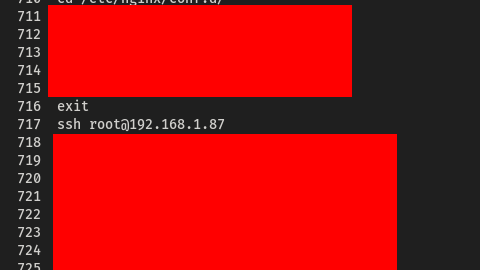
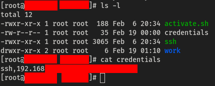
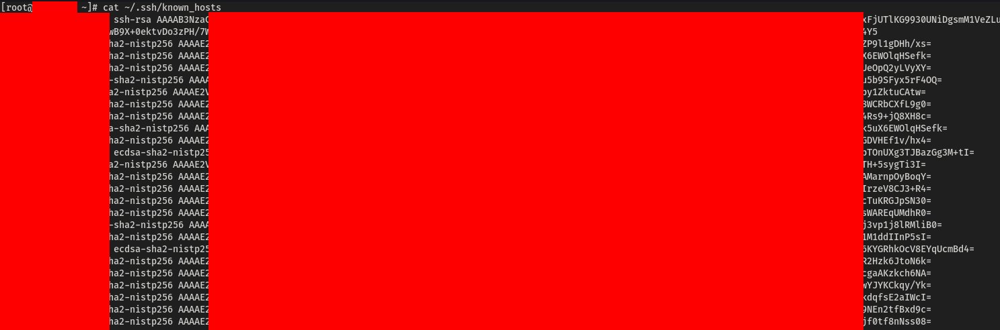
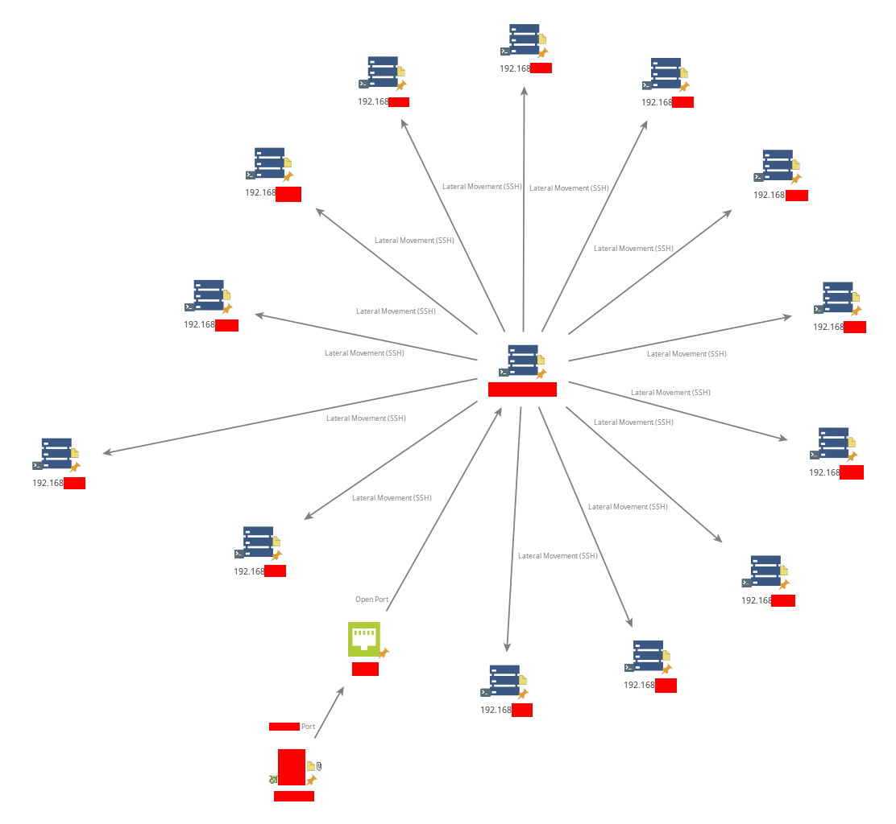

## Understanding Lateral Movement
Lateral movement in cybersecurity refers to the techniques used by attackers to move within a compromised network after gaining initial access. This allows them to escalate privileges, exfiltrate data, and reach high-value targets while evading detection. Advanced Persistent Threats (APTs) commonly use this tactic to maintain long-term access, often remaining undetected for extended periods.
## Entry Point
During my exploration of vulnerable and misconfigured internet-facing machines, I was able to gain root access to several devices. The methods I used to gain initial access are beyond the scope of this blog. 
While analyzing one of the compromised machines during post-exploitation, I noticed in the bash history that the user frequently connected to other devices via SSH. 
 
This discovery led me to investigate further, with the goal of capturing credentials to access additional systems. 
## Capturing SSH Credentials
> “You don’t have to be a part of the system to use it. You just need to know how to manipulate it.” — Mr.Robot
<!-- -->
To achieve this, I devised a simple method using a Python script alongside modifications to the `.bashrc` file. This setup allowed me to intercept SSH credentials entered by the user.
### Implementation
1. **Installing `sshpass`** – This tool bypasses the native SSH password prompt, allowing automation of SSH authentication.
2. **Tampering with SSH Commands** – By creating an alias for the SSH command, I ensured that every SSH connection attempt executed my Python script first, capturing the credentials before proceeding with the actual connection.
<!-- -->
For complete details on the scripts and instructions used, check out the [SSH Credential Logger](https://github.com/Gill-Singh-A/SSH-Credential-Logger).
## Extracting SSH Credentials
After some waiting, my setup successfully captured SSH credentials entered by the user. 
 
With these credentials, I was ready to move laterally across the network.
## Network Traversal
Once I obtained valid SSH credentials, I aimed to access additional devices on the network. Simply waiting for the user to enter credentials for other machines would be too slow, so I employed two proactive methods:
### 1. Port Scanning & Brute Force
This involved scanning the network for open SSH ports and attempting authentication using the stolen credentials. However, this approach generates significant noise, increasing the chances of detection due to logged failed attempts.
### 2. Extracting IPs from `known_hosts`
A stealthier method involves inspecting the `.ssh/known_hosts` file, which contains a list of previously connected devices. This file provided direct IPs and hostnames of machines the user had accessed before. 
 
By leveraging this information, I could target machines more efficiently while minimizing network noise, making detection less likely.
## Summary
Below is the attack path I followed, visualized using [Maltego](https://www.maltego.com/) 

## Conclusion
This technique demonstrates how attackers can leverage misconfigurations and simple command tampering to perform lateral movement within a network. By capturing SSH credentials and analyzing user activity, an attacker can systematically expand their foothold while remaining under the radar. 
Key takeaways:
- **Monitoring bash history** is crucial to detect unauthorized activity.
- **Regularly auditing `.bashrc`, `.profile`, and alias configurations** can help uncover unauthorized modifications.
- **Network segmentation** limits an attacker's ability to move laterally across a network.
<!-- -->
Understanding these attack methods helps security professionals develop better defense mechanisms to detect and prevent unauthorized access. By staying proactive, organizations can significantly mitigate the risk of lateral movement in their networks.