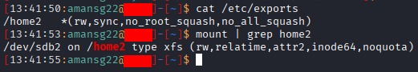
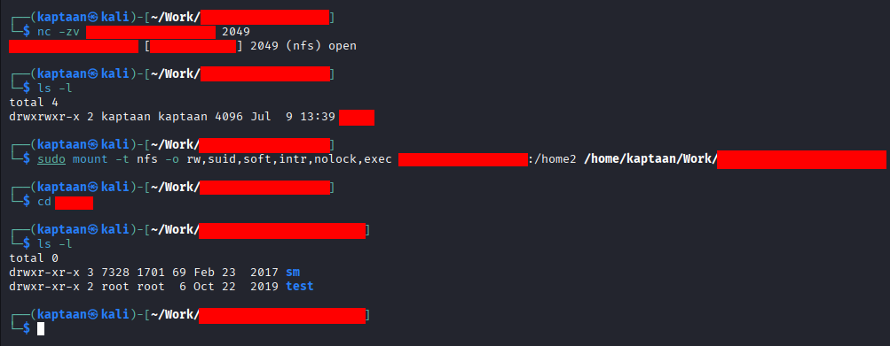
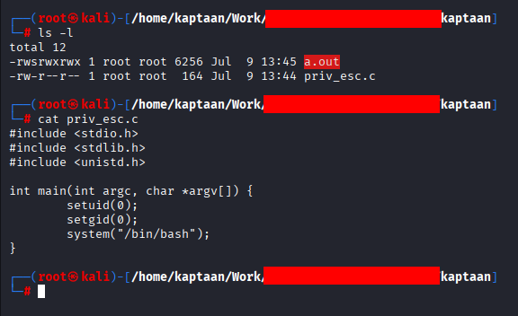
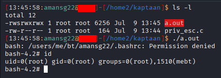

In this blog, I'll walk through how I escalated my privileges from a low-privileged user to **root** on a remote server by abusing an insecurely configured **NFS export** (`no_root_squash`).
## Prologue
> **"Control is an illusion."**  
> — *Mr. Robot*

NFS has a habit of trusting whoever knocks on the door — and trust, as always, is the real vulnerability.<br />
## Initial Foothold
At this stage I already had a shell as a regular, low-privileged user. The interesting part began while I was looking for a way up to root.
## Enumerating NFS Exports
While enumerating running services, I noticed the machine was exposing an **NFS** service. NFS (Network File System) lets a server share directories over the network so clients can mount them as if they were local. The quickest way to see what a host is sharing is `showmount`:
```bash
showmount -e <TARGET>
```
One of the exported directories was shared with everyone (`*`). That alone was worth a closer look, so I wanted to confirm exactly *how* it was being exported.
## Spotting the Misconfiguration
> **"People always make the best exploits."**  
> — *Elliot Alderson, Mr. Robot*
<!-- -->
Since I already had a shell on the box, I read the export configuration directly from `/etc/exports`. The shared directory carried the **`no_root_squash`** option.<br />
<br />
This single option is the whole ballgame. Normally NFS applies **`root_squash`**, which *squashes* a connecting root user (UID 0) down to the unprivileged `nobody` account — so being root on the client buys you nothing on the share. With **`no_root_squash`**, the server trusts the client's UID as-is. If I'm root on my own machine, I'm effectively **root on the share** — including the ability to write root-owned files and set the SUID bit on them.<br />
A human typed that word into a config file once and moved on. That's the exploit.
## Mounting the Export
I switched to my own machine, where I have full root, and mounted the vulnerable export locally:
```bash
mount -t nfs -o rw,suid,soft,intr,nolock,exec SERVER_ADDRESS:SERVER_DIRECTORY LOCAL_MOUNT_DIRECTORY
```
<br />
The share mounted without any authentication — NFSv3 doesn't challenge the client, it simply trusts the source address and the UID it presents.
## Planting a Root-Owned SUID Binary
With the share mounted and me sitting as root on my own box, I wrote a tiny C program that spawns a shell while preserving its privileges:
```c
#include <stdio.h>
#include <stdlib.h>
#include <unistd.h>

int main() {
    setuid(0);
    setgid(0);
    system("/bin/bash");
    return 0;
}
```
I compiled it straight into the mounted share and made it a **root-owned SUID** binary:
```bash
gcc priv_esc.c
chmod 4777 a.out
```
<br />
Because of `no_root_squash`, the file lands on the server **owned by root**, and the SUID bit sticks.
## Getting a Root Shell
Back in my original low-privileged shell on the target, the binary was now sitting in the exported directory — owned by `root`, with the SUID bit set. Executing it dropped me straight into a shell running as root:
<br />
`uid=0(root)` — full control of the server, earned from a single misconfigured export. No kernel exploit, no crash risk, nothing fragile. Just a trust boundary that was set too wide.
## Attack Path
1. Started with a low-privileged shell on the target.
2. Enumerated NFS and found a writable export shared with everyone.
3. Confirmed the export used `no_root_squash`.
4. Mounted the export from a machine where I had root.
5. Planted a root-owned SUID binary in the share.
6. Executed it on the target to become root.
## Mitigations
To prevent this type of attack, consider the following security best practices:
- **Never use `no_root_squash`**: Stick to the default `root_squash`, and prefer `all_squash` to map every client UID to `nobody` unless there is a hard requirement otherwise.
- **Mount and export with `nosuid`**: The `nosuid` option strips the effect of the SUID/SGID bits, so a planted binary can't gain privileges.
- **Restrict exports to specific hosts**: Never export to `*`. Pin each share to the exact IPs or subnets that legitimately need it.
- **Export read-only where possible**: Use the `ro` option whenever write access isn't required.
- **Prefer NFSv4 with Kerberos (`sec=krb5`)**: Move away from the trust-the-client model of NFSv3 to authenticated, identity-aware access.
- **Firewall NFS services**: Restrict access to port `2049` and the `rpcbind`/portmapper ports so only trusted networks can reach the service.
- **Audit `/etc/exports` regularly**: Treat any `no_root_squash` entry as a finding that must be justified or removed.
## References
* [GTFOBins - NFS no_root_squash](https://gtfobins.github.io/)
* [HackTricks - NFS no_root_squash / no_all_squash Privilege Escalation](https://book.hacktricks.xyz/network-services-pentesting/nfs-service-pentesting)
